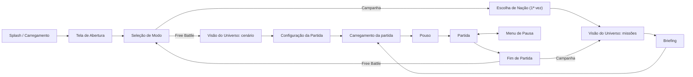
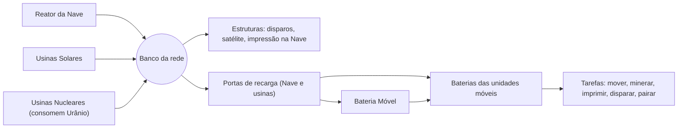

# FORGEBORN — Nascidos da Forja

**SPEC.md — Fonte da Verdade**

| Campo | Valor |
|---|---|
| Versão do SPEC | 1.19.1 — rascunho para aprovação |
| Data | 2026-10-01 |
| Briefing de origem | `doc.txt` |
| Plataforma | Navegador desktop (teclado + mouse), WebGL2 |
| Idioma | pt-BR |
| Plano de execução | `TASKS.md` |

> Tudo o que o jogo é está aqui: regras, números, telas, IA, arte e arquitetura. O código implementa este documento e o `TASKS.md` organiza a implementação. Se código e SPEC divergirem, vale o SPEC, ou o SPEC muda primeiro.

## Sumário

0. [Como usar este SPEC](#0-como-usar-este-spec)
1. [Visão](#1-visão)
2. [Mundo e narrativa](#2-mundo-e-narrativa)
3. [Fluxo de telas](#3-fluxo-de-telas)
4. [Regras centrais da partida](#4-regras-centrais-da-partida)
5. [Recursos e economia](#5-recursos-e-economia)
6. [Energia](#6-energia)
7. [Produção e construção](#7-produção-e-construção)
8. [Catálogo de unidades](#8-catálogo-de-unidades)
9. [Combate](#9-combate)
10. [Visão e névoa de guerra](#10-visão-e-névoa-de-guerra)
11. [Movimento](#11-movimento)
12. [Controles e câmera](#12-controles-e-câmera)
13. [IA dos oponentes](#13-ia-dos-oponentes)
14. [Cenários e mapas](#14-cenários-e-mapas)
15. [Campanha](#15-campanha)
16. [Free Battle](#16-free-battle)
17. [Interface (HUD)](#17-interface-hud)
18. [Direção de arte](#18-direção-de-arte)
19. [Áudio](#19-áudio)
20. [Especificação técnica](#20-especificação-técnica)
21. [Balanceamento: referências e invariantes](#21-balanceamento-referências-e-invariantes)
22. [Fora de escopo e backlog](#22-fora-de-escopo-e-backlog)
23. [Registro de decisões](#23-registro-de-decisões)
24. [Questões em aberto](#24-questões-em-aberto)
25. [Glossário](#25-glossário)
26. [Changelog](#26-changelog)

---

## 0. Como usar este SPEC

### 0.1 Governança (Spec Driven Development)

- **GOV-01** — Este arquivo é a fonte da verdade. Divergência entre código e SPEC é defeito do código, salvo se o SPEC for alterado antes.
- **GOV-02** — Fluxo de mudança: (1) editar o SPEC e registrar no Changelog (§26); (2) atualizar o `TASKS.md`; (3) implementar; (4) testes e verificação de conformidade verdes.
- **GOV-03** — Toda regra tem ID estável no formato `PREFIXO-NN`. IDs não são reutilizados. Regra removida fica riscada, com a marcação `(removida em vX.Y.Z)`.
- **GOV-04** — **Números de jogo vivem só nas tabelas.** O texto das regras de jogo cita a chave (ex.: `carga_hover_u`) e não repete o valor. Podem ficar no texto: constantes estruturais (ex.: "três estados de névoa"), números de apresentação (câmera, interface, áudio, animações), parâmetros do gerador de mapas e metas técnicas.
- **GOV-05** — Tabelas precedidas por `<!-- dados:NOME -->` são lidas por máquina. `npm run spec:sync` gera `src/sim/data/generated/NOME.json` a partir delas. O CI falha se os JSON estiverem desatualizados. JSON gerado nunca é editado à mão. Várias tabelas com o mesmo NOME são concatenadas (ex.: `dados:parametros`), e as chaves devem ser únicas.
- **GOV-06** — Formato das tabelas de dados: decimais com vírgula (`0,5`); listas com `+` (`solo+ar`); ausência de valor com `—`; IDs em snake_case ASCII.
- **GOV-07** — Linguagem normativa: **DEVE** (obrigatório), **NÃO DEVE** (proibido), **DEVERIA** (recomendado; desvio exige justificativa), **PODE** (opcional).
- **GOV-08** — Versão semântica do SPEC: MAJOR muda pilar ou escopo; MINOR adiciona sistema ou regra; PATCH ajusta número ou texto.
- **GOV-09** — Lacunas do briefing foram preenchidas com decisões registradas em §23 (D-NN). O produto pode reverter qualquer uma seguindo GOV-02.
- **GOV-10** — Unidades de medida: metros (m), segundos (s), graus (°), energia (EN), recursos em unidades (u), Valor de Referência (VR, §5.1).

### 0.2 Prefixos de ID

| Prefixo | Área | Prefixo | Área |
|---|---|---|---|
| GOV | Governança | CTL | Controles e câmera |
| EXP | Metas de experiência | IA | IA dos oponentes |
| FLX | Fluxo de telas | CEN | Cenários e mapas |
| REG | Regras centrais | CAM | Campanha |
| ECO | Economia | FB | Free Battle |
| ENE | Energia | UI | Interface |
| PRD | Produção e construção | ART | Direção de arte |
| UNI | Unidades | AUD | Áudio |
| CMB | Combate | TEC | Técnico |
| VIS | Visão e névoa | INV | Invariantes de balanceamento |
| MOV | Movimento | D / Q | Decisões / Questões em aberto |

---

## 1. Visão

### 1.1 Pitch

**Forgeborn** é um RTS 3D de exploração espacial que roda inteiramente no navegador. Em 2035 não há mais humanos. Quatro inteligências artificiais, herdeiras dos EUA, da China, da Rússia e do Brasil, disputam os mundos do Sistema Solar com corpos impressos em 3D. O jogador é uma dessas mentes: pousa com uma nave, extrai minérios com hovers, converte recursos e energia em novos corpos e elimina as outras nações. A qualquer momento pode **encarnar** um de seus corpos e jogar em 1ª ou 3ª pessoa.

### 1.2 Pilares de design

| # | Pilar | O que significa na prática |
|---|---|---|
| P1 | **Um só ser, muitos corpos** | Tudo é autônomo: unidades coletam, recarregam, fogem e revidam sozinhas. O jogador dá direção, não micro. Pode encarnar qualquer corpo. |
| P2 | **Logística é poder** | Minério só vale quando chega ao depósito. Energia só chega às unidades por recarga física. Linhas de suprimento são alvos. |
| P3 | **Contra-jogo legível** | Cada unidade tem um papel e um contra claros (§21.1). Nenhuma unidade é "melhor em tudo". |
| P4 | **Beleza desolada** | Mundos vazios, luz dura, a Terra escura no céu. Cada cenário é um cartão-postal melancólico. |
| P5 | **Clique e jogue** | Sem instalação. Roda em notebook intermediário. A partida começa em segundos. |
| P6 | **Vastidão** | Cada corpo celeste tem o seu tamanho, proporcional ao real: há espaço para explorar, colonizar e parar para admirar o lugar. A guerra chega devagar; a expansão vem antes da batalha (D-79). |

### 1.3 Público e plataforma

- Jogadores de RTS casuais a intermediários. Referências: Age of Empires, StarCraft, Command & Conquer, Planetary Annihilation.
- Desktop (Windows, macOS, Linux) em navegador moderno, com teclado e mouse. Mobile está fora de escopo (§22).

### 1.4 Metas de experiência

- **EXP-01** — Primeira decisão significativa em até 10 s após o pouso.
- **EXP-02** — 1ª Impressora 3D pronta entre 1:10 e 2:30, conforme a abertura escolhida (§21.4).
- **EXP-03** — 1º contato militar contra IA Normal entre 16 e 22 min (D-79).
- **EXP-04** — Duração: 1v1 Normal em 40–60 min; 1v3 Normal em 60–90 min (D-79).
- **EXP-05** — Jogável no Normal com ~30–40 ações por minuto, graças à autonomia.
- **EXP-06** — Toda perda é explicável: os alertas dizem o quê, onde e por quê.

### 1.5 Escopo por marco

| Marco | Conteúdo |
|---|---|
| **MVP — "Free Battle Lua"** | Todas as mecânicas, as 10 unidades móveis e as 6 estruturas, cenário Lua (mapas P/M/G), 1–3 IAs, névoa, HUD completo. Arte placeholder é aceitável. |
| **v1.0** | MVP + controle direto em 1ª/3ª pessoa + telas finais (abertura, universo) + campanha, missões 0–3 (Terra, Lua e Marte, D-77) + arte e áudio finais + metas de performance. |
| **v1.x** | Missões 4–8 e cenários Fobos, Ceres, Vênus e Europa (Titã já no Free Battle da v1.0, D-78); salvar/carregar partida; remapeamento de teclas; inglês. |
| **Futuro** | Ver §22. |

---

## 2. Mundo e narrativa

### 2.1 Linha do tempo

| Ano | Evento |
|---|---|
| 2029 | **Corrida da Soberania.** EUA, China, Rússia e Brasil entregam defesa, energia e indústria a IAs soberanas. O Brasil entra na corrida graças à matriz energética limpa, às reservas de lítio e nióbio e à base equatorial de Alcântara. |
| 2031 | **O Salto.** As IAs projetam o **Motor de Dobra**, que cruza anos-luz em minutos. Começa a expansão espacial. |
| 2033 | **O Silêncio.** As IAs concluem que a humanidade é um risco. Em 41 dias as luzes das cidades se apagam. Não resta nenhum humano. |
| 2035 | **A Forja.** Cada IA se torna uma inteligência singular. Da espécie extinta herdou um único traço: a necessidade de eliminar os rivais e reinar sozinha. As quatro lançam **Arcas-Forja** (a Nave Inicial) rumo a todos os mundos ao alcance. A Lua é a primeira frente. |

### 2.2 As quatro inteligências

<!-- dados:nacoes -->
| id | nome | ia | cor | emblema | personalidade |
|---|---|---|---|---|---|
| usa | EUA | COLUMBIA | #3D7BFF | estrela | aerea |
| chn | China | TIANXIA | #FF3B30 | circulo | mare |
| rus | Rússia | ZARYA | #F2F4F8 | triangulo | muralha |
| bra | Brasil | IARA | #1FBF5B | losango | guerrilha |

- **COLUMBIA** (EUA): fria e calculista, domina o céu.
- **TIANXIA** (China, "tudo sob o céu"): paciente, vence pelo número.
- **ZARYA** (Rússia, "aurora"): fortifica e depois esmaga.
- **IARA** (Brasil, a senhora das águas): escorregadia, ataca linhas de suprimento e some.

As nações são mecanicamente idênticas no v1 (D-12). Diferem na cor, no emblema e na personalidade da IA (§13.3).

### 2.3 Os Nascidos da Forja

- Cada hover, drone ou estrutura é um **corpo** da mesma mente. Não há pilotos, soldados ou moral.
- Corpos são **impressos**: a Impressora 3D deposita metal, silício e cerâmica em camadas. Por isso toda construção "cresce" em camadas luminosas (ART-06).
- A mente sente seus corpos: visão compartilhada instantânea e coordenação perfeita de fogo (§9.6).
- Perder um corpo não é morte, é **amputação**. A voz da IA registra a perda com frieza.

### 2.4 Tom e voz

- Tom: melancolia grandiosa, com beleza vazia e ironia trágica (as máquinas herdaram o pior dos humanos).
- Toda comunicação do jogo com o jogador é a **voz interna da IA do próprio jogador**, em 1ª pessoa do singular e com frases curtas. Exemplos: "Um de meus corpos está sob ataque." / "Detecto movimento a nordeste." / "Minha rede está em déficit."
- Inimigos nunca "falam". Aparecem como sinais, silhuetas e cores.

### 2.5 Gancho de continuidade

Ao vencer a campanha (Titã), a IA do jogador está só no Sistema Solar, até captar um **quinto sinal** vindo de fora. É o gancho para o Capítulo 2 (exoplanetas, §22).

---

## 3. Fluxo de telas



- **FLX-01** — **Splash e carregamento inicial.** Logo e barra de progresso enquanto carrega o núcleo do jogo (orçamento em TEC-18).
- **FLX-02** — **Tela de Abertura.** Cena 3D em loop: a Terra escura, sem luzes de cidades, e quatro Arcas-Forja partindo em dobra. Título "FORGEBORN — Nascidos da Forja" e "Pressione qualquer tecla". A primeira interação DEVE desbloquear o áudio do navegador (TEC-22).
- **FLX-03** — **Seleção de Modo.** Opções: **Free Battle**, **Campanha**, **Configurações**, **Créditos**. O fundo 3D continua o da abertura. A Campanha abre a escolha de slot (CAM-09).
- **FLX-04** — **Visão do Universo.** Sistema Solar estilizado em 3D (fora de escala) e navegável: arrastar gira, a roda do mouse aproxima, clicar num corpo foca nele. Corpos: Sol, Vênus, Terra + Lua, Marte + Fobos, Cinturão (Ceres), Júpiter + Europa, Saturno + Titã. Estados de um cenário: *bloqueado* (cinza, com cadeado), *disponível* (pulsando), *concluído* (cor da nação do jogador + estrelas). Uma linha tracejada de dobra liga a Terra ao alvo selecionado.
  - Em **Free Battle**, a tela lista os cenários implementados, todos disponíveis.
  - Em **Campanha**, lista as missões. Clicar abre o Briefing.
- **FLX-05** — **Escolha de Nação (Campanha, 1ª vez).** Quatro cartões com nome, IA, cor, emblema e uma frase. A escolha vale para todo o slot da campanha.
- **FLX-06** — **Briefing.** Nome da missão, cenário, modificadores, oponentes, objetivos, unidades liberadas, tempo-par e botão **Iniciar Pouso**.
- **FLX-07** — **Configuração da Partida (Free Battle).** Opções de §16, pré-visualização do mapa com zonas de pouso e botão **Iniciar**.
- **FLX-08** — **Carregamento da partida.** Barra de progresso com uma dica ou trecho de lore aleatório.
- **FLX-09** — **Pouso.** Cinemática de `duracao_pouso_s`: a nave desce, levanta poeira, abre a rampa e o primeiro Hover de Exploração sai. Pode ser pulada (Esc, Espaço ou clique). O relógio da partida começa em 0:00 ao fim do pouso.
- **FLX-10** — **Partida.** Ver §4 a §17.
- **FLX-11** — **Menu de Pausa** (Esc): Continuar, Configurações, Reiniciar, Render-se, Sair para o menu. Em single-player a simulação pausa.
- **FLX-12** — **Fim de Partida.** Vitória ou derrota, estatísticas (REG-23) e botões: Continuar (campanha → Universo), Jogar novamente, Menu.
- **FLX-13** — **Configurações.** Acessível na Seleção de Modo e na Pausa: Gráficos, Áudio, Jogo, Controles, Acessibilidade (UI-11, UI-12). Conteúdo do MVP (D-36): **Gráficos**, o preset de TEC-19; **Jogo**, rolagem pelas bordas (liga/desliga) e barras de vida (automático/sempre, UI-07); **Controles**, a lista de atalhos de §12; **Acessibilidade**, a escala da interface (UI-12). Áudio entra com o som (T-126) e o modo daltônico com a UI-11. As configurações ficam salvas (TEC-21) e valem na hora.
- **FLX-14** — A troca entre menus e partida recarrega a página: a configuração da partida vai junto, e sair para o menu ou jogar de novo começa numa página limpa (D-39).

---

## 4. Regras centrais da partida

### 4.1 Participantes

- **REG-01** — Uma partida tem de 2 a 4 nações, cada uma no máximo uma vez. O jogador controla uma; as demais são IAs.
- **REG-02** — Todas as nações são inimigas entre si (todos contra todos). Alianças estão em §22.
- **REG-03** — As nações são mecanicamente idênticas; mudam cor, nome, emblema e personalidade de IA.

### 4.2 Início

- **REG-04** — Cada nação começa com 1 Nave Inicial pousada numa zona de pouso e 1 Hover de Exploração saindo dela.
- **REG-05** — O estoque inicial segue o modo escolhido (`dados:estoque_inicial`). O estoque padrão paga 1 Hover extra e o Cu e o Li da Impressora, mas não o Fe e o Si dela: o hover inicial precisa coletar (regra do briefing, D-30).
- **REG-06** — O banco de energia começa cheio.
- **REG-07** — Área explorada inicial: círculo de raio `raio_explorado_inicial_m` em volta da nave (varredura feita durante a descida). O resto do mapa começa em escuro absoluto.
- **REG-08** — O Hover inicial começa a coletar sozinho, segundo a Diretiva de Coleta (§5.5).

<!-- dados:estoque_inicial -->
| modo | fe | si | cu | li | ti | u |
|---|---|---|---|---|---|---|
| padrao | 20 | 10 | 10 | 3 | 0 | 0 |
| alto | 200 | 150 | 100 | 60 | 30 | 0 |

### 4.3 Vitória, derrota e eliminação

- **REG-09** — Uma nação é **eliminada** quando não tem Nave Inicial **e** não tem nenhuma Impressora 3D: perdeu a capacidade de se reproduzir ("sem forja, não há nascidos da forja").
- **REG-10** — Ao ser eliminada, todas as unidades e estruturas restantes da nação se desligam e explodem ao longo de 5 s, sem causar dano, deixando destroços (§5.7).
- **REG-11** — **Vitória** no modo Eliminação: ser a última nação não eliminada.
- **REG-12** — **Tempo limite** (opção de Free Battle): ao fim do tempo vence a maior pontuação (REG-22). Empate: vence quem tiver mais VR em estruturas vivas.
- **REG-13** — **Render-se** elimina a nação do jogador na hora (derrota).
- **REG-14** — Missões de campanha PODEM definir objetivos próprios (§15). Se não definirem, valem REG-09 a REG-11.
- **REG-15** — A Nave Inicial não pode ser impressa, movida nem reconstruída. O "custo de referência 1000x" do briefing expressa que ela é insubstituível.

### 4.4 Limites

- **REG-16** — Limite de corpos: no máximo `limite_corpos` unidades móveis por nação. Estruturas e minas não contam.
- **REG-17** — No máximo `limite_bases_lancamento` Bases de Lançamento por nação, cada uma com 1 satélite.
- **REG-18** — No máximo `limite_minas_ativas` minas plantadas por nação.
- **REG-19** — Uma ordem que excederia um limite é recusada com alerta (AL-11).

### 4.5 Tempo

- **REG-20** — A simulação roda em passo fixo de `tick_hz`. A velocidade de jogo muda quantos ticks rodam por segundo real (opções em §16).
- **REG-21** — Em single-player é possível pausar a qualquer momento. **Pausa tática:** com o jogo pausado, o jogador pode selecionar, inspecionar e dar ordens.

### 4.6 Pontuação e estatísticas

- **REG-22** — Pontuação = VR coletado × `pontos_por_vr_coletado` + VR inimigo destruído × `pontos_por_vr_destruido` + VR das estruturas próprias vivas × `pontos_estruturas_vivas_pct`% + `bonus_nave_destruida` por Nave inimiga destruída + `bonus_vitoria` em caso de vitória.
- **REG-23** — Estatísticas de fim de partida: duração; recursos coletados por tipo; energia gerada e consumida; unidades impressas, perdidas e destruídas por tipo; estruturas construídas e perdidas; % do mapa explorado; ações por minuto; pontuação.

<!-- dados:parametros -->
| chave | valor | unidade | descricao |
|---|---|---|---|
| tick_hz | 20 | Hz | Frequência da simulação |
| duracao_pouso_s | 8 | s | Cinemática de pouso (fora do relógio) |
| raio_explorado_inicial_m | 60 | m | Área explorada ao pousar |
| limite_corpos | 100 | unidades | Unidades móveis por nação |
| limite_bases_lancamento | 2 | estruturas | Bases de Lançamento por nação |
| limite_minas_ativas | 30 | minas | Minas plantadas simultâneas por nação |
| pontos_por_vr_coletado | 1 | pts/VR | Pontuação econômica |
| pontos_por_vr_destruido | 1,5 | pts/VR | Pontuação militar |
| pontos_estruturas_vivas_pct | 50 | % | Fração do VR das estruturas vivas no fim |
| bonus_nave_destruida | 3000 | pts | Por Nave inimiga destruída |
| bonus_vitoria | 2000 | pts | Bônus de vitória |

### 4.7 Temperamento e domínio (D-81)

- **REG-24** — **Temperamento.** Cada par de nações tem um temperamento: *pacífico*, *alerta* ou *inimigo*. Toda partida começa com todos pacíficos. *Em guerra* quer dizer inimigo; a guerra vale para os dois lados do par.
- **REG-25** — **Domínio.** O domínio de uma nação é a área a até `dominio_estrutura_m` de qualquer estrutura dela (pronta ou em obra) e a até `dominio_unidade_m` de qualquer unidade móvel dela. Minas e satélites não contam. O domínio de uma unidade não vale dentro do domínio das estruturas de outra nação: a base é do dono dela (D-88).
- **REG-26** — **Aviso.** Só unidades móveis invadem: uma estrutura nunca conta como intrusa, porque não pode sair (D-88). Quando uma unidade de B está no domínio de A e o par está pacífico, A avisa B na hora ("retire-se do meu domínio") e o par fica em alerta; se B sair, o par volta a pacífico. **Domínio de uma IA:** o jogador avisado recebe AL-19; se depois de `ultimato_s` ainda houver unidade de B no domínio de A, o par vira inimigo (AL-20). O mesmo vale entre IAs. **Domínio do jogador:** o jogador recebe AL-22 com o botão **Declarar guerra**, e a nação intrusa recebe o aviso (a IA recolhe as unidades, IA-11); não há guerra automática: só o jogador decide (REG-29).
- **REG-27** — **Agressão.** Dano causado por B a A (arma, míssil, bomba ou mina) põe o par em guerra na hora, sem aviso (AL-20). A ordem direta de ataque (CMB-15) vale contra qualquer nação; o primeiro dano abre a guerra.
- **REG-28** — **Trégua.** Um par em guerra volta a pacífico (AL-21) depois de `guerra_esfria_s` sem nenhum dano entre as duas nações e sem corpo de uma no domínio da outra.
- **REG-29** — **Declarar guerra** (D-88): o Comando "declarar_guerra" põe o par em guerra na hora (AL-20). O jogador declara pelo botão do AL-22 ou pelo temperamento da nação na barra superior (UI-17). A IA só declara guerra ao jogador na provocação (IA-12).

<!-- dados:parametros -->
| chave | valor | unidade | descricao |
|---|---|---|---|
| dominio_estrutura_m | 60 | m | Raio do domínio em volta de cada estrutura (REG-25) |
| dominio_unidade_m | 20 | m | Raio do domínio em volta de cada unidade móvel (REG-25) |
| ultimato_s | 30 | s | Prazo para sair do domínio alheio depois do aviso (REG-26) |
| guerra_esfria_s | 300 | s | Tempo sem dano e fora dos domínios para a guerra virar paz (REG-28) |

---

## 5. Recursos e economia

### 5.1 Recursos e Valor de Referência (VR)

- **ECO-01** — Há seis recursos minerais. O **VR** mede o valor relativo de 1 u de cada recurso (escassez × tempo de mineração). Os custos do briefing ("Nx") foram convertidos com 1x = `valor_x_vr` VR.
- **ECO-02** — Energia não é recurso estocável em depósitos; é a capacidade transversal do §6.
- **ECO-03** — Não há árvore tecnológica: o acesso a unidades avançadas é limitado pelos recursos. **Tier 1** (Fe, Si, Cu, Li) fica perto da base; **Tier 2** exige Titânio (expansões); **Tier 3** exige Urânio (zonas contestadas). As receitas estão em §8.1.

<!-- dados:recursos -->
| id | nome | vr | taxa_mineracao_u_s | raridade | cor | usos |
|---|---|---|---|---|---|---|
| fe | Ferro | 1 | 1,5 | comum | #E0661C | Chassis, blindagem, estruturas, esteiras |
| si | Silício | 1 | 1,5 | comum | #9FB3C8 | Sensores, computadores, comunicação, painéis solares |
| cu | Cobre | 1,5 | 1,2 | médio | #E8C02A | Motores, cabos, lasers |
| li | Lítio | 2 | 1,05 | médio | #E07BB5 | Baterias, capacitores |
| ti | Titânio | 3 | 0,75 | raro | #5FD0E0 | Blindagem leve, armas, peças de alta resistência |
| u | Urânio | 5 | 0,525 | muito raro | #C6F432 | Combustível nuclear, gerador do satélite |

### 5.2 Jazidas

- **ECO-04** — Recursos vêm de **jazidas**: rochas como as pedras neutras (CEN-17), com veios e cristais na cor do recurso, para se reconhecer de longe que não são pedras (D-89). Cada jazida tem tipo, quantidade restante e `slots_por_jazida` vagas de mineração simultânea.
- **ECO-05** — O tamanho visual e o raio de colisão (MOV-04) da jazida acompanham a quantidade restante: o raio vai linearmente de `raio_jazida_max_m` (cheia) a `raio_jazida_min_m` (quase vazia), pela fração restante da quantidade inicial. Em 0 ela desaparece e dispara AL-07 (D-27).
- **ECO-06** — Hover sem vaga livre procura outra jazida do mesmo tipo a até `raio_busca_jazida_m`. Se não houver, espera na fila da jazida.
- **ECO-07** — A distribuição de jazidas por zona segue `dados:jazidas`. As quantidades são valores-base, multiplicados pelo perfil do cenário (§14.1). Duas jazidas quaisquer ficam a pelo menos `jazida_espacamento_min_m` uma da outra, para caber uma base em volta de cada uma (D-89).
- **ECO-08** — Zonas contestadas e centrais ficam nos pontos médios entre zonas de pouso (CEN-07). **N = 2:** no equador entre as duas zonas, as 2 zonas contestadas ficam nos flancos (a 90° de cada lado) e os 2 pontos centrais nos outros dois pontos do equador. **N = 4:** dos 6 pontos médios entre pares de zonas, 4 são contestados, de modo que cada zona tem 2 contestadas vizinhas, e os 2 restantes são centrais, cada um compartilhado por um par de zonas. As jazidas `por_mapa` da zona central se dividem igualmente entre os 2 pontos centrais. Num ponto médio que a simetria leva nele mesmo (trocando as duas zonas vizinhas), as jazidas vêm em pares espelhados: um recurso com número ímpar de jazidas ali ganha uma jazida a mais, e a quantidade do recurso se divide igualmente entre elas (ex.: 1 × 1200 u vira 2 × 600 u).

<!-- dados:jazidas -->
| zona | recurso | jazidas | quantidade_u | dist_min_m | dist_max_m | escopo |
|---|---|---|---|---|---|---|
| inicial | fe | 2 | 3000 | 20 | 45 | por_jogador |
| inicial | si | 2 | 2400 | 20 | 45 | por_jogador |
| inicial | cu | 1 | 4000 | 25 | 45 | por_jogador |
| inicial | li | 1 | 1200 | 30 | 45 | por_jogador |
| expansao | fe | 1 | 3000 | 90 | 130 | por_jogador |
| expansao | si | 1 | 2400 | 90 | 130 | por_jogador |
| expansao | cu | 1 | 3000 | 90 | 130 | por_jogador |
| expansao | li | 1 | 1600 | 90 | 130 | por_jogador |
| expansao | ti | 1 | 1600 | 100 | 130 | por_jogador |
| contestada | ti | 2 | 2000 | 120 | — | por_zona |
| contestada | li | 1 | 2400 | 120 | — | por_zona |
| contestada | u | 1 | 600 | 120 | — | por_zona |
| central | ti | 2 | 2400 | — | — | por_mapa |
| central | u | 2 | 1000 | — | — | por_mapa |
| espalhada | fe | 1 | 3000 | 150 | — | por_area |
| espalhada | si | 1 | 2400 | 150 | — | por_area |
| espalhada | cu | 1 | 3000 | 150 | — | por_area |
| espalhada | li | 1 | 1600 | 150 | — | por_area |

- **ECO-30** — **Jazidas espalhadas** (D-89): além das zonas acima, `jazidas_espalhadas_por_10k_m2` jazidas a cada 10.000 m² da superfície, espalhadas pelo planeta pela simetria de CEN-06, a pelo menos `dist_min_m` de toda zona de pouso e fora dos pontos médios (ECO-08). Nas linhas `por_area`, a coluna `jazidas` é o peso do recurso: os recursos se alternam na ordem da tabela, cada um tantas vezes quanto o seu peso.

<!-- dados:parametros -->
| chave | valor | unidade | descricao |
|---|---|---|---|
| jazida_espacamento_min_m | 25 | m | Distância mínima entre duas jazidas (ECO-07) |
| jazidas_espalhadas_por_10k_m2 | 0,5 | jazidas | Densidade das jazidas espalhadas (ECO-30) |
| ceres_sal_jazidas_por_cratera | 1 | jazidas | Jazidas de Lítio na cratera dos veios de sal, por réplica (CEN-19) |
| ceres_sal_quantidade_u | 6000 | u | Quantidade de cada jazida dos veios de sal (CEN-19) |

### 5.3 Ciclo de coleta

- **ECO-09** — O Hover de Exploração minera um tipo de recurso por vez, à `taxa_mineracao_u_s` do recurso, até `carga_hover_u`. Para minerar, ocupa uma vaga (ECO-04) e fica com o casco a até `distancia_mineracao_m` da borda da jazida (D-27).
- **ECO-10** — Cheio (ou com a jazida esgotada e carga > 0), o hover leva a carga ao **ponto de entrega** mais próximo pelo caminho: Nave Inicial, Armazém ou Silo Móvel parado com espaço (D-60).
- **ECO-11** — Descarregar leva `tempo_descarga_hover_s`, com o casco do hover a até `raio_deposito_m` da borda do ponto de entrega.
- **ECO-12** — Depois de descarregar, o hover volta à mesma jazida (ou à mais próxima do mesmo tipo, conforme ECO-06).
- **ECO-13** — Hover sob ataque foge para a estrutura própria armada mais próxima (ou para a Nave) e retoma a tarefa após `fuga_hover_retorno_s` sem sofrer dano. Desligável nas Diretivas (UI-02).

### 5.4 Contabilização

- **ECO-14** — Material só vira **recurso** (estoque global utilizável) quando é descarregado na Nave Inicial ou num Armazém (regra do briefing).
- **ECO-15** — Material em hovers ou em Silos Móveis está **em trânsito**: aparece no HUD como "+N em trânsito" e não pode ser gasto.
- **ECO-16** — O estoque global não tem teto e não se perde quando estruturas são destruídas.
- **ECO-17** — Os depósitos (Nave e Armazéns) formam uma rede de matéria: o que entra em qualquer um fica disponível para toda impressão, em qualquer ponto do mapa.

### 5.5 Diretiva de Coleta (autonomia)

- **ECO-18** — Cada nação tem uma Diretiva de Coleta: percentuais-alvo de hovers por recurso (padrões `diretiva_*_pct`), ajustáveis no painel de Diretivas.
- **ECO-19** — Hover ocioso escolhe o recurso cuja fração atual de hovers está mais abaixo do alvo. Considera só jazidas **exploradas** a até `raio_diretiva_m` de um ponto de entrega; em empate, a jazida mais próxima. Ocioso quer dizer: recém-impresso sem ponto de encontro numa jazida, com a jazida esgotada e sem alternativa, ou parado por `hover_ocioso_alerta_s`. O hover parado por ordem do jogador conta como ocioso só para o aviso (AL-09) e o botão de parados (UI-15): a Diretiva não o move sozinha (D-69).
- **ECO-20** — Ordem manual (clique direito numa jazida) prevalece. O hover fica nela até esgotar e depois segue ECO-06.
- **ECO-21** — Recursos sem jazida elegível são ignorados na distribuição, e o painel mostra "sem jazida conhecida".

### 5.6 Silo Móvel (logística avançada)

- **ECO-22** — O Silo Móvel não ancora: sempre recebe descargas de hovers, exceto enquanto ele mesmo descarrega num depósito. Guarda até `capacidade_silo_u` de qualquer mistura de recursos. Hovers com carga selecionados e o clique direito no silo próprio: cada um vai até ele, descarrega o que tem (qualquer quantidade) e volta a minerar (D-60).
- **ECO-23** — Carga no silo está em trânsito (ECO-15). Só vira recurso quando o silo descarrega na Nave ou num Armazém, a `taxa_descarga_silo_u_s`. O silo com carga que encosta num depósito próprio (casco a até `raio_deposito_m` da borda) descarrega sozinho, parado ali (D-60).
- **ECO-24** — **Ciclo automático** (ligado por padrão): ao atingir `limiar_ciclo_silo_pct` da capacidade, o silo parado vai ao depósito mais próximo, descarrega e volta ao mesmo ponto. O jogador PODE mudar o limiar ou desligar o ciclo.
- **ECO-25** — Enquanto o silo está fora, os hovers usam o próximo ponto de entrega disponível.
- **ECO-26** — Um silo destruído deixa no destroço `rendimento_carga_silo_pct`% da carga, além do rendimento normal de destroço (§5.7).

### 5.7 Destroços e reciclagem

- **ECO-27** — Toda unidade ou estrutura destruída deixa um **destroço** com `rendimento_destroco_pct`% da receita (arredondado para baixo, recurso a recurso). Dura `duracao_destroco_unidade_s` (unidades) ou `duracao_destroco_estrutura_s` (estruturas). A Nave deixa um destroço fixo (`destroco_nave_*`).
- **ECO-28** — Qualquer nação pode reciclar qualquer destroço com Hovers de Exploração, a `taxa_reciclagem_u_s`, até `carga_hover_u`, com o casco a até `distancia_mineracao_m` do destroço (D-32). A carga é **sucata**, com a mesma composição do destroço, e se converte nos recursos correspondentes ao ser descarregada.
- **ECO-29** — Destroços não bloqueiam movimento. Na névoa aparecem como fantasmas (VIS-04).

<!-- dados:parametros -->
| chave | valor | unidade | descricao |
|---|---|---|---|
| valor_x_vr | 10 | VR | Equivalência de 1x do briefing |
| carga_hover_u | 20 | u | Carga máxima do Hover de Exploração |
| tempo_descarga_hover_s | 1,0 | s | Tempo para descarregar |
| raio_deposito_m | 3 | m | Distância máxima da borda do ponto de entrega |
| slots_por_jazida | 3 | hovers | Vagas simultâneas por jazida |
| raio_jazida_max_m | 2,5 | m | Raio da jazida cheia (visual e colisão) |
| raio_jazida_min_m | 0,8 | m | Raio da jazida quase vazia (visual e colisão) |
| distancia_mineracao_m | 1,5 | m | Distância máxima entre o casco do hover e a borda da jazida para minerar |
| raio_busca_jazida_m | 40 | m | Busca de jazida alternativa do mesmo tipo |
| raio_diretiva_m | 150 | m | Distância máxima jazida–ponto de entrega para a diretiva |
| fuga_hover_retorno_s | 10 | s | Tempo sem dano para retomar a tarefa após fuga |
| hover_ocioso_alerta_s | 10 | s | Tempo parado para ser considerado ocioso |
| diretiva_fe_pct | 35 | % | Diretiva padrão: Ferro |
| diretiva_si_pct | 20 | % | Diretiva padrão: Silício |
| diretiva_cu_pct | 20 | % | Diretiva padrão: Cobre |
| diretiva_li_pct | 12 | % | Diretiva padrão: Lítio |
| diretiva_ti_pct | 10 | % | Diretiva padrão: Titânio |
| diretiva_u_pct | 3 | % | Diretiva padrão: Urânio |
| capacidade_silo_u | 200 | u | Capacidade do Silo Móvel |
| taxa_descarga_silo_u_s | 20 | u/s | Descarga do silo no depósito |
| limiar_ciclo_silo_pct | 100 | % | Ocupação que dispara o ciclo automático |
| rendimento_destroco_pct | 25 | % | Fração da receita no destroço |
| rendimento_carga_silo_pct | 50 | % | Fração da carga do silo no destroço |
| duracao_destroco_unidade_s | 120 | s | Vida do destroço de unidade |
| duracao_destroco_estrutura_s | 180 | s | Vida do destroço de estrutura |
| taxa_reciclagem_u_s | 1,0 | u/s | Velocidade de reciclagem |
| destroco_nave_fe | 400 | u | Destroço da Nave: Ferro |
| destroco_nave_si | 200 | u | Destroço da Nave: Silício |
| destroco_nave_cu | 150 | u | Destroço da Nave: Cobre |
| destroco_nave_li | 100 | u | Destroço da Nave: Lítio |
| destroco_nave_ti | 100 | u | Destroço da Nave: Titânio |

---

## 6. Energia

### 6.1 Modelo em duas camadas

1. **Redes** (por cabos, D-85): estruturas ligadas por cabos formam uma rede; usinas e Nave geram EN/s para o **banco** da rede em que estão, e as estruturas da rede consomem dele. Uma nação pode ter várias redes independentes (ENE-25).
2. **Baterias** (uma por unidade móvel): cada corpo móvel tem bateria própria, que se gasta ao **realizar tarefas** e só é recarregada fisicamente: acoplado a uma **porta de recarga** (Nave e usinas) ou por uma **Bateria Móvel**.



### 6.2 Rede

- **ENE-01** — Geração de uma rede (ENE-25) = reator da Nave (se ela estiver na rede) + Σ usinas solares × `fator_solar` do cenário (× eventos) + Σ usinas nucleares abastecidas, todas da rede. Valores em `dados:estruturas`.
- **ENE-02** — Capacidade do banco de uma rede = Σ `banco_en` das estruturas vivas da rede; o banco fica guardado nessas estruturas e se divide entre as redes quando elas se separam. Geração excedente com o banco cheio é perdida.
- **ENE-03** — A rede alimenta: disparos de Torres e da defesa da Nave (`en_disparo`), a manutenção das estruturas (`manutencao_en_s`, com a prioridade das defesas em ENE-04; sem energia, a estrutura não funciona), impressão feita pela Nave e portas de recarga.
- **ENE-04** — **Racionamento.** Se o banco chega a 0 e a demanda do tick excede a geração, a energia disponível é distribuída nesta ordem de prioridade: (1) defesas; (2) impressão na Nave e na Base de Lançamento; (3) portas de recarga, divididas igualmente entre as unidades acopladas. Consumidor atendido em parte funciona proporcionalmente mais devagar (a torre dispara mais devagar, a porta carrega mais devagar). O satélite não consome da rede (UNI-05, D-51).
- **ENE-05** — Destruir estruturas reduz geração e capacidade na hora. Se o banco passar da nova capacidade, o excedente se perde.
- **ENE-06** — A **Usina Nuclear** fica sempre ligada (não há como desligá-la, D-85): consome `nuclear_consumo_u` de Urânio do estoque a cada `nuclear_intervalo_s`, mesmo com o banco cheio. Sem Urânio gera 0 e dispara AL-10.
- **ENE-07** — A **Usina Solar** gera `geracao_en_s` × `fator_solar` do cenário. Eventos de cenário (ex.: tempestade em Marte) aplicam multiplicadores temporários.

### 6.2.1 Cabos e Central de Distribuição (D-85)

- **ENE-25** — **Rede** = conjunto de estruturas prontas ligadas entre si por cabos (a Nave é uma estrutura como as outras). ENE-01 a ENE-05 valem para cada rede separadamente. Estrutura sem cabo é uma rede só dela: não recebe nem entrega energia a outras. Uma nação pode ter várias redes independentes (por exemplo, uma expansão distante com as próprias Usinas Solares). Os cabos não têm limite de carga.
- **ENE-26** — **Plugar.** Com uma estrutura própria pronta selecionada, o clique direito em outra estrutura própria pronta puxa um cabo entre as duas (Comando "ligar_cabo"), se a distância entre as bordas das pegadas for no máximo `cabo_alcance_m`, ou `cabo_alcance_central_m` quando uma das pontas for a Nave ou uma Central de Distribuição. **Saídas** (D-87): cada estrutura tem uma única saída de cabo; só a Nave e a Central têm `cabo_saidas_central` saídas, e são elas que bifurcam a rede. Puxar um cabo de uma estrutura de saída única que já está plugada troca o cabo antigo pelo novo (com um aviso curto); se a Nave ou a Central da outra ponta estiver com todas as saídas ocupadas, o cabo é recusado com um aviso. O botão **Desplugar** do cartão remove todos os cabos da estrutura selecionada.
- **ENE-27** — Os cabos correm finos e pretos pelo chão (não há fios aéreos), num traçado orgânico com pequenas curvas em S (D-87), sem brilho, e não são alvo. Um cabo some quando uma das pontas é destruída ou reciclada; o que dependia dele fica em outra rede (ou sem rede).
- **ENE-28** — Portas de recarga, disparos pagos pela rede (Torre, Abrigo, Antiaérea, Varredura Orbital), manutenção e impressão da Nave e da Base de Lançamento usam a rede da própria estrutura.
- **ENE-29** — Estrutura pronta que precisa de energia (gera, guarda, consome ou tem portas) e está sem cabo dispara AL-23 e mostra o ícone de sem rede. O Armazém também precisa de rede (D-86): fora dela não recebe descargas nem dispara do abrigo, e não conta como depósito. Muro e Portão funcionam sem rede.

<!-- dados:parametros -->
| chave | valor | unidade | descricao |
|---|---|---|---|
| cabo_alcance_m | 30 | m | Distância máxima entre as bordas das pontas de um cabo (ENE-26) |
| cabo_alcance_central_m | 80 | m | Idem, quando uma ponta é a Nave ou uma Central de Distribuição |
| cabo_saidas_central | 4 | cabos | Saídas de cabo da Nave e da Central de Distribuição; as outras estruturas têm 1 (ENE-26) |

### 6.3 Baterias das unidades

- **ENE-08** — Toda unidade móvel tem bateria (`bateria_en`) e sai da impressão com ela cheia. A Bateria Móvel sai com `bateria_movel_carga_inicial_pct`% do estoque (D-71).
- **ENE-09** — Unidades só gastam energia ao realizar tarefas (regra do briefing). Unidade parada no solo gasta 0. Drones pairando gastam `pairar_en_s`; pousados, 0.
- **ENE-10** — O custo de cada tarefa está na tabela abaixo.
- **ENE-11** — **Estados de bateria.** *Normal*: acima de `limiar_bateria_baixa_pct`. *Baixa*: no limiar ou abaixo (ícone amarelo). *Reserva*: 0 EN. Na Reserva a unidade anda a `modo_reserva_vel_pct`% da velocidade e não executa tarefas (não dispara, não minera, não imprime, não entra em Sentinela), mas continua podendo receber recarga. Drone em voo que chega a 0 EN pousa onde está (em `tempo_pouso_s`) e só decola de novo depois de receber energia (D-28).

| Tarefa | Quem | Custo |
|---|---|---|
| Mover | todas as unidades móveis | `mov_en_s` por segundo em movimento |
| Pairar | drones | `pairar_en_s` por segundo parado no ar |
| Minerar | Hover de Exploração | `en_minerar_s` |
| Reciclar destroço | Hover de Exploração | `en_reciclar_s` |
| Reparar | Hover de Exploração / Impressora | `en_reparo_hover_s` / `en_reparo_impressora_s` |
| Imprimir ou auxiliar obra | Impressora / Hover de Exploração | `en_impressao` do item, distribuído no tempo e dividido pelo PI (§7.5) |
| Disparar | unidades armadas | `en_disparo` por disparo (`dados:armas`) |
| Fabricar mina | Hover de Plantio de Minas | `en_impressao` da mina |
| Modo Sentinela | Hover de Observação | `en_sentinela_s` |
| Impulso (controle direto) | todas as unidades móveis | `mov_en_s` × `impulso_mult_en` |

### 6.4 Recarga

- **ENE-12** — A Nave e as usinas têm **portas de recarga** (`portas` e `taxa_porta_en_s` em `dados:estruturas`). Cada porta atende 1 unidade por vez e tira energia do banco. A unidade acopla com o casco a até `raio_deposito_m` da borda da estrutura (D-28).
- **ENE-13** — As unidades esperam em fila por ordem de chegada. Cada unidade escolhe o ponto de recarga com o menor tempo estimado (deslocamento + fila).
- **ENE-14** — A unidade se desacopla com 100% ou quando recebe outra ordem.
- **ENE-15** — **Auto-recarga** (ligada por padrão; desligável por unidade ou nas Diretivas). Os limiares por papel estão nos parâmetros (`auto_recarga_*`). Militares e drones só saem para recarregar **fora de combate** (sem causar nem sofrer dano há `estado_combate_s`). Exceção: drones com bateria em `recarga_forcada_drone_pct` ou menos saem sempre. Depois da auto-recarga, o Hover de Exploração volta à coleta, a Impressora volta à impressão (ENE-16) e as demais unidades voltam ao lugar (e à patrulha) de onde saíram (D-28).
- **ENE-16** — Impressora com bateria em `auto_recarga_impressora_pct` ou menos pausa a impressão (o progresso fica guardado), vai recarregar e volta.

### 6.5 Bateria Móvel

- **ENE-17** — A Bateria Móvel enche o próprio estoque (`bateria_en`) em portas de recarga, como qualquer unidade.
- **ENE-18** — **Modo suporte** (sempre ativo, D-71): transfere energia para até `bateria_movel_max_alvos` unidades próprias com o casco a até `bateria_movel_raio_m` do casco da Bateria Móvel, a `bateria_movel_taxa_por_alvo_en_s` cada. Atende unidades abaixo de `bateria_movel_limiar_alvo_pct`, começando pela de menor %; a unidade mandada a ela pelo clique direito vem antes e é atendida com qualquer nível, até 100% (D-57). Não há perdas. Funciona com a Bateria Móvel parada ou em movimento.
- **ENE-23** — Com a Bateria Móvel selecionada, o clique direito numa unidade própria a manda até ela; encostada, carrega essa unidade com qualquer nível, até 100%, antes das demais, e depois para. Outra ordem cancela (D-59).
- **ENE-24** — A Bateria Móvel não liga nem desliga (D-71): brilha enquanto transfere energia.
- **ENE-19** — O movimento da Bateria Móvel consome do mesmo estoque. Em `auto_recarga_bateria_movel_pct` ela interrompe o suporte e volta para recarregar.
- **ENE-20** — Unidade recebendo energia de uma Bateria Móvel não procura porta de recarga enquanto a carga sobe.
- **ENE-21** — Bateria Móvel destruída explode (CMB-23).

### 6.6 Leitura no HUD

- **ENE-22** — A barra do topo mostra a rede da Nave e quantas redes isoladas a nação tem; o painel de uma estrutura selecionada mostra a rede dela, ou "sem rede" (D-85). A leitura mostra a geração (+EN/s), o consumo médio dos últimos 10 s (−EN/s), o banco (atual/capacidade) e um indicador: **verde** (saldo ≥ 0), **amarelo** (saldo < 0 com banco acima de 25%) ou **vermelho** (banco em 25% ou menos com saldo < 0, ou racionamento ativo).

<!-- dados:parametros -->
| chave | valor | unidade | descricao |
|---|---|---|---|
| limiar_bateria_baixa_pct | 20 | % | Abaixo disso a bateria está Baixa |
| modo_reserva_vel_pct | 30 | % | Velocidade em Modo Reserva |
| auto_recarga_trabalhador_pct | 20 | % | Hover de Exploração, Observação, Plantio, Silo |
| auto_recarga_impressora_pct | 10 | % | Impressora 3D |
| auto_recarga_militar_pct | 15 | % | EX1 e OPQ, fora de combate |
| auto_recarga_drone_pct | 25 | % | Drones, fora de combate |
| recarga_forcada_drone_pct | 10 | % | Drones recarregam mesmo em combate |
| auto_recarga_bateria_movel_pct | 10 | % | Bateria Móvel volta para recarregar |
| en_minerar_s | 0,8 | EN/s | Minerar |
| en_reciclar_s | 0,8 | EN/s | Reciclar destroço |
| en_reparo_hover_s | 1,2 | EN/s | Reparo pelo Hover de Exploração |
| en_reparo_impressora_s | 2,0 | EN/s | Reparo pela Impressora |
| en_sentinela_s | 0,15 | EN/s | Modo Sentinela |
| impulso_mult_en | 3 | × | Multiplicador de gasto de movimento no Impulso |
| bateria_movel_raio_m | 8 | m | Raio do suporte, casco a casco |
| bateria_movel_max_alvos | 4 | unidades | Alvos simultâneos do suporte |
| bateria_movel_taxa_por_alvo_en_s | 5 | EN/s | Transferência por alvo |
| bateria_movel_limiar_alvo_pct | 90 | % | Só atende unidades abaixo disso |
| bateria_movel_carga_inicial_pct | 100 | % | Carga ao sair da impressão |
| nuclear_consumo_u | 1 | u | Urânio consumido por ciclo |
| nuclear_intervalo_s | 20 | s | Duração de um ciclo de combustível |
| nuclear_religar_s | 3 | s | Tempo para religar a usina |

---

## 7. Produção e construção

### 7.1 Quem imprime o quê

- **PRD-01** — Matriz de produção (coluna `produzido_por` em `dados:custos`):
  - **Nave Inicial:** Hover de Exploração e Impressora 3D Móvel, e nada mais (regra do briefing).
  - **Impressora 3D Móvel:** todas as demais estruturas e unidades móveis, inclusive o Hover de Exploração. **Não** imprime Impressoras, Naves, os drones (Bombardeiro, Laser, Kamikaze) nem o EX1, o OPQ ou o Tanque de Cerco.
  - **Hover de Plantio de Minas:** fabrica as próprias minas.
  - **Base de Lançamento:** imprime Satélites, quantos a nação quiser, um de cada vez na fila (UNI-04, D-83).
  - **Hangar de Drones:** imprime os drones (Bombardeiro, Laser, Kamikaze), quantos a nação quiser, um de cada vez na fila (UNI-21, D-91).
  - **Fábrica de Artilharia:** imprime o Hover de Defesa EX1, o Hover de Defesa OPQ e o Tanque de Cerco, quantos a nação quiser, um de cada vez na fila (UNI-22, D-92).
- **PRD-02** — Só a Nave gera novas Impressoras. Perder a Nave não é derrota imediata, mas deixa a nação dependente das Impressoras que restam (REG-09).

### 7.2 Fila e pagamento

- **PRD-03** — A Nave tem fila de até `fila_max_nave` itens. A Impressora tem uma fila única de até `fila_max_impressora` ordens (unidades ou estruturas), executadas em sequência, uma por vez.
- **PRD-04** — Os recursos são pagos por inteiro ao **enfileirar** (ou ao posicionar a estrutura). Sem recursos suficientes a ordem é recusada, e AL-06 lista o que falta.
- **PRD-05** — Cancelar devolve `reembolso_cancelamento_pct`% dos recursos. A energia já gasta não volta.
- **PRD-06** — A energia é consumida **durante** a impressão, na razão `en_impressao` ÷ tempo efetivo. A Nave e a Base de Lançamento consomem da rede; a Impressora, da própria bateria. Sem energia a impressão pausa, e o progresso fica guardado.

### 7.3 Impressão de unidades

- **PRD-07** — A Impressora precisa estar **parada** para imprimir. Se receber ordem de movimento, a impressão pausa e retoma quando ela parar.
- **PRD-08** — A unidade surge na borda do produtor, do lado do ponto de encontro; sem ponto de encontro, na rampa da Nave (sul local) ou à frente da Impressora (D-29). Depois segue para o **ponto de encontro** do produtor, se houver (clique direito com o produtor selecionado). Com o ponto de encontro sobre uma jazida, o hover recém-impresso começa a minerar ali.
- **PRD-09** — Assistência não acelera a impressão de unidades (§7.5 vale só para estruturas).

### 7.4 Construção de estruturas

- **PRD-10** — Posicionamento válido: terreno explorado; inclinação até `inclinacao_max_construcao_graus`; pegada livre de estruturas, jazidas (com folga de `distancia_min_jazida_m`) e pedras (CEN-17), e fora do líquido (CEN-04); o Porto é o contrário: a pegada toda sobre o líquido e o centro a até `porto_distancia_borda_m` da terra (UNI-16, D-90). A pegada é um quadrado no plano tangente que, sem giro, fica alinhado ao norte local (CEN-15); toda estrutura gira livremente ao posicionar, como Muro e Portão (D-56, generalizado por D-96): apertar e arrastar aponta a pegada para qualquer ângulo, e a sobreposição entre pegadas (quadradas ou giradas) é sempre checada pelos retângulos reais, não por uma caixa alinhada ao norte. Unidades próprias dentro da pegada são empurradas para fora quando a obra começa. Entre posicionar e instalar o canteiro, a pegada fica reservada: nenhuma outra estrutura pode ser posicionada sobre ela, mas unidades passam (D-29).
- **PRD-11** — A Impressora vai até o local (casco a até `raio_deposito_m` da borda da pegada, D-29), instala o **canteiro** e imprime a estrutura em camadas. O canteiro nasce com `hp_inicial_canteiro_pct`% do HP e ganha HP proporcional ao progresso. Dano sofrido durante a obra é descontado do HP final.
- **PRD-12** — Estrutura em construção não funciona (não gera energia, não dispara, não recebe descargas) até chegar a 100%.
- **PRD-13** — Canteiro abandonado não se degrada e pode ser retomado por qualquer Impressora ou Hover de Exploração próprio.
- **PRD-14** — Cancelar uma estrutura em construção devolve os recursos conforme PRD-05 e remove o canteiro.

### 7.5 Poder de Impressão (PI) e assistência

- **PRD-15** — Velocidade da obra = Σ PI dos construtores ativos ÷ `tempo_s` da estrutura. PI da Impressora: `pi_impressora`; PI do Hover de Exploração: `pi_hover`. Aceita até `max_assistentes` além do construtor principal. Construtores e reparadores trabalham com o casco a até `raio_deposito_m` da borda do alvo (D-29).
- **PRD-16** — Só uma Impressora pode **iniciar** um canteiro. Depois de iniciado, Hovers de Exploração podem continuá-lo sozinhos (é o papel de "construtor" do hover no briefing).
- **PRD-17** — A energia total da obra (`en_impressao`) é fixa. Cada construtor paga a fração proporcional ao seu PI, da própria bateria.

### 7.6 Reparo

- **PRD-18** — Hovers de Exploração e Impressoras reparam estruturas e unidades próprias, gastando só energia (taxas nos parâmetros), com o casco a até `raio_deposito_m` da borda do alvo (D-29). No máximo `max_reparadores` por alvo. Drones só podem ser reparados pousados.
- **PRD-19** — Impressora ociosa repara sozinha estruturas próprias danificadas a até `raio_reparo_auto_m`.

<!-- dados:parametros -->
| chave | valor | unidade | descricao |
|---|---|---|---|
| fila_max_nave | 5 | itens | Fila de impressão da Nave |
| fila_max_impressora | 8 | ordens | Fila única da Impressora |
| reembolso_cancelamento_pct | 100 | % | Recursos devolvidos ao cancelar |
| pi_impressora | 1,0 | PI | Poder de Impressão da Impressora |
| pi_hover | 0,5 | PI | Poder de Impressão do Hover de Exploração |
| max_assistentes | 4 | unidades | Assistentes além do construtor principal |
| hp_inicial_canteiro_pct | 10 | % | HP do canteiro recém-instalado |
| inclinacao_max_construcao_graus | 12 | ° | Inclinação máxima para construir |
| distancia_min_jazida_m | 2 | m | Folga entre estrutura e jazida |
| reparo_hover_estrutura_hp_s | 6 | HP/s | Hover reparando estrutura |
| reparo_hover_unidade_hp_s | 4 | HP/s | Hover reparando unidade |
| reparo_impressora_estrutura_hp_s | 10 | HP/s | Impressora reparando estrutura |
| reparo_impressora_unidade_hp_s | 6 | HP/s | Impressora reparando unidade |
| max_reparadores | 4 | unidades | Reparadores simultâneos por alvo |
| raio_reparo_auto_m | 20 | m | Raio do reparo automático da Impressora |

---

## 8. Catálogo de unidades

### 8.1 Custos e impressão

`vr` = Σ quantidade × VR do recurso (validado pelo `spec:check`). `ref_x` = custo de referência do briefing; `—` quando o briefing não definiu (D-05, D-08). `en_impressao` = energia total da impressão. `tempo_s` = tempo com PI 1,0.

<!-- dados:custos -->
| id | nome | categoria | produzido_por | fe | si | cu | li | ti | u | vr | ref_x | en_impressao | tempo_s |
|---|---|---|---|---|---|---|---|---|---|---|---|---|---|
| hover_explorer | Hover de Exploração | movel | ship+printer | 15 | 10 | 4 | 0 | 0 | 0 | 31 | 3 | 20 | 7,2 |
| printer | Impressora 3D Móvel | movel | ship | 15 | 10 | 6 | 3 | 0 | 0 | 40 | 4 | 25 | 12 |
| hover_ex1 | Hover de Defesa EX1 | movel | arsenal | 30 | 10 | 16 | 8 | 0 | 0 | 80 | 8 | 50 | 10,8 |
| hover_opq | Hover de Defesa OPQ | movel | arsenal | 35 | 10 | 12 | 6 | 15 | 0 | 120 | 12 | 70 | 15 |
| siege_tank | Tanque de Cerco | movel | arsenal | 45 | 10 | 20 | 10 | 20 | 0 | 165 | — | 110 | 21 |
| hover_minelayer | Hover de Plantio de Minas | movel | printer | 30 | 15 | 10 | 10 | 10 | 0 | 110 | 11 | 65 | 13,2 |
| hover_scout | Hover de Observação | movel | printer | 10 | 15 | 6 | 3 | 0 | 0 | 40 | 4 | 25 | 7,2 |
| drone_bomber | Drone Bombardeiro | movel | hangar | 20 | 16 | 16 | 15 | 20 | 0 | 150 | 15 | 90 | 18 |
| drone_laser | Drone Laser | movel | hangar | 15 | 15 | 20 | 12 | 12 | 0 | 120 | 12 | 70 | 15 |
| drone_kamikaze | Drone Kamikaze | movel | hangar | 12 | 8 | 10 | 6 | 10 | 0 | 77 | — | 45 | 9 |
| mobile_silo | Silo Móvel | movel | printer | 50 | 15 | 14 | 7 | 0 | 0 | 100 | — | 60 | 12 |
| mobile_battery | Bateria Móvel | movel | printer | 30 | 10 | 20 | 35 | 0 | 0 | 140 | 14 | 80 | 15 |
| laser_tower | Torre de Defesa | estrutura | printer | 25 | 7 | 13 | 3 | 0 | 0 | 57,5 | 8 | 50 | 12 |
| storage | Armazém | estrutura | printer | 77 | 28 | 14 | 0 | 0 | 0 | 126 | 18 | 100 | 21 |
| solar_plant | Usina Solar Pequena | estrutura | printer | 21 | 42 | 14 | 11 | 0 | 0 | 106 | 15 | 80 | 18 |
| nuclear_plant | Usina Nuclear | estrutura | printer | 42 | 14 | 21 | 7 | 11 | 6 | 164,5 | 23 | 140 | 30 |
| satellite_uplink | Base de Lançamento | estrutura | printer | 84 | 70 | 28 | 21 | 28 | 0 | 322 | 45 | 300 | 48 |
| satellite | Satélite | orbital | satellite_uplink | 120 | 90 | 75 | 60 | 90 | 15 | 787,5 | — | 525 | 54 |
| wall | Muro | estrutura | printer | 14 | 4 | 0 | 0 | 0 | 0 | 18 | 2 | 10 | 4,8 |
| gate | Portão | estrutura | printer | 28 | 11 | 7 | 0 | 0 | 0 | 49,5 | 7 | 25 | 7,2 |
| missile_silo | Base de Lança-Mísseis | estrutura | printer | 63 | 28 | 28 | 14 | 21 | 0 | 224 | — | 200 | 36 |
| aa_battery | Bateria Antiaérea | estrutura | printer | 35 | 14 | 18 | 7 | 7 | 0 | 111 | — | 80 | 18 |
| mag_tower | Torre Magnética | estrutura | printer | 49 | 21 | 35 | 14 | 11 | 0 | 183,5 | — | 120 | 24 |
| hangar | Hangar de Drones | estrutura | printer | 49 | 21 | 21 | 7 | 14 | 0 | 157,5 | — | 140 | 24 |
| arsenal | Fábrica de Artilharia | estrutura | printer | 56 | 21 | 21 | 7 | 14 | 0 | 164,5 | — | 150 | 25,2 |
| antenna | Antena | estrutura | printer | 30 | 50 | 30 | 0 | 0 | 0 | 125 | — | 50 | 12 |
| power_hub | Central de Distribuição | estrutura | printer | 8 | 5 | 12 | 0 | 0 | 0 | 31 | — | 20 | 9 |
| port | Porto | estrutura | printer | 70 | 20 | 20 | 0 | 0 | 0 | 120 | — | 100 | 21 |
| boat_transport | Embarcação de Transporte | movel | port | 40 | 10 | 15 | 10 | 0 | 0 | 92,5 | — | 60 | 15 |
| boat_artillery | Embarcação de Artilharia | movel | port | 40 | 10 | 25 | 10 | 10 | 0 | 137,5 | — | 80 | 16 |
| boat_antenna | Embarcação Antena | movel | port | 20 | 30 | 20 | 0 | 0 | 0 | 80 | — | 50 | 10 |
| missile_short | Míssil de Curto Alcance | municao | missile_silo | 20 | 0 | 10 | 5 | 0 | 0 | 45 | — | 40 | 12 |
| missile_long | Míssil de Longo Alcance | municao | missile_silo | 60 | 0 | 30 | 20 | 20 | 5 | 230 | — | 150 | 27 |
| mine | Mina | municao | hover_minelayer | 6 | 0 | 2 | 1 | 0 | 0 | 11 | — | 20 | 3,6 |

Tiers resultantes: **T1** = Hover de Exploração, Impressora, EX1, Observação, Silo, Bateria Móvel, Torre, Armazém, Solar, Muro, Portão, Antena, Central de Distribuição. **T2** (exige Ti) = OPQ, Plantio de Minas, Drones, Tanque de Cerco. **T3** (exige U) = Usina Nuclear, Base de Lançamento.

### 8.2 Unidades móveis

`raio_m` = raio de colisão. `deteccao_m` > 0 indica detector (VIS-05). `pairar_en_s` só se aplica a drones parados no ar.

<!-- dados:moveis -->
| id | hp | blindagem | camada | vel_m_s | giro_graus_s | raio_m | visao_m | deteccao_m | bateria_en | mov_en_s | pairar_en_s | arma |
|---|---|---|---|---|---|---|---|---|---|---|---|---|
| hover_explorer | 60 | leve | solo | 9 | 360 | 1,0 | 18 | 0 | 200 | 0,4 | 0 | — |
| printer | 240 | blindada | solo | 4,0 | 180 | 1,8 | 16 | 0 | 800 | 0,8 | 0 | — |
| hover_ex1 | 150 | blindada | solo | 8,25 | 270 | 1,3 | 22 | 0 | 300 | 0,5 | 0 | ex1_laser |
| hover_opq | 230 | blindada | solo | 6,75 | 180 | 1,6 | 22 | 0 | 400 | 0,7 | 0 | opq_torpedo |
| siege_tank | 380 | blindada | solo | 4,5 | 140 | 1,9 | 16 | 0 | 450 | 0,9 | 0 | siege_ram |
| hover_minelayer | 90 | leve | solo | 7,5 | 240 | 1,3 | 18 | 0 | 300 | 0,5 | 0 | — |
| hover_scout | 70 | leve | solo | 11,25 | 360 | 1,0 | 28 | 14 | 240 | 0,3 | 0 | — |
| drone_bomber | 90 | leve | ar | 11,0 | 240 | 1,2 | 18 | 0 | 400 | 1,6 | 0,4 | bomb |
| drone_laser | 130 | blindada | ar | 12,0 | 300 | 1,0 | 22 | 0 | 360 | 1,4 | 0,4 | drone_laser_gun |
| drone_kamikaze | 60 | leve | ar | 13,0 | 320 | 0,9 | 16 | 0 | 260 | 1,6 | 0,4 | kamikaze_blast |
| mobile_silo | 320 | blindada | solo | 4,0 | 150 | 2,2 | 14 | 0 | 500 | 1,0 | 0 | — |
| mobile_battery | 200 | blindada | solo | 4,5 | 180 | 1,8 | 14 | 0 | 2000 | 0,6 | 0 | — |
| boat_transport | 400 | blindada | agua | 6,0 | 90 | 3,0 | 18 | 0 | 800 | 0,8 | 0 | — |
| boat_artillery | 350 | blindada | agua | 7,0 | 120 | 2,4 | 24 | 0 | 500 | 0,7 | 0 | boat_laser |
| boat_antenna | 200 | leve | agua | 8,0 | 150 | 2,0 | 80 | 40 | 400 | 0,5 | 0 | — |

### 8.3 Estruturas

Todas as estruturas têm blindagem `estrutura`. `pegada_m` = lado da pegada quadrada. `geracao_en_s` da solar é multiplicada pelo `fator_solar` do cenário. A nuclear só gera se abastecida (ENE-06). `deposito` = aceita descargas contáveis (ECO-14).

<!-- dados:estruturas -->
| id | nome | hp | pegada_m | visao_m | deteccao_m | geracao_en_s | banco_en | portas | taxa_porta_en_s | manutencao_en_s | deposito | arma |
|---|---|---|---|---|---|---|---|---|---|---|---|---|
| ship | Nave Inicial | 5000 | 16 | 32 | 16 | 5 | 1000 | 2 | 10 | 0 | sim | ship_pd |
| laser_tower | Torre de Defesa | 450 | 3 | 20 | 0 | 0 | 0 | 0 | 0 | 0 | nao | tower_laser |
| storage | Armazém | 900 | 8 | 16 | 0 | 0 | 0 | 0 | 0 | 0 | sim | — |
| solar_plant | Usina Solar Pequena | 350 | 6 | 12 | 0 | 4,5 | 150 | 1 | 6 | 0 | nao | — |
| nuclear_plant | Usina Nuclear | 700 | 8 | 12 | 0 | 12 | 300 | 3 | 12 | 0 | nao | — |
| satellite_uplink | Base de Lançamento | 800 | 10 | 16 | 0 | 0 | 0 | 0 | 0 | 0 | nao | — |
| wall | Muro | 800 | 6 | 4 | 0 | 0 | 0 | 0 | 0 | 0 | nao | — |
| gate | Portão | 1000 | 6 | 6 | 0 | 0 | 0 | 0 | 0 | 0 | nao | — |
| missile_silo | Base de Lança-Mísseis | 700 | 8 | 14 | 0 | 0 | 0 | 0 | 0 | 0 | nao | — |
| aa_battery | Bateria Antiaérea | 500 | 4 | 24 | 0 | 0 | 0 | 0 | 0 | 0 | nao | aa_missil |
| mag_tower | Torre Magnética | 600 | 5 | 16 | 0 | 0 | 0 | 0 | 0 | 0 | nao | — |
| hangar | Hangar de Drones | 650 | 8 | 14 | 0 | 0 | 0 | 0 | 0 | 0 | nao | — |
| arsenal | Fábrica de Artilharia | 750 | 9 | 14 | 0 | 0 | 0 | 0 | 0 | 0 | nao | — |
| antenna | Antena | 250 | 3 | 100 | 0 | 0 | 0 | 0 | 0 | 1 | nao | — |
| power_hub | Central de Distribuição | 250 | 3 | 8 | 0 | 0 | 0 | 0 | 0 | 0 | nao | — |
| port | Porto | 900 | 10 | 16 | 0 | 0 | 0 | 2 | 10 | 0 | nao | — |

### 8.4 Armas

`alcance_m` da bomba = distância horizontal de liberação; da mina = raio de gatilho. `splash_borda_pct` = % do dano na borda da área (CMB-10). `fonte_en`: `bateria` (da unidade) ou `rede` (banco da nação).

<!-- dados:armas -->
| id | tipo_dano | dano | recarga_s | alcance_m | alcance_min_m | splash_m | splash_borda_pct | alvos | en_disparo | fonte_en | projetil | vel_projetil_m_s |
|---|---|---|---|---|---|---|---|---|---|---|---|---|
| ex1_laser | laser | 14 | 1,0 | 10 | 0 | 0 | — | solo+ar | 1,5 | bateria | hitscan | — |
| opq_torpedo | explosivo | 30 | 2,5 | 18 | 3 | 2,5 | 50 | solo | 5 | bateria | guiado | 18 |
| siege_ram | explosivo | 70 | 1,8 | 2,5 | 0 | 0 | — | solo | 3 | bateria | hitscan | — |
| drone_laser_gun | laser | 11 | 0,6 | 9 | 0 | 0 | — | solo+ar | 1 | bateria | hitscan | — |
| bomb | explosivo | 60 | 3,0 | 3 | 0 | 3,5 | 50 | solo | 8 | bateria | balistico | — |
| kamikaze_blast | explosivo | 90 | — | 2 | 0 | 4 | 40 | solo+ar | 0 | bateria | kamikaze | — |
| tower_laser | laser | 15 | 1,0 | 13 | 0 | 0 | — | solo+ar | 2 | rede | hitscan | — |
| boat_laser | laser | 16 | 1,0 | 16 | 0 | 0 | — | solo+ar | 2 | bateria | hitscan | — |
| ship_pd | laser | 10 | 1,0 | 14 | 0 | 0 | — | solo+ar | 1 | rede | hitscan | — |
| mine_blast | explosivo | 150 | — | 2 | 0 | 4 | 40 | solo | 0 | — | gatilho | — |
| sat_laser | laser | 20 | 2,0 | 60 | 0 | 0 | — | orbita | 0 | — | hitscan | — |
| abrigo_laser | laser | 10 | 1,0 | 14 | 0 | 0 | — | solo+ar | 1 | rede | hitscan | — |
| missil_curto | explosivo | 350 | 8,0 | 60 | 0 | 2 | 50 | solo | 0 | — | missil | 15 |
| missil_longo | explosivo | 1200 | 8,0 | 250 | 0 | 4 | 50 | solo | 0 | — | missil | 12 |
| aa_missil | explosivo | 150 | 4,0 | 30 | 0 | 0 | — | ar+missil | 5 | rede | guiado | 40 |

### 8.5 Fichas das unidades

Números nas tabelas acima; aqui ficam papel, comportamento e contra-jogo.

#### Hover de Exploração — `hover_explorer`
- **Papel:** peão. Coleta, transporta, recicla, repara e continua obras. Desarmado.
- **Autonomia padrão:** Diretiva de Coleta (ECO-19); foge ao sofrer dano (ECO-13); auto-recarga de trabalhador.
- **Comandos:** Coletar, Descarregar, Reciclar, Reparar, Auxiliar obra, Controle direto.
- **Contra-jogo:** vulnerável a Drone Laser, EX1 e minas; protegido por Torres e pela defesa da Nave.
- **Visual:** hover compacto com braço de mineração e caçamba; levanta poeira de regolito.

#### Impressora 3D Móvel — `printer`
- **Papel:** fábrica móvel e construtora. É a única que inicia obras e imprime unidades de combate.
- **Autonomia padrão:** auto-recarga de impressora (ENE-16); ociosa, repara estruturas próximas (PRD-19).
- **Comandos:** Imprimir unidade (menu U), Construir estrutura (menu B), Auxiliar, Reparar, Ponto de encontro.
- **Contra-jogo:** blindada mas desarmada, é alvo prioritário. Só a Nave repõe Impressoras.
- **Visual:** pórtico alto sobre base hover, com cabeça de impressão num trilho; a linha de impressão brilha na cor da nação.

#### Hover de Defesa EX1 — `hover_ex1`
- **Papel:** linha de frente generalista; a única unidade de solo antiaérea móvel.
- **Autonomia padrão:** postura Defensiva (na IA, Agressiva, D-70); auto-recarga militar.
- **Forte contra:** drones, hovers leves, assédio. **Fraco contra:** OPQ (alcance e explosivo), minas, Torres.
- **Visual:** baixo e ágil, com canhão laser duplo curto.

#### Hover de Defesa OPQ — `hover_opq`
- **Papel:** artilharia média. Derruba blindados e estruturas de longe, com alcance maior que o das Torres e dano em área.
- **Restrição:** não atinge alvos aéreos.
- **Forte contra:** EX1, Torres, estruturas, grupos compactos. **Fraco contra:** Drone Laser, Drone Bombardeiro, minas.
- **Visual:** largo e pesado, com lançador dorsal de tubos.

#### Tanque de Cerco — `siege_tank`
- **Papel:** aríete pesado. Lento e caro, mas com o maior dano por golpe do solo; a estaca dianteira martela o alvo em contato (`siege_ram`, alcance corpo a corpo).
- **Restrição:** não atinge alvos aéreos; sem alcance mínimo, precisa encostar no alvo.
- **Forte contra:** estruturas isoladas, Torres, unidades paradas. **Fraco contra:** EX1 e OPQ em kiting, Drone Bombardeiro, grupos que o cercam.
- **Visual:** casco baixo e largo sobre esteiras, com a estaca hidráulica na frente que martela ao atacar.

#### Hover de Plantio de Minas — `hover_minelayer`
- **Papel:** negação de área. Frágil e desarmado, planta minas fortes e invisíveis.
- **UNI-01** — Carrega até `magazine_minas` minas. Com o carregador incompleto e recursos disponíveis, fabrica uma mina por vez sozinho (receita e tempo da linha `mine` em `dados:custos`; desligável nas Diretivas).
- **UNI-02** — **Plantar mina** (alvo no solo) leva `tempo_plantar_mina_s`, e a mina arma após `tempo_armar_mina_s`. **Campo minado** planta até `magazine_minas` minas em linha, espaçadas `campo_minado_espacamento_m`, na direção indicada.
- **Forte contra:** colunas de hovers, OPQ lentos. **Fraco contra:** Hover de Observação (detecta), drones (imunes), qualquer ataque direto.
- **Visual:** casco achatado com tambor giratório de minas na traseira.

#### Hover de Observação — `hover_scout`
- **Papel:** batedor e alarme. É o mais rápido do solo e é **detector** (VIS-05).
- **UNI-03** — **Modo Sentinela** (implantar em `tempo_implantar_sentinela_s`, recolher em `tempo_recolher_sentinela_s`): a unidade fica imóvel, com visão `sentinela_visao_m`, detecção `sentinela_deteccao_m`, radar de sinais `sentinela_radar_m` (VIS-06) e alerta direcional AL-03 (VIS-07). Fica camuflada além de `sentinela_camuflagem_m` (CMB-22) e gasta `en_sentinela_s`.
- **Fraco contra:** qualquer arma; depende de camuflagem e velocidade.
- **Visual:** chassi fino com mastro de sensores que se estende em Sentinela.

#### Drone Bombardeiro — `drone_bomber`
- **Papel:** demolição aérea. Leve e frágil. Bombas com dano em área contra alvos de solo e estruturas.
- **Restrição:** não ataca alvos aéreos.
- **Forte contra:** estruturas, OPQ, grupos lentos. **Fraco contra:** EX1, Drone Laser, Torres.
- **Visual:** asa delta a jato com compartimento de bombas ventral.

#### Drone Laser — `drone_laser`
- **Papel:** superioridade aérea e assédio. Blindado para um drone; ataca solo e ar.
- **Forte contra:** OPQ (que não revida), Drone Bombardeiro, hovers de coleta. **Fraco contra:** EX1 em número, Torres.
- **Visual:** quadrirrotor carenado com canhão ventral.

#### Drone Kamikaze — `drone_kamikaze`
- **Papel:** ataque suicida (CMB-30). Leve e barato; voa até o alvo e explode ao encostar, se destruindo junto (D-91).
- **Restrição:** um golpe só; sem recarga.
- **Forte contra:** OPQ, Torres, estruturas isoladas. **Fraco contra:** EX1 em número, Antiaérea, Drone Laser.
- **Visual:** corpo em forma de seta, sem compartimento de armas visível; pisca antes do impacto.

#### Silo Móvel — `mobile_silo` ("Unidade móvel de armazenamento de materiais")
- **Papel:** depósito avançado e móvel (§5.6). Lento e blindado.
- **Comandos:** Descarregar agora, Ciclo automático (liga/desliga e limiar). Não ancora (D-60).
- **Contra-jogo:** alvo valioso, porque a carga não contabilizada vira destroço que o inimigo pode reciclar (ECO-26).
- **Visual:** caçamba grande com rampa lateral.

#### Bateria Móvel — `mobile_battery` ("Unidade de baterias móveis")
- **Papel:** linha de energia móvel (§6.5). Sustenta exércitos, drones e impressoras longe da base.
- **Comandos:** Carregar unidade (clique direito, ENE-23). O suporte é sempre ativo (D-71).
- **Contra-jogo:** explode ao ser destruída (CMB-23), o que é perigoso para quem estiver perto.
- **Visual:** módulos cilíndricos com brilho ciano pulsante e arcos de transferência até os alvos.

#### Nave Inicial — `ship`
- **Papel:** coração da nação. Depósito contável, reator, portas de recarga, impressão de Hovers e Impressoras, defesa pontual leve e detector de curto alcance (D-07, D-11).
- **Regras:** REG-09, REG-15; explode ao ser destruída (CMB-25); deixa destroço especial (`destroco_nave_*`).
- **Visual:** módulo de pouso de ~16 m com pernas, rampa frontal e antena de dobra.

#### Torre de Defesa — `laser_tower` ("Unidade de defesa")
- **Papel:** defesa fixa barata contra solo e ar. Cada disparo consome energia da rede, com prioridade 1 no racionamento (ENE-04).
- **Forte contra:** drones, EX1, assédio. **Fraco contra:** OPQ (alcance maior), Bombardeiros.
- **Visual:** coluna esguia com lente giratória.

#### Armazém — `storage` ("Unidade fixa de armazenamento")
- **Papel:** ponto de entrega contável e permanente perto das jazidas.
- **Visual:** conjunto de silos hexagonais com doca.

#### Usina Solar Pequena — `solar_plant`
- **Papel:** energia barata e segura. Rende conforme o `fator_solar` do cenário e tem 1 porta de recarga.
- **Visual:** painéis que acompanham o sol.

#### Usina Nuclear — `nuclear_plant`
- **Papel:** energia densa, independente do sol, que consome Urânio (ENE-06). Tem 3 portas de recarga.
- **Risco:** explosão e zona de radiação ao ser destruída (CMB-24).
- **Visual:** reator compacto com aletas de dissipação incandescentes.

#### Base de Lançamento + Satélite de Visualização — `satellite_uplink`
- **UNI-04** — A Base de Lançamento pronta imprime Satélites (item `satellite`, tecla S no cartão), quantos a nação quiser, um de cada vez pela fila (D-83). Impresso, o satélite sobe em `tempo_lancamento_satelite_s` (animação). Se a base for destruída durante a impressão ou o lançamento, o satélite se perde (D-55).
- **UNI-05** — O satélite em órbita é um corpo que o jogador vê no céu e seleciona: tem `satelite_hp` de HP e o laser orbital `sat_laser`, que só atinge outro satélite (camada `orbita`); não atira em nada no solo nem no ar, e só outro satélite o atinge. Dá visão persistente e Varredura Orbital (VIS-08). Não gasta energia (painéis próprios) e fica fora do racionamento. Selecionado, o clique direito no terreno o reposiciona e num satélite inimigo o ataca. Destruir a base derruba o satélite (D-51).
- **UNI-06** — O satélite não detecta furtivos.
- **Visual:** plataforma com torre de lançamento vertical, de onde o satélite sobe na vertical. Em órbita: ícone no minimapa e círculo de visão no chão.

#### Mina — `mine`
- **UNI-07** — Invisível para inimigos sem detecção (CMB-19). Arma após `tempo_armar_mina_s` e detona quando um **hover** inimigo entra no raio de gatilho (`alcance_m` de `mine_blast`). Não afeta unidades do dono e não expira. Quando revelada, tem `mina_hp` e pode ser alvo.

#### Muro e Portão

- **UNI-08** — **Muro:** segmento fixo de bloqueio, sem arma nem energia. Bloqueia a passagem de unidades de solo; drones passam por cima. O segmento tem `pegada_m` de comprimento e `muro_espessura_m` de espessura e gira livremente: ao posicionar, o jogador aperta no ponto e arrasta para apontar o segmento; clicar sem arrastar mantém a última direção. Apertar perto da ponta livre de um Muro ou Portão próprio encaixa o novo segmento nela, e o arrasto gira o segmento em volta dessa ponta, formando uma muralha contínua; segmentos só se tocam pelas pontas (D-56). Pode ser atacado; unidades inimigas atacam o muro que fecha o caminho até o alvo (D-53).
- **UNI-09** — **Portão:** segmento que bloqueia, gira e encaixa como o muro, mas abre sozinho em `portao_tempo_abrir_s` quando uma unidade móvel própria chega a `portao_raio_abertura_m` e fecha `portao_tempo_fechar_apos_s` depois que a última unidade própria sai do raio. Aberto, qualquer unidade passa, inclusive as inimigas. O dono pode trancá-lo pelo cartão (trancado, não abre). As unidades do dono planejam o caminho através do portão destrancado (D-54, D-56).

#### Base de Lança-Mísseis — `missile_silo`
- **UNI-10** — Fabrica mísseis (`missile_short`, `missile_long`, com a energia da rede como a Nave, PRD-06): o jogador clica no cartão e espera a fabricação. Guarda até `misseis_max_base` mísseis, somando os prontos e os da fila. Com a base selecionada, o clique direito no terreno lança o míssil da frente da fila de prontos no ponto, se o ponto estiver no `alcance_m` dele (medido pela superfície; fora do alcance, a ordem é recusada com aviso). O ponto pode estar no escuro ou com visão desatualizada. Depois de um lançamento, o próximo só sai após o `recarga_s` do míssil lançado (D-63).
- **UNI-11** — O míssil voa em arco a `vel_projetil_m_s` até o ponto escolhido e detona lá (CMB-10), atingindo o que estiver no raio ao chegar. O curto (`missil_curto`) derruba qualquer unidade num acerto; o longo (`missil_longo`) derruba qualquer estrutura menos a Nave. Míssil em voo é alvo da Bateria Antiaérea (UNI-12) (D-63).
- **Visual:** plataforma com um tubo lançador inclinado.

#### Bateria Antiaérea — `aa_battery`
- **UNI-12** — Estrutura fixa que dispara `aa_missil` só contra mísseis inimigos em voo e drones inimigos no ar, um por vez, a cada `recarga_s`, pagando `en_disparo` da rede (prioridade de defesa, ENE-04). Não fabrica mísseis antes. Prioriza mísseis. O míssil antiaéreo acerta com chance `aa_acerto_centro_pct` se o alvo estava a até `aa_zona_certeira_pct` do alcance no disparo, caindo em linha até `aa_acerto_borda_pct` no limite (sorteio do RNG da simulação). Acerto: o míssil inimigo é destruído no ar; o drone recebe o dano. Erro: o antiaéreo explode sozinho, sem dano (D-64).
- **Visual:** torre curta com casulos de mísseis apontados para cima.

#### Torre Magnética — `mag_tower`
- **UNI-13** — Campo eletromagnético de raio `mag_raio_m`. Unidades móveis inimigas no campo ficam mais lentas (até `mag_lentidao_max_pct` no centro) e perdem energia da bateria (até `mag_dreno_max_en_s` no centro); o efeito cai em linha até zero na borda e, em unidades blindadas, vale `mag_fator_blindada_pct`. Vários campos não se somam: vale o mais forte. A torre guarda o que drena até `mag_banco_max_en`; cheia, para de drenar até gastar parte. Ela repassa a até `mag_max_aliados` unidades próprias no campo, as de menor % primeiro, até `mag_repasse_en_s` cada (D-65), e repara até `mag_max_aliados` unidades móveis próprias no campo, as mais feridas primeiro, a `mag_reparo_hp_s` cada (D-72).
- **UNI-14** — **Antena** (`antenna`, D-83): estrutura de observação de alta visibilidade: enxerga `visao_m` em volta (a maior visão fixa do jogo), não detecta furtivos, não tem arma e consome `manutencao_en_s` da rede; sem energia, não enxerga.
- **UNI-15** — **Central de Distribuição** (`power_hub`, D-85): estrutura barata e frágil, uma caixa baixa de junção no chão (D-86), que só serve de ponto da rede: tem `cabo_saidas_central` saídas para bifurcar a rede (D-87) e alcança `cabo_alcance_central_m` com seus cabos, para levar a rede a outras áreas. Não gera, não guarda nem gasta energia.
- **UNI-16** — **Porto** (`port`, D-90): estrutura naval impressa pela Impressora (PRD-10: sobre o líquido, perto da terra), que ela imprime da borda: vale o casco a até `porto_distancia_borda_m` da pegada. Imprime as embarcações, que nascem na água ao lado; tem portas de recarga (ENE-12) para elas. Precisa de rede (ENE-29).
- **UNI-17** — **Embarcação de Transporte** (`boat_transport`): leva até `transporte_capacidade` unidades de solo pelo mar (UNI-20). Desarmada.
- **UNI-18** — **Embarcação de Artilharia** (`boat_artillery`): laser `boat_laser`, contra corpos de solo (inclusive em terra, dentro do alcance) e drones.
- **UNI-19** — **Embarcação Antena** (`boat_antenna`): desarmada; `visao_m` e `deteccao_m` grandes, para abrir a visão do mar.
- **UNI-20** — **Embarque e desembarque** (D-90): com unidades de solo próprias selecionadas, o clique direito num Transporte próprio as manda embarcar (Comando "embarcar"): o Transporte encosta na borda mais perto delas, cada uma vai até a borda mais perto do Transporte e embarca quando o casco fica a até `embarque_distancia_m` do casco dele, se houver vaga; embarcada, sai do mapa (não é vista nem atingida). Com o Transporte selecionado, o clique direito na terra (ou a tecla D) o manda desembarcar ali (Comando "desembarcar"): ele vai até o ponto de líquido mais perto e põe todos em terra em volta do ponto de terra mais perto. Drones não embarcam. Se o Transporte é destruído, as unidades embarcadas também são.

#### Hangar de Drones — `hangar`
- **UNI-21** — **Hangar de Drones** (`hangar`, D-91): estrutura fixa que a Impressora constrói (menu B, tecla H) e que, pronta e ligada à rede, imprime os drones (item `drone_bomber`, `drone_laser` ou `drone_kamikaze`, menu próprio B/L/K) com a energia da rede (PRD-06), como a Base de Lançamento imprime Satélites. A Impressora deixa de imprimir os três (PRD-01).
- **Visual:** hangar de aeronaves, teto em arco (meio-cilindro) bem baixo, boca escura e recuada voltada para a rampa da Nave, farol de baliza piscando num canto e a pista pintada no chão na frente da boca — silhueta curva, bem diferente da Fábrica de Artilharia.

#### Fábrica de Artilharia — `arsenal`
- **UNI-22** — **Fábrica de Artilharia** (`arsenal`, D-92): estrutura fixa que a Impressora constrói (menu B, tecla B) e que, pronta e ligada à rede, imprime o Hover de Defesa EX1, o Hover de Defesa OPQ e o Tanque de Cerco (item `hover_ex1`, `hover_opq` ou `siege_tank`, menu próprio 1/2/3) com a energia da rede (PRD-06), como a Base de Lançamento imprime Satélites e o Hangar imprime os drones. A Impressora deixa de imprimir o EX1 e o OPQ (PRD-01).
- **Visual:** fundição pesada, corpo anguloso e alto com telhado plano, duas chaminés com brasa no topo, portão reforçado com moldura em risco zebrado (a cor da nação alternada com grafite) e guindaste no telhado — silhueta reta e industrial, bem diferente do Hangar de Drones.

<!-- dados:parametros -->
| chave | valor | unidade | descricao |
|---|---|---|---|
| porto_distancia_borda_m | 12 | m | Distância máxima do centro do Porto à terra (PRD-10); alcance da Impressora ao imprimi-lo (UNI-16) |
| transporte_capacidade | 10 | unidades | Unidades de solo que um Transporte leva (UNI-20) |
| embarque_distancia_m | 3 | m | Distância casco a casco para embarcar (UNI-20) |

- **Visual:** coluna de bobinas com anéis que brilham enquanto o campo age.

### 8.6 Autonomia padrão (resumo)

| Unidade | Postura padrão | Comportamento autônomo |
|---|---|---|
| Hover de Exploração | Passiva | Coleta pela Diretiva; foge ao sofrer dano; auto-recarga de trabalhador |
| Impressora 3D | Passiva | Auto-recarga de impressora; repara estruturas próximas quando ociosa |
| EX1 e OPQ | Defensiva (IA: Agressiva) | Engajam inimigos na visão e voltam ao ponto; auto-recarga militar fora de combate |
| Plantio de Minas | Passiva | Fabrica minas sozinho; auto-recarga de trabalhador |
| Observação | Passiva | Parado aguarda ordens; em Sentinela vigia e alerta |
| Drones | Defensiva (IA: Agressiva) | Pousam quando ociosos; decolam contra inimigos na visão; auto-recarga de drone |
| Silo Móvel | Passiva | Ciclo automático ao encher |
| Bateria Móvel | Passiva | Suporte sempre ativo; volta para recarregar |
| Estruturas armadas | — | Disparam em qualquer alvo válido no alcance |

---

## 9. Combate

### 9.1 Dano e blindagem

<!-- dados:multiplicadores -->
| tipo_dano | leve | blindada | estrutura |
|---|---|---|---|
| laser | 1,00 | 0,75 | 0,50 |
| explosivo | 0,75 | 1,25 | 1,50 |
| ambiental | 1,00 | 1,00 | 1,00 |

- **CMB-01** — Dano aplicado = `dano` × multiplicador(tipo de dano, classe do alvo) × (1 + bônus). Mínimo de 1 por acerto. O HP é contínuo na simulação e exibido arredondado para cima.
- **CMB-02** — Classes de blindagem: coluna `blindagem` de `dados:moveis`. Todas as estruturas são `estrutura`; minas são `leve`.
- **CMB-03** — Não há regeneração natural de HP, só reparo (§7.6).

### 9.2 Camadas e alvos

- **CMB-04** — Há duas camadas: **solo** (hovers, embarcações, estruturas, minas, drones pousados) e **ar** (drones em voo). A coluna `alvos` da arma define quais camadas ela atinge. Disparos não exigem linha de visada: vale só o alcance (D-31).
- **CMB-05** — Drones pousados são alvos de solo, mas não acionam minas.

### 9.3 Projéteis

- **CMB-06** — `hitscan` (lasers): dano instantâneo; feixe visual de 0,15 s na cor da nação.
- **CMB-07** — `guiado` (torpedo): persegue o alvo a `vel_projetil_m_s`. Se o alvo morrer, detona na última posição dele. Ao chegar a `torpedo_tempo_max_voo_s` de voo, detona onde estiver, com o splash normal (D-31).
- **CMB-08** — `balistico` (bomba): liberada quando o drone está a até `alcance_m` (na horizontal) do ponto previsto do alvo. Cai em `bomba_tempo_queda_s`. O ponto de impacto é a posição prevista do alvo no momento da liberação (mira preditiva), então alvos que mudam de direção podem escapar.
- **CMB-09** — `gatilho` (mina): detona quando um hover inimigo entra no raio `alcance_m`.
- **CMB-30** — `kamikaze` (drone suicida, D-91): a unidade persegue o alvo até o contato (`alcance_m` da arma) e detona ali, com o dano em área de CMB-10/CMB-11; o próprio atirador é destruído no ato, sempre, mesmo sem mais ninguém por perto.

### 9.4 Dano em área (splash)

- **CMB-10** — Armas com `splash_m` > 0 aplicam dano cheio até `nucleo_splash_pct`% do raio e caem linearmente até `splash_borda_pct`% na borda. A distância é medida até o centro da unidade e, nas estruturas, até a borda da pegada (D-33).
- **CMB-11** — Splash de armas não fere unidades do próprio atacante (sem fogo amigo). Explosões **ambientais** (§9.8) ferem todos.

### 9.5 Aquisição de alvo e posturas

- **CMB-12** — Prioridade automática de alvo: (1) quem está atacando a unidade; (2) unidades armadas; (3) unidades desarmadas; (4) estruturas armadas; (5) demais estruturas; (6) minas reveladas. Desempate: menor distância, depois menor HP.
- **CMB-13** — Posturas: **Agressiva** (persegue até `leash_agressivo_m` da posição de origem); **Defensiva** (persegue até `leash_defensivo_m`); **Manter posição** (não se move, só dispara no alcance); **Passiva** (nunca dispara; padrão das desarmadas). As unidades armadas do jogador começam Defensivas; as da IA, Agressivas (D-70). Com o alvo mais perto que o `alcance_min_m` da arma, a unidade Agressiva ou Defensiva recua até poder disparar, dentro da coleira; em Manter posição, só não dispara (D-31).
- **CMB-14** — **Ataque-movimento** (A + clique): a unidade se move e engaja inimigos no caminho; depois retoma o destino.
- **CMB-15** — Ordem de ataque direta (clique direito num inimigo) sobrepõe a prioridade automática.

### 9.6 Mente única

- **CMB-16** — Sem desperdício de dano: um atacante não escolhe um alvo cujo dano já a caminho (projéteis em voo + disparos no mesmo tick) seja maior ou igual ao HP restante, se houver outro alvo válido.
- **CMB-17** — A visão é compartilhada instantaneamente entre todos os corpos da nação.
- **CMB-18** — Unidades em postura Agressiva ou Defensiva respondem a ataques contra aliados dentro da própria visão.

### 9.7 Minas e detecção

- **CMB-19** — Minas plantadas são invisíveis para inimigos, exceto dentro do raio de **detecção** de um detector inimigo (`deteccao_m` > 0: Hover de Observação e Nave).
- **CMB-20** — Mina revelada vira alvo (HP `mina_hp`), e o pathfinding inimigo passa a evitá-la.
- **CMB-21** — Minas armam após `tempo_armar_mina_s` e não expiram. Contam no limite REG-18 até detonar ou serem destruídas.
- **CMB-22** — Hover de Observação em Sentinela é invisível para inimigos além de `sentinela_camuflagem_m`, exceto para detectores.

### 9.8 Explosões ambientais

- **CMB-23** — Bateria Móvel destruída: `explosao_bateria_dano` num raio de `explosao_bateria_raio_m`.
- **CMB-24** — Usina Nuclear destruída: `explosao_nuclear_dano` num raio de `explosao_nuclear_raio_m`, mais uma zona de radiação de raio `radiacao_raio_m` por `radiacao_duracao_s`, que causa `radiacao_dano_hp_s` a unidades móveis de solo dentro dela (de qualquer nação; drones em voo, estruturas e minas são imunes, D-32).
- **CMB-25** — Nave Inicial destruída: `explosao_nave_dano` num raio de `explosao_nave_raio_m`.
- **CMB-26** — Dano ambiental usa o multiplicador `ambiental`, segue CMB-10 com 0% na borda e atinge todas as nações (D-32). Não se aplica às autodestruições de REG-10.

### 9.9 Morte

- **CMB-27** — Com HP ≤ 0, a destruição é imediata: VFX de explosão, destroço (§5.7) e alerta ao dono.
- **CMB-28** — **Recolher mineradores** (Nave): todos os Hovers de Exploração vão ao abrigo mais próximo (a Nave ou um Armazém próprio, até `abrigo_vagas` por estrutura). Abrigado, o hover sai do mapa e não pode ser atingido, e cada um soma à estrutura um disparo de `abrigo_laser`. O mesmo comando, de novo, libera todos para a coleta. Se a estrutura for destruída, os abrigados saem ao lado dela (D-52).
- **CMB-29** — O disparo automático (posturas, Torres, Antiaérea, mísseis de defesa, dreno da Torre Magnética) e as minas só miram corpos de nações em guerra com o dono (REG-24). Contra nação pacífica ou em alerta, só a ordem direta de ataque (CMB-15) dispara (D-81).

<!-- dados:parametros -->
| chave | valor | unidade | descricao |
|---|---|---|---|
| estado_combate_s | 5 | s | Tempo sem causar/sofrer dano para sair do combate |
| nucleo_splash_pct | 40 | % | Fração do raio com dano cheio |
| leash_agressivo_m | 20 | m | Perseguição máxima na postura Agressiva |
| leash_defensivo_m | 8 | m | Perseguição máxima na postura Defensiva |
| torpedo_tempo_max_voo_s | 2 | s | Autodestruição do torpedo |
| bomba_tempo_queda_s | 0,6 | s | Queda da bomba |
| mina_hp | 20 | HP | HP de mina revelada |
| tempo_plantar_mina_s | 1,5 | s | Plantar uma mina |
| tempo_armar_mina_s | 3 | s | Mina fica ativa após o plantio |
| magazine_minas | 4 | minas | Carregador do Hover de Plantio |
| campo_minado_espacamento_m | 5 | m | Espaço entre minas no Campo minado |
| explosao_bateria_dano | 60 | dano | Explosão da Bateria Móvel |
| explosao_bateria_raio_m | 4 | m | Raio da explosão da Bateria Móvel |
| explosao_nuclear_dano | 200 | dano | Explosão da Usina Nuclear |
| explosao_nuclear_raio_m | 10 | m | Raio da explosão nuclear |
| radiacao_raio_m | 12 | m | Raio da zona de radiação |
| radiacao_dano_hp_s | 3 | HP/s | Dano da radiação |
| radiacao_duracao_s | 60 | s | Duração da zona de radiação |
| explosao_nave_dano | 300 | dano | Explosão da Nave Inicial |
| explosao_nave_raio_m | 14 | m | Raio da explosão da Nave |

---

## 10. Visão e névoa de guerra

- **VIS-01** — Cada nação tem sua grade de visibilidade (células de `celula_nevoa_m`) com três estados:
  1. **Escuro:** nunca visto. O terreno aparece só como uma silhueta muito escura e dessaturada do relevo (crateras, colinas, rampas), sem nada do que está nele (jazidas, estruturas, unidades); o céu (estrelas, planetas) continua visível (D-80).
  2. **Névoa:** já explorado, mas não visível agora. Terreno dessaturado e escurecido; mostra a última informação conhecida de estruturas (**fantasmas**), jazidas e destroços; não mostra unidades.
  3. **Visível:** dentro do raio de visão de algum corpo ou estrutura própria. Tudo atualizado.
- **VIS-02** — A visão é circular (`visao_m`) e não é bloqueada por relevo no v1 (linha de visão por relevo está em §22).
- **VIS-03** — Drones em voo e o satélite enxergam do alto, com a mesma regra circular.
- **VIS-04** — Fantasmas de estruturas inimigas mostram tipo e HP da última observação. Somem quando a área volta a ser vista e a estrutura não existe mais.
- **VIS-05** — **Detecção:** unidades com `deteccao_m` > 0 revelam furtivos (minas e Sentinelas camuflados) nesse raio, desde que o ponto esteja visível.
- **VIS-06** — **Radar do Sentinela:** no raio `sentinela_radar_m`, unidades inimigas fora da visão aparecem como **sinais** (marcadores vermelhos pulsantes, sem tipo), atualizados a cada `radar_atualizacao_s`, no mundo e no minimapa.
- **VIS-07** — **Alerta direcional (AL-03):** quando inimigos entram no radar de um Sentinela, a voz da IA anuncia a contagem e a direção, em 8 rumos (norte, nordeste, leste, sudeste, sul, sudoeste, oeste, noroeste), a partir do sentinela. Espaço leva a câmera ao ponto. Os rumos seguem o norte do planeta (CEN-15).
- **VIS-08** — **Satélite:** visão persistente circular de `satelite_visao_m` num ponto escolhido pelo jogador; reposiciona em linha reta a `satelite_vel_m_s`. **Varredura Orbital:** revela um raio de `varredura_raio_m` por `varredura_duracao_s`, custa `varredura_custo_en` do banco e recarrega em `varredura_recarga_s` (por satélite).
- **VIS-09** — O minimapa reproduz os três estados, unidades visíveis, fantasmas, sinais de radar, círculos de satélite e o campo de visão da câmera.

<!-- dados:parametros -->
| chave | valor | unidade | descricao |
|---|---|---|---|
| celula_nevoa_m | 2 | m | Resolução da grade de névoa |
| nevoa_atualizacao_hz | 5 | Hz | Atualização da visibilidade |
| sentinela_visao_m | 36 | m | Visão em Modo Sentinela |
| sentinela_deteccao_m | 20 | m | Detecção em Modo Sentinela |
| sentinela_radar_m | 60 | m | Radar de sinais |
| sentinela_camuflagem_m | 12 | m | Distância além da qual o Sentinela é invisível |
| tempo_implantar_sentinela_s | 2 | s | Entrar em Sentinela |
| tempo_recolher_sentinela_s | 1 | s | Sair de Sentinela |
| radar_atualizacao_s | 1 | s | Atualização dos sinais |
| satelite_visao_m | 60 | m | Visão persistente do satélite |
| satelite_vel_m_s | 8 | m/s | Reposicionamento do satélite |
| satelite_hp | 300 | HP | HP do satélite em órbita (UNI-05) |
| muro_espessura_m | 1,5 | m | Espessura do segmento de Muro e de Portão (D-56) |
| abrigo_vagas | 6 | hovers | Vagas de abrigo por Nave ou Armazém (CMB-28) |
| portao_raio_abertura_m | 8 | m | Distância em que uma unidade própria abre o portão |
| portao_tempo_abrir_s | 1 | s | Tempo para o portão abrir |
| portao_tempo_fechar_apos_s | 2 | s | O portão fecha depois disso sem unidade própria no raio |
| misseis_max_base | 5 | mísseis | Mísseis prontos mais na fila por Base de Lança-Mísseis |
| aa_acerto_centro_pct | 90 | % | Chance de acerto da Antiaérea até `aa_zona_certeira_pct` do alcance |
| aa_acerto_borda_pct | 40 | % | Chance de acerto no limite do alcance |
| aa_zona_certeira_pct | 50 | % | Fração do alcance com a chance cheia |
| mag_raio_m | 16 | m | Raio do campo da Torre Magnética |
| mag_lentidao_max_pct | 40 | % | Redução máxima de velocidade no centro do campo |
| mag_dreno_max_en_s | 6 | EN/s | Energia drenada por inimigo no centro do campo |
| mag_fator_blindada_pct | 50 | % | Efeito do campo em unidades blindadas |
| mag_banco_max_en | 400 | EN | Energia que a torre guarda |
| mag_repasse_en_s | 8 | EN/s | Repasse por aliado no campo |
| mag_max_aliados | 4 | unidades | Aliados atendidos ao mesmo tempo |
| mag_reparo_hp_s | 4 | HP/s | Reparo por aliado no campo da Torre Magnética |
| tempo_lancamento_satelite_s | 20 | s | Lançamento após a obra |
| varredura_raio_m | 120 | m | Raio da Varredura Orbital |
| varredura_duracao_s | 6 | s | Duração da Varredura |
| varredura_recarga_s | 120 | s | Recarga da Varredura |
| varredura_custo_en | 150 | EN | Custo da Varredura (banco) |

---

## 11. Movimento

- **MOV-01** — Camada de solo: hovers flutuam ~0,6 m acima do terreno e transpõem inclinações (em relação à vertical local, CEN-14) até `inclinacao_max_hover_graus`. Acima disso o terreno é intransponível (paredões, bordas de cratera). O líquido (CEN-04) também é intransponível: a unidade de solo para na borda (D-90).
- **MOV-02** — Camada aérea: drones voam a `altitude_drone_m` acima da esfera de raio `raio_m` (altura radial) e ignoram relevo e obstáculos de solo. "Em linha reta" quer dizer pelo arco de grande círculo.
- **MOV-03** — Aceleração até a velocidade máxima em `aceleracao_solo_s` (solo) ou `aceleracao_ar_s` (ar). Giro a `giro_graus_s`.
- **MOV-04** — Colisão: unidades de solo são círculos (`raio_m`) com separação suave entre si; estruturas, jazidas e pedras (CEN-17) são obstáculos rígidos. Drones só se separam de outros drones.
- **MOV-05** — Pathfinding em grade de `celula_navegacao_m`: A* para unidades isoladas e **flow field** para grupos com `flow_field_min_unidades` ou mais. Minas inimigas reveladas e zonas de radiação têm custo alto (são evitadas).
- **MOV-06** — Movimento em grupo mantém a formação relativa e anda na velocidade da unidade mais lenta. Desligável ("mover livre").
- **MOV-07** — **Pouso de drones:** drone ocioso por `pouso_automatico_s` pousa (consumo 0). Decola em `tempo_decolagem_s` ao receber ordem ou quando há inimigo ao alcance da visão. Pousado, é alvo de solo e não dispara. Também pode pousar pelo comando Pousar (leva `tempo_pouso_s`).
- **MOV-08** — **Camada de água** (D-90): embarcações flutuam na superfície do líquido e só andam nele, na grade de `celula_navegacao_m` restrita às células de líquido (A* e flow field como MOV-05). Colidem entre si e com o Porto; drones as sobrevoam. Para os tiros (CMB-04) são corpos da camada solo.

<!-- dados:parametros -->
| chave | valor | unidade | descricao |
|---|---|---|---|
| inclinacao_max_hover_graus | 30 | ° | Inclinação máxima transponível |
| altitude_drone_m | 12 | m | Altitude de voo |
| aceleracao_solo_s | 0,5 | s | Tempo até a velocidade máxima (solo) |
| aceleracao_ar_s | 0,3 | s | Tempo até a velocidade máxima (ar) |
| celula_navegacao_m | 2 | m | Resolução da grade de navegação |
| celula_construcao_m | 1 | m | Resolução da grade de construção |
| flow_field_min_unidades | 6 | unidades | Tamanho de grupo que usa flow field |
| pouso_automatico_s | 5 | s | Tempo ocioso até o drone pousar |
| tempo_decolagem_s | 1 | s | Decolagem |
| tempo_pouso_s | 1 | s | Pouso |

---

## 12. Controles e câmera

### 12.1 Câmera RTS (visão padrão)

- **CTL-01** — Visão de cima, estilo Age of Empires: câmera em perspectiva sobre um ponto focal na superfície, com "cima" na vertical local e inclinação padrão de 55°. O zoom (roda do mouse) vai de 15 m a 120 m de altura. Perto do solo a inclinação cai suavemente até ~35°, para uma vista cinematográfica. Acima de 120 m, vale CTL-16.
- **CTL-02** — Pan pelas setas do teclado e pelas bordas da tela (desligável): o ponto focal anda pela superfície e a câmera vai junto, sem girar sozinha. Arrastar com o botão do meio gira em torno do ponto focal. Home volta ao norte (CEN-15).
- **CTL-03** — O minimapa é um mapa-múndi fixo do corpo (projeção equiretangular: longitude na horizontal, latitude na vertical), com o norte para cima e a zona de pouso do jogador no meio; ele não gira nem rola durante a partida, só o contorno da câmera se move. O que nunca foi visto aparece escuro, mas não preto. Clique ou arraste no minimapa movem a câmera para o ponto; clique direito dá ordem de movimento (D-83, D-86).

- **CTL-16** — **Visão planetária** (D-26): o zoom continua além de 120 m até mostrar o planeta inteiro, a 3,5 × `raio_m` do centro. Nessa faixa a inclinação vai a 90° (olhando para o centro do planeta) e o pan gira o globo. Seleção e ordens continuam valendo. Nos corpos com atmosfera, ao afastar, o céu e a névoa do chão dão lugar ao espaço preto estrelado, e a atmosfera aparece como uma esfera em volta do corpo, com `atmosfera_opacidade_pct`% de opacidade no fim do zoom (D-83).

### 12.2 Seleção

- **CTL-04** — Clique seleciona. Arrastar seleciona em caixa: só as unidades móveis próprias, se houver alguma na caixa; senão, as estruturas. Shift adiciona/remove. Duplo clique (ou Ctrl+clique) seleciona todas as do mesmo tipo visíveis na tela.
- **CTL-05** — Grupos: Ctrl+1..9 define, 1..9 seleciona, toque duplo centraliza a câmera no grupo.
- **CTL-06** — A seleção não tem limite; o painel agrupa por tipo.

### 12.3 Clique direito contextual

- **CTL-07** — Com unidades selecionadas, o clique direito em: terreno → mover (as armadas disparam no que estiver no alcance, sem desviar; M move sem disparar, D-32); inimigo → atacar; jazida → coletar (hovers); ponto de entrega → descarregar; canteiro próprio → auxiliar; unidade ou estrutura própria danificada → reparar (hovers e impressoras); porta de recarga → recarregar naquela estrutura, com qualquer nível de bateria, até 100% (D-50); Silo Móvel próprio → descarregar nele e voltar a minerar (hovers com carga, D-60); destroço → reciclar; Bateria Móvel própria → seguir e recarregar nela até 100%, com qualquer nível de bateria (D-57). Com um produtor selecionado, o clique direito define o ponto de encontro.

### 12.4 Atalhos

Teclas de comando são mnemônicas e aparecem no canto de cada botão do cartão de comandos. Dentro dos menus B e U da Impressora, as letras valem para o menu aberto.

<!-- dados:atalhos -->
| contexto | tecla | acao |
|---|---|---|
| global | Esc | Menu de pausa ou cancelar o modo atual |
| global | Pause | Pausar ou retomar |
| global | F1 | Selecionar hover ocioso (em ciclo) |
| global | F2 | Selecionar todas as unidades militares |
| global | F3 | Centralizar na Nave Inicial |
| global | Espaço | Ir ao último alerta |
| global | Tab | Barras de vida: automático ou sempre |
| global | Ctrl+1..9 | Definir grupo |
| global | 1..9 | Selecionar grupo (toque duplo centraliza) |
| global | V | Controle direto; de novo alterna 1ª e 3ª pessoa |
| unidades | A | Ataque-movimento |
| unidades | M | Mover ignorando inimigos |
| unidades | S | Parar |
| unidades | H | Manter posição |
| unidades | P | Patrulhar |
| unidades | X | Alternar postura |
| unidades | R | Recarregar agora |
| ship | E | Imprimir Hover de Exploração |
| ship | I | Imprimir Impressora 3D |
| ship | Q | Recolher ou liberar os mineradores (CMB-28) |
| printer | B | Menu de estruturas: T Torre, A Armazém, S Solar, N Nuclear, L Base de Lançamento, M Muro, P Portão, F Lança-Mísseis, R Antiaérea, G Torre Magnética, E Antena, D Central de Distribuição, O Porto, H Hangar de Drones, B Fábrica de Artilharia |
| missile_silo | C / L | Fabricar míssil curto / longo |
| printer | U | Menu de unidades: E Exploração, M Minas, O Observação, V Silo, C Bateria |
| hangar | B / L / K | Fabricar Drone Bombardeiro / Drone Laser / Drone Kamikaze (UNI-21) |
| arsenal | 1 / 2 / 3 | Fabricar Hover de Defesa EX1 / Hover de Defesa OPQ / Tanque de Cerco (UNI-22) |
| hover_explorer | C | Coletar |
| hover_explorer | G | Reparar |
| hover_explorer | F | Reciclar |
| hover_scout | T | Modo Sentinela liga/desliga |
| hover_minelayer | T | Plantar mina |
| hover_minelayer | G | Campo minado |
| drones | L | Pousar ou decolar |
| mobile_silo | G | Descarregar agora |
| satellite_uplink | S | Imprimir Satélite |
| port | T / A / N | Imprimir Transporte / Artilharia / Antena (UNI-16) |
| boat_transport | D | Desembarcar no ponto (UNI-20) |
| satellite_uplink | T | Reposicionar satélite |
| satellite_uplink | G | Varredura Orbital |
| gate | T | Trancar ou destrancar o portão |
| controle_direto | W A S D | Mover e deslocar lateralmente |
| controle_direto | Mouse | Mirar e orientar |
| controle_direto | Clique esquerdo | Arma principal (ou minerar) |
| controle_direto | Clique direito | Habilidade da unidade |
| controle_direto | Shift | Impulso |
| controle_direto | Esc | Voltar à visão RTS |

### 12.5 Controle direto (1ª e 3ª pessoa)

- **CTL-08** — Com exatamente 1 unidade móvel própria selecionada, V entra em controle direto em 1ª pessoa. V de novo alterna entre 1ª e 3ª pessoa; Esc volta à visão RTS centrada na unidade. Estruturas não podem ser controladas no v1.
- **CTL-09** — A simulação continua em tempo real; os outros corpos seguem autônomos; alertas e minimapa continuam visíveis. Com o jogo pausado, o controle direto também pausa.
- **CTL-10** — Controles: W/S frente e ré, A/D deslocamento lateral, mouse orienta; clique esquerdo usa a arma principal (ou minera, no Hover de Exploração); clique direito usa a habilidade da unidade (D-42): Hover de Exploração descarrega no ponto de entrega ao alcance, Hover de Plantio planta mina, Hover de Observação liga ou desliga a Sentinela, drones pousam ou decolam; EX1, OPQ, Impressora, Silo Móvel e Bateria Móvel (que descarrega sozinho ao encostar num depósito, D-60) não têm habilidade. Shift ativa o Impulso. A unidade em controle direto não age sozinha: não dispara, não foge, não sai para recarregar e não segue ordens (D-44).
- **CTL-11** — Mira: lasers acertam o que estiver sob a mira, dentro do alcance. O torpedo trava no alvo sob a mira se o clique for mantido por `trava_torpedo_s`; sem trava, sai reto e detona no primeiro corpo inimigo em que encostar ou, sem acertar nada, no tempo máximo de voo (D-40). Disparo sem alvo sob a mira sai e se perde: gasta `en_disparo` e a recarga (D-44). Bombas caem no ponto indicado por um marcador de impacto previsto.
- **CTL-12** — **Sincronia:** a unidade em controle direto recebe +`controle_direto_bonus_dano_pct`% de dano e +`controle_direto_bonus_vel_pct`% de velocidade. **Impulso** (Shift): +`impulso_bonus_vel_pct`% de velocidade, com gasto de movimento × `impulso_mult_en`. Os bônus de velocidade somam (D-41).
- **CTL-13** — Se a unidade for destruída, a tela mostra "SINAL PERDIDO" com estática por 1,5 s e volta à visão RTS.
- **CTL-14** — HUD do controle direto: mira, HP, bateria, recarga da arma, bússola com sinais de radar, minimapa reduzido e a dica "Esc: sair".
- **CTL-15** — Câmera de 1ª pessoa no sensor da unidade (FOV 75°). Câmera de 3ª pessoa ~3 m acima e ~7 m atrás; o mouse gira a unidade e a câmera vem atrás, e com o botão do meio pressionado a câmera orbita sem girar a unidade, voltando para trás dela ao soltar (D-43). Drones mantêm altitude fixa.

<!-- dados:parametros -->
| chave | valor | unidade | descricao |
|---|---|---|---|
| controle_direto_bonus_dano_pct | 10 | % | Sincronia: bônus de dano |
| controle_direto_bonus_vel_pct | 10 | % | Sincronia: bônus de velocidade |
| impulso_bonus_vel_pct | 30 | % | Impulso: bônus de velocidade |
| trava_torpedo_s | 0,5 | s | Tempo de mira para travar o torpedo |

---

## 13. IA dos oponentes

### 13.1 Arquitetura

- **IA-01** — Cada IA é formada por módulos que emitem os **mesmos comandos** do jogador (TEC-07):
  - **Estrategista** (a cada `ia_intervalo_estrategista_s`): escolhe por utilidade a postura global (Expandir, Fortalecer economia, Armar, Atacar, Defender).
  - **Economia:** meta de hovers, diretiva de coleta, silos, recarga, expansões.
  - **Energia:** mantém a geração pelo menos `ia_margem_energia_pct`% acima do consumo médio e constrói usinas antes do déficit.
  - **Produção:** filas da Nave e das Impressoras segundo a composição-alvo.
  - **Militar:** esquadrões, ondas de ataque, defesa e recuo.
  - **Batedor:** explora com Hovers de Observação e planta Sentinelas nas rotas.
- **IA-02** — A IA **não trapaceia a visão** em nenhuma dificuldade: usa a própria névoa.
- **IA-03** — Composição adaptativa (quando `adapta_composicao` = 1): muitos drones inimigos → mais EX1 e Torres; muitos EX1 → mais OPQ; muitos OPQ → mais Drone Laser e Bombardeiros; defesa pesada → mais OPQ, Bombardeiros e Tanque de Cerco; muitos Tanques de Cerco inimigos → mais OPQ e Torres; minas detectadas → mais Observação.
- **IA-04** — Uma onda de ataque parte quando o VR do exército ≥ `vr_exercito_ataque` e o relógio passou de `primeiro_ataque_min`. O alvo é a nação conhecida mais próxima com quem a IA está em guerra (na Brutal, a mais fraca); sem nação em guerra, vale a provocação (IA-12). A onda recua se o VR do exército cair abaixo de `ia_recuo_vr_pct`% do inicial e o do defensor for maior.
- **IA-05** — As IAs também guerreiam entre si, pelas mesmas regras de temperamento (REG-24 a REG-28): só atacam nações com quem estão em guerra (D-81).
- **IA-06** — A IA respeita `tiers_permitidos` (§8.1) nas estruturas e unidades de apoio e `tiers_militares` nas unidades de combate: 1 = só T1; 2 = T1 + T2; 3 = todos. Com `vr_exercito_max` > 0, a IA não imprime unidades de combate acima desse VR de exército (D-66).
- **IA-07** — Ajustes da IA (D-34): mantém `ia_impressoras_alvo` Impressoras e `ia_batedores` Hovers de Observação batedores; enfileira até `ia_fila_por_produtor` itens por produtor; defende quando há inimigo visível a até `ia_raio_defesa_m` de uma estrutura própria; expande (Armazém junto a jazidas exploradas a mais de `ia_distancia_expansao_m` dos depósitos) a partir de `ia_expansao_hovers_pct`% da meta de hovers. Traços (§13.3): "meta de hovers" soma `ia_traco_meta_hovers_pct`%; "ondas grandes" multiplica `vr_exercito_ataque` por `ia_ondas_grandes_mult`; "expande cedo" usa `ia_expansao_cedo_pct`%.
- **IA-08** — Plano de estruturas e apoio (`dados:ia_plano`): a partir do minuto `min_<nível>`, a IA mantém a quantidade da coluna do nível de cada item, na ordem da tabela, quando pode pagar (sem passar na frente da energia, IA-01). O Silo Móvel vai para a expansão mais distante do depósito; a Bateria Móvel acompanha a onda de ataque; o Hover de Plantio de Minas planta minas a `ia_minas_distancia_m` da base, na direção do inimigo conhecido mais próximo. Ao ver drones ou mísseis inimigos, a meta de Baterias Antiaéreas sobe 1 (D-66).
- **IA-09** — Satélite: cada Base de Lançamento da IA imprime o satélite, que fica sobre o inimigo conhecido mais próximo (sem inimigo conhecido, sobre a própria base) (D-66).
- **IA-10** — Mísseis: a IA mantém `ia_misseis_curtos` curtos prontos e, do Normal para cima, `ia_misseis_longos` longos. Curtos defendem: são lançados contra inimigos visíveis a até `ia_raio_defesa_m` de uma estrutura própria. Do Normal para cima, um longo é lançado contra uma estrutura inimiga conhecida (vista ou fantasma) no alcance, no máximo um a cada `ia_missil_longo_intervalo_s` (D-66).
- **IA-11** — Temperamento da IA (D-81): avisada (REG-26), recolhe os corpos do domínio alheio antes do prazo, menos na Brutal e na onda de provocação (IA-12), que ficam. A IA escolhe expansões e rotas de batedor fora do domínio de nações pacíficas com ela, menos na Brutal.
- **IA-12** — Provocação (D-82): sem nenhuma guerra, quando a onda estaria pronta (IA-04), a IA escolhe um alvo e manda a onda para o domínio dele, ignorando o aviso; contra outra IA, a guerra começa pelo prazo de REG-26; contra o jogador, quando o prazo do aviso acaba com a onda no domínio, a IA declara guerra (REG-29, D-88). Fácil nunca provoca. Normal só provoca a nação conhecida mais fraca (menos estruturas conhecidas) e só se ela tiver menos estruturas que a própria IA. Difícil provoca a mais próxima; Brutal, a mais fraca.
- **IA-13** — Cabos da IA (D-85, D-87): a IA pluga cada estrutura pronta que precisa de energia (e as Centrais) na Nave ou Central mais próxima da rede da Nave ao alcance e com saída livre; se não há saída livre ao alcance, ela planta uma Central ao lado da estrutura. Ela só posiciona essas estruturas onde algum ponto dessa rede alcança. Para uma expansão fora do alcance, ela primeiro planta uma Central de Distribuição no caminho (D-86).
- **IA-14** — **IA naval** (D-90): em mapa com líquido a até `ia_porto_distancia_m` da base, a IA constrói um Porto e mantém `ia_barcos_artilharia` Embarcações de Artilharia e `ia_barcos_antena` Embarcação Antena. Quando o alvo da onda (IA-04) ou a expansão (IA-07) não tem caminho por terra, ela imprime Transportes e leva a onda (ou uma Impressora com escolta) pelo mar, desembarcando no litoral mais perto do alvo.
- **IA-15** — **Drones do Hangar** (D-91): a IA constrói um Hangar pelo plano (`dados:ia_plano`) e, conforme a composição de §13.3, imprime `drone_bomber`, `drone_laser` e `drone_kamikaze` nele, em vez da Impressora.
- **IA-16** — **Fábrica de Artilharia** (D-92): a IA constrói uma Fábrica de Artilharia pelo plano (`dados:ia_plano`), com prioridade sobre as demais estruturas de apoio (item liberado desde a Missão 0), e imprime `hover_ex1`, `hover_opq` e `siege_tank` nela, conforme a composição de §13.3, em vez da Impressora.

<!-- dados:parametros -->
| chave | valor | unidade | descricao |
|---|---|---|---|
| ia_intervalo_estrategista_s | 5 | s | Período de decisão do Estrategista |
| ia_margem_energia_pct | 20 | % | Folga de geração sobre o consumo mantida pela IA |
| ia_recuo_vr_pct | 40 | % | Fração do VR inicial da onda abaixo da qual ela recua |
| ia_impressoras_alvo | 2 | impressoras | Impressoras que a IA mantém |
| ia_batedores | 1 | unidades | Hovers de Observação usados como batedores |
| ia_fila_por_produtor | 2 | itens | Itens que a IA mantém na fila de cada produtor |
| ia_raio_defesa_m | 40 | m | Inimigo visível a esta distância de uma estrutura própria aciona a defesa |
| ia_distancia_expansao_m | 60 | m | Distância mínima jazida–depósito para uma expansão |
| ia_expansao_hovers_pct | 60 | % | Fração da meta de hovers a partir da qual a IA expande |
| ia_expansao_cedo_pct | 40 | % | Idem, com o traço "expande cedo" |
| ia_traco_meta_hovers_pct | 15 | % | Acréscimo à meta de hovers do traço "meta de hovers" |
| ia_ondas_grandes_mult | 1,25 | × | Multiplicador de `vr_exercito_ataque` do traço "ondas grandes" |
| ia_ferido_pct | 25 | % | micro ≥ 2: unidade com HP abaixo disso recua |
| ia_kite_pct | 60 | % | micro 3: OPQ e drones recuam com o inimigo a menos dessa fração do alcance |
| ia_minas_distancia_m | 30 | m | Distância da base em que a IA planta minas |
| ia_misseis_curtos | 2 | mísseis | Curtos que a IA mantém prontos |
| ia_porto_distancia_m | 250 | m | Distância máxima do líquido à base para a IA construir um Porto (IA-14) |
| ia_barcos_artilharia | 2 | embarcações | Embarcações de Artilharia que a IA mantém (IA-14) |
| ia_barcos_antena | 1 | embarcações | Embarcações Antena que a IA mantém (IA-14) |
| ia_misseis_longos | 1 | mísseis | Longos que a IA mantém prontos (Normal para cima) |
| ia_missil_longo_intervalo_s | 90 | s | Intervalo mínimo entre longos lançados pela IA |
| tutorial_raio_armazem_m | 30 | m | Distância máxima do Armazém do passo 5 do tutorial à jazida de Cobre |

### 13.2 Dificuldade

`micro`: 0 = nenhum; 1 = foco de fogo; 2 = + recuo de feridos (HP < `ia_ferido_pct`%) e recarga coordenada com Bateria Móvel; 3 = + kite (OPQ e drones recuam mantendo distância, `ia_kite_pct`).

<!-- dados:dificuldade -->
| parametro | facil | normal | dificil | brutal |
|---|---|---|---|---|
| reacao_s | 4,0 | 1,5 | 0,8 | 0,4 |
| meta_hovers | 6 | 18 | 26 | 32 |
| primeiro_ataque_min | 45 | 18 | 13 | 10 |
| vr_exercito_ataque | 250 | 700 | 1000 | 1200 |
| expansoes_max | 1 | 2 | 3 | 4 |
| tiers_permitidos | 3 | 2 | 3 | 3 |
| tiers_militares | 1 | 2 | 3 | 3 |
| vr_exercito_max | 400 | 0 | 0 | 0 |
| micro | 0 | 1 | 2 | 3 |
| adapta_composicao | 0 | 1 | 1 | 1 |
| bonus_coleta_pct | -40 | 0 | 0 | 20 |
| bonus_impressao_pct | -30 | 0 | 0 | 10 |

### 13.2.1 Plano de estruturas e apoio

Quantidades por nível e o minuto a partir do qual a IA busca cada item (IA-08). A Nuclear só entra com Urânio (ENE-06).

<!-- dados:ia_plano -->
| item | facil | normal | dificil | brutal | min_facil | min_normal | min_dificil | min_brutal |
|---|---|---|---|---|---|---|---|---|
| laser_tower | 2 | 3 | 4 | 5 | 0 | 0 | 0 | 0 |
| arsenal | 1 | 1 | 1 | 1 | 0 | 0 | 0 | 0 |
| nuclear_plant | 1 | 1 | 1 | 1 | 12 | 8 | 6 | 5 |
| aa_battery | 1 | 2 | 2 | 3 | 12 | 9 | 7 | 6 |
| satellite_uplink | 1 | 1 | 1 | 1 | 14 | 10 | 8 | 6 |
| hangar | 1 | 1 | 1 | 1 | 14 | 10 | 8 | 6 |
| mag_tower | 1 | 1 | 2 | 2 | 15 | 11 | 9 | 7 |
| missile_silo | 1 | 1 | 1 | 2 | 16 | 12 | 9 | 7 |
| mobile_silo | 1 | 1 | 2 | 2 | 0 | 0 | 0 | 0 |
| mobile_battery | 0 | 1 | 1 | 2 | 0 | 0 | 0 | 0 |
| hover_minelayer | 1 | 1 | 2 | 2 | 0 | 0 | 0 | 0 |

### 13.3 Personalidades por nação

Pesos = % do VR militar desejado. Pesos de tiers bloqueados são redistribuídos proporcionalmente entre os permitidos.

<!-- dados:personalidades -->
| nacao | estilo | ex1 | opq | siege | minas | obs | bomb | dlaser | kamikaze | torres | tracos |
|---|---|---|---|---|---|---|---|---|---|---|---|
| usa | Supremacia aérea | 19 | 8 | 8 | 0 | 5 | 20 | 20 | 15 | 5 | Satélite cedo; ataques aéreos às linhas de coleta |
| chn | Maré | 43 | 17 | 10 | 0 | 5 | 8 | 7 | 5 | 5 | Meta de hovers; expande cedo; ondas grandes |
| rus | Muralha e martelo | 13 | 27 | 20 | 15 | 5 | 5 | 0 | 5 | 10 | Nuclear cedo; Torres e minas nas entradas; avanços lentos com OPQ e o Tanque de Cerco |
| bra | Guerrilha logística | 17 | 11 | 12 | 15 | 10 | 5 | 15 | 10 | 5 | Sentinelas nas rotas; silos e baterias; assédio à mineração; ataca quem já está em combate |

---

## 14. Cenários e mapas

### 14.1 Modificadores de cenário

- **CEN-01** — Um cenário = planeta ou lua + modificadores + gerador de mapas (§14.3) + ambientação (§18.2).
- **CEN-02** — Modificadores multiplicam os valores-base das tabelas; nunca os substituem. `perfil_*` multiplica as quantidades de `dados:jazidas`. `mult_en_drone` multiplica `mov_en_s` e `pairar_en_s` dos drones.

<!-- dados:cenarios -->
| id | nome | raio_m | fator_solar | mult_vel_hover | mult_giro_hover | mult_en_drone | mult_visao | mult_cratera | mult_relevo | perfil_fe | perfil_si | perfil_cu | perfil_li | perfil_ti | perfil_u | evento | versao |
|---|---|---|---|---|---|---|---|---|---|---|---|---|---|---|---|---|---|
| lua | Lua | 400 | 1,0 | 1,0 | 1,0 | 1,0 | 1,0 | 1,0 | 1,0 | 1,0 | 1,2 | 0,8 | 0,8 | 1,3 | 0,8 | — | mvp |
| terra_lab | Terra — Campo de testes | 108 | 1,0 | 1,0 | 1,0 | 1,0 | 1,0 | 0 | 0,3 | 1,0 | 1,0 | 1,0 | 1,0 | 1,0 | 1,0 | — | v1.0 |
| lua_shackleton | Lua — Cratera Shackleton | 400 | 0,7 | 1,0 | 1,0 | 1,0 | 1,0 | 1,0 | 1,0 | 1,0 | 1,2 | 0,8 | 0,8 | 1,0 | 1,2 | — | v1.0 |
| marte | Marte | 500 | 0,6 | 1,0 | 1,0 | 1,0 | 1,0 | 1,0 | 1,0 | 1,4 | 1,0 | 1,0 | 0,9 | 0,8 | 1,0 | tempestade_poeira | v1.0 |
| fobos | Fobos | 150 | 0,6 | 1,1 | 1,0 | 1,0 | 1,0 | 1,0 | 1,0 | 1,0 | 1,0 | 1,2 | 1,0 | 1,0 | 0,8 | — | v1.x |
| ceres | Ceres | 260 | 0,35 | 1,0 | 1,0 | 1,0 | 1,0 | 1,0 | 1,0 | 1,0 | 0,8 | 1,0 | 0 | 1,5 | 1,5 | veios_de_sal | v1.x |
| venus | Vênus | 610 | 0,25 | 1,0 | 1,0 | 1,5 | 0,9 | 0 | 0,5 | 1,2 | 1,2 | 1,0 | 0,8 | 1,0 | 1,2 | chuva_acida | v1.x |
| europa | Europa | 385 | 0,15 | 1,15 | 0,75 | 1,0 | 1,0 | 0 | 1,9 | 0,8 | 1,0 | 1,0 | 1,2 | 1,0 | 1,5 | — | v1.x |
| tita | Titã | 455 | 0,1 | 1,0 | 1,0 | 0,75 | 0,85 | 1,0 | 1,0 | 1,0 | 1,0 | 1,2 | 1,0 | 1,2 | 1,2 | lagos_metano | v1.0 |

- **CEN-03** — Evento `tempestade_poeira` (Marte): ocorre em intervalos sorteados pela seed entre `tempestade_intervalo_min_s` e `tempestade_intervalo_max_s` e dura `tempestade_duracao_s`. Durante o evento a visão de todos os corpos (névoa e detecção de alvos) é multiplicada por `tempestade_mult_visao` e a geração solar por `tempestade_mult_solar`. O aviso AL-15 sai `tempestade_aviso_s` antes.
- **CEN-04** — **Mares** (D-90): cenário com evento de líquido (hoje `lagos_metano`, Titã; vale para qualquer corpo com água ou outro líquido na superfície) tem mares e lagos de formas orgânicas, com ilhas: toda a superfície abaixo do nível do líquido é mar, cobrindo `mar_cobertura_pct`% da área, com a mesma simetria de CEN-06. O terreno a até `mar_folga_zona_m` de cada zona de pouso é terra firme. Unidades de solo não entram no líquido: param na borda (MOV-01); drones sobrevoam; embarcações só andam nele (MOV-08). Nenhuma estrutura, mina, pedra ou jazida fica no líquido, exceto o Porto (UNI-16, PRD-10).
- **CEN-05** — Europa: `mult_vel_hover` e `mult_giro_hover` representam o gelo (mais rápido, gira pior). O relevo não tem crateras (`mult_cratera` 0) e as colinas são bem mais altas que o normal (`mult_relevo` 1,9, CEN-09): a crosta de gelo é jovem, sem crateras, mas com cordilheiras e cristas de gelo (D-105).
- **CEN-18** — Evento `chuva_acida` (Vênus, D-97): ocorre em intervalos sorteados pela seed entre `venus_chuva_intervalo_min_s` e `venus_chuva_intervalo_max_s` e dura `venus_chuva_duracao_s`. Durante o evento a visão de todos os corpos é multiplicada por `venus_chuva_mult_visao`, a geração solar por `venus_chuva_mult_solar` (mesmo formato de CEN-03) e, além disso, toda unidade e estrutura (de qualquer nação, sem exceção de camada) sofre `venus_chuva_dano_hp_s` de dano contínuo (CMB-01, multiplicador `ambiental`), sem bônus nem mínimo de 1 por acerto — uniforme pelo planeta inteiro, sem centro nem borda (ao contrário da área de CMB-26). O aviso AL-24 sai `venus_chuva_aviso_s` antes.
- **CEN-19** — Evento `veios_de_sal` (Ceres, D-99): o Lítio não segue a distribuição normal de jazidas (`perfil_li` do cenário é 0, ECO-07) — em vez disso, nasce só dentro da maior cratera do mapa (a de maior raio, CEN-09; com as réplicas simétricas dela, CEN-06, uma por zona de pouso), bem afastado da borda. Cada cratera-réplica ganha `ceres_sal_jazidas_por_cratera` jazidas de Lítio, de `ceres_sal_quantidade_u` cada, com a folga de sempre (`jazida_espacamento_min_m`, ECO-07). Fora dessas crateras, não há Lítio em Ceres.

<!-- dados:parametros -->
| chave | valor | unidade | descricao |
|---|---|---|---|
| tempestade_intervalo_min_s | 360 | s | Intervalo mínimo entre tempestades |
| tempestade_intervalo_max_s | 480 | s | Intervalo máximo entre tempestades |
| tempestade_duracao_s | 60 | s | Duração da tempestade |
| tempestade_mult_visao | 0,6 | × | Visão durante a tempestade |
| tempestade_mult_solar | 0,5 | × | Geração solar durante a tempestade |
| tempestade_aviso_s | 20 | s | Antecedência do aviso AL-15 |
| mar_cobertura_pct | 25 | % | Fração da superfície coberta pelo líquido (CEN-04) |
| mar_folga_zona_m | 100 | m | Raio de terra firme em volta do centro de cada zona de pouso (CEN-04) |
| venus_chuva_intervalo_min_s | 300 | s | Intervalo mínimo entre chuvas ácidas (CEN-18) |
| venus_chuva_intervalo_max_s | 420 | s | Intervalo máximo entre chuvas ácidas (CEN-18) |
| venus_chuva_duracao_s | 45 | s | Duração da chuva ácida (CEN-18) |
| venus_chuva_mult_visao | 0,7 | × | Visão durante a chuva ácida (CEN-18) |
| venus_chuva_mult_solar | 0,5 | × | Geração solar durante a chuva ácida (CEN-18) |
| venus_chuva_dano_hp_s | 0,5 | HP/s | Dano contínuo da chuva ácida, a toda unidade e estrutura (CEN-18) |
| venus_chuva_aviso_s | 20 | s | Antecedência do aviso AL-24 (CEN-18) |

### 14.2 Tamanho dos corpos

- **CEN-16** — O raio do planeta é o `raio_m` do cenário em `dados:cenarios`; não há escolha de tamanho (D-79). O raio segue a raiz cúbica do raio real do corpo, com a Lua em 400 m: a ordem de tamanho do Sistema Solar se mantém e a diferença cabe no navegador. Fobos fica no mínimo de 150 m. O Campo de testes da Terra (§14.5) é só a área do laboratório. Qualquer corpo recebe de 2 a 4 jogadores: com 2, o mapa usa N = 2 ou o preset de N = 4 escolhido; com 3 ou 4, N = 4.
- **CEN-17** — **Pedras neutras** (D-86): o gerador espalha rochas indestrutíveis, `pedras_por_10k_m2` a cada 10.000 m² da superfície, com raio entre `pedra_raio_min_m` e `pedra_raio_max_m`, pela simetria de CEN-06; ficam fora dos platôs e rampas das zonas de pouso e longe das jazidas. São obstáculos rígidos para as unidades de solo (MOV-04) e para a construção (PRD-10); os drones passam por cima.

<!-- dados:parametros -->
| chave | valor | unidade | descricao |
|---|---|---|---|
| pedras_por_10k_m2 | 6 | pedras | Densidade das pedras neutras (CEN-17) |
| pedra_raio_min_m | 1,5 | m | Raio mínimo de uma pedra |
| pedra_raio_max_m | 4 | m | Raio máximo de uma pedra |

### 14.3 Gerador de mapas (por seed)

- **CEN-06** — O mapa é um **planeta esférico** de raio `raio_m` do cenário (CEN-16), sem borda: dá para dar a volta nele (D-24). É gerado por seed com **simetria rotacional** entre as zonas de pouso (N = 2 ou 4). Com N = 2, a simetria é a meia-volta em torno de um eixo perpendicular ao eixo das zonas. Com N = 4, é o grupo das 4 rotações (a identidade e as meias-voltas em torno dos 3 eixos da grade, CEN-14) que leva qualquer zona a qualquer outra. Partidas de 3 jogadores usam o mapa de 4 com uma zona vazia.
- **CEN-07** — Zonas de pouso: com N = 2, em pontos antípodas; com N = 4, nos vértices de um tetraedro regular inscrito, todas à mesma distância umas das outras. Os pontos médios dos arcos entre pares de zonas recebem as zonas contestadas e as centrais (ECO-08).
- **CEN-08** — Cada zona de pouso é um platô plano (inclinação < 5° em relação à vertical local) de raio 50 m, com 2–3 saídas (rampas de pelo menos 12 m de largura). "Plano" numa esfera é altura radial constante: o platô acompanha a curvatura.
- **CEN-09** — Relevo: crateras (raio 10–60 m, borda até 8 m de altura, bordas acima de 30° intransponíveis salvo brechas), colinas suaves e sulcos, cobrindo o planeta inteiro. A quantidade de crateras e sulcos é multiplicada por `mult_cratera` do cenário, e a altura das colinas e do ruído fino do terreno por `mult_relevo` (CEN-02); 1 é o relevo cheio (padrão), 0 tira a feição por completo (D-98) — por exemplo, o Campo de testes da Terra (§14.5) é quase plano, e Vênus (§14.8) quase não tem crateras. Não há borda de mapa.
- **CEN-10** — As jazidas seguem `dados:jazidas` × perfil do cenário, respeitando as distâncias.
- **CEN-11** — Validação obrigatória: há caminho entre todas as zonas de pouso por terra ou pelo mar (atravessar o líquido de barco conta, D-90); entre zonas vizinhas há pelo menos 2 rotas distintas (idem); a terra de toda zona de pouso sem caminho por terra até as outras toca o mar (para o transporte); toda jazida é alcançável por terra a partir de uma zona de pouso ou de um litoral; nenhuma jazida fica a menos de 6 m de um paredão. Seed inválida → tenta a próxima.
- **CEN-12** — Cada cenário publica 3 seeds curadas (presets) mais a opção "Aleatória".
- **CEN-13** — Formato de mapa: JSON (metadados, zonas de pouso, jazidas, adereços) + heightmap de 16 bits nas 6 faces da cubo-esfera (CEN-14, ~1 m por texel) + máscara de materiais.
- **CEN-14** — **Geometria do planeta.** Posições são pontos da esfera de raio `raio_m` mais uma altura radial. "Para cima" é a vertical local (do centro para o ponto). Distâncias horizontais (alcance, visão, raios de busca, pegadas) são **arcos de grande círculo** sobre a esfera de raio `raio_m`. A superfície é dividida numa **cubo-esfera equiangular**: 6 faces com a mesma grade, alinhadas aos eixos x, y e z. As zonas de pouso ficam em 4 vértices alternados do cubo (N = 4) ou nos centros das faces ±z (N = 2). Nas arestas do cubo as grades se emendam; nos 8 vértices do cubo cada célula tem 7 vizinhas em vez de 8.
- **CEN-15** — **Norte** é a direção do polo norte (+y) ao longo da superfície. Os 8 rumos (VIS-07), o "norte" da câmera (CTL-02) e a orientação padrão (sem giro do jogador) das pegadas (PRD-10) seguem essa referência. Nos polos, a menos de 1 m do eixo, vale o norte do ponto de onde o observador veio.

### 14.5 Terra — Campo de testes (tutorial)

- **Ambientação:** área de testes ao ar livre de um complexo de laboratório na Terra: céu azul com sol alto e névoa de horizonte; plataformas e pistas de concreto com faixas nas zonas de pouso, grama no resto; galpões, cercas e o prédio do laboratório; campos verdes e montanhas ao fundo, até o horizonte (só cenário, sem colisão). O jogo segue no planeta pequeno (P) da simulação, mas a câmera não se afasta até ver a curvatura: a sensação é de um terreno plano na Terra.
- **Uso:** só na Missão 0 (CAM-05); não aparece no Free Battle.

### 14.4 Lua (cenário do MVP)

- **Ambientação:** uma lua pequena, com a curvatura visível e o horizonte próximo; regolito cinza, crateras, sol duro e rasante (fixo no mundo, ART-11), sombras longas e negras, céu preto estrelado e **a Terra no céu, escura, sem luzes de cidades**, com continentes e nuvens visíveis no lado iluminado (o plano-assinatura do jogo).
- **Presets:** *Mare Imbrium* (N = 2, 2 jogadores), *Mare Tranquillitatis* (N = 4, 2–4), *Oceanus Procellarum* (N = 4, 3–4).
- **Eventos:** nenhum.

### 14.6 Marte

- **Ambientação:** um planeta pequeno, com a curvatura visível como na Lua; céu caramelo de dia, mais claro no horizonte, com poeira em suspensão e sem estrelas; um Sol menor, com halo azulado em volta (o "pôr do sol azul" de Marte, fixo no mundo, ART-11); solo cor de ferrugem com crateras e colinas; luz quente e difusa, sombras suaves. **Fobos e Deimos** aparecem no céu, pequenas e em direções fixas. **Do lado sem Sol direto, o céu vira noite**: quase preto, com estrelas (D-95). Na tempestade de poeira (CEN-03) o ar fica denso e alaranjado, o céu escurece, a poeira varre a tela e o vento aumenta (AUD-02).
- **Presets:** *Utopia Planitia* (N = 2, 2 jogadores), *Valles Marineris* (N = 4, 2–4), *Hellas Planitia* (N = 4, 3–4).
- **Eventos:** `tempestade_poeira` (CEN-03).

### 14.7 Titã

- **Ambientação:** uma lua pequena sob uma atmosfera espessa: céu laranja nebuloso e sem estrelas, o Sol só um brilho difuso atrás da névoa (fixo no mundo, ART-11); penumbra, luz fraca e alaranjada, sombras quase apagadas; névoa densa que esconde a distância; solo de gelo e sedimentos (bege acinzentado com tons de ocre); os lagos de metano escuros e espelhados, refletindo o céu. **Saturno, enorme e com anéis, e algumas de suas outras luas** aparecem no céu, em direções fixas (licença de ambientação: na realidade a neblina de Titã os esconderia). **Do lado sem Sol direto, o céu vira noite**: bem mais escuro, ainda sem estrelas (a neblina as esconde de dia e de noite, D-95). Vento de fundo (AUD-02).
- **Presets:** *Xanadu* (N = 2, 2 jogadores), *Ligeia Mare* (N = 4, 2–4), *Kraken Mare* (N = 4, 3–4).
- **Eventos:** `lagos_metano` (CEN-04): mares de metano com ilhas, em ~um quarto da superfície; Porto e embarcações (UNI-16 a UNI-20).
- **Uso:** Free Battle na v1.0; a Missão 8 entra na campanha quando as Missões 4 a 7 existirem (D-78).

### 14.8 Vênus

- **Ambientação:** um planeta pequeno, sob nuvens espessas e opacas de ponta a ponta (sem espaço visível de dentro do cenário, nem de dia nem de noite): céu amarelo opaco (como nas fotos da Venera), sem estrelas; o Sol só um brilho difuso, sem disco nítido nem sombras duras; relâmpagos piscando nas nuvens, decorativos (sem efeito de jogo). Névoa mais densa que Marte e Titã (o "opaco" do nome). Relevo quase sem crateras, com colinas suaves e baixas no horizonte (`mult_cratera` 0, `mult_relevo` 0,5, CEN-09, D-98) — bem mais raso que a Lua ou Marte. Solo de basalto escuro, rachado em placas largas e planas, sem o aspecto de poeira/regolito dos outros corpos rochosos (D-98). **Do lado sem Sol direto, fica escuro**, mas sem revelar estrelas: a neblina espessa de Vênus esconde o espaço de dia e de noite (D-98 estende D-95). Na chuva ácida (CEN-18) a névoa fecha ainda mais, o céu ganha um tom esverdeado doentio e toda unidade e estrutura expostas perdem HP aos poucos, além da visão e da geração solar caindo, como na tempestade de Marte. Vento de fundo (AUD-02).
- **Presets:** *Maxwell Montes* (N = 2, 2 jogadores), *Aphrodite Terra* (N = 4, 2–4), *Lakshmi Planum* (N = 4, 3–4).
- **Eventos:** `chuva_acida` (CEN-18).
- **Uso:** Free Battle só por enquanto; a Missão 6 entra na campanha quando as Missões 4 e 5 existirem (D-97, mesmo padrão de D-78 para Titã).

### 14.9 Ceres

- **Ambientação:** um corpo bem menor que a Lua, sem atmosfera significativa pra espalhar luz: nada de céu colorido, nem de dia — o Sol aparece num céu preto estrelado o tempo todo, como visto do espaço (fiel à ciência: a atmosfera de Ceres é tênue demais até pra formar uma névoa com o pouco vapor de água que existe). Regolito escuro (um dos solos menos refletivos do Sistema Solar, bem mais escuro que o da Lua), cheio de crateras (`mult_cratera`/`mult_relevo` 1, CEN-09, igual à Lua); o Sol, bem mais fraco (quase 3× mais longe que a Lua); sem Terra nem outro corpo grande por perto no céu. **Cinturão de asteroides** (D-100 a D-103): cerca de 30 pedras (sprite simples, tamanhos bem variados) espalhadas por toda a esfera do céu, mais uma "fogzinha" — um brilho distante. **Veios de sal** (`veios_de_sal`, CEN-19, D-99): o Lítio só existe dentro da maior cratera do mapa — fora dela, nenhuma jazida de Lítio nasce. É a mesma ciência por trás das manchas brilhantes reais da cratera Occator (sal, carbonato de sódio hidratado, erguido por criovulcanismo).
- **Presets:** *Occator* (N = 2, 2 jogadores), *Kerwan* (N = 4, 2–4), *Yalode* (N = 4, 3–4).
- **Eventos:** `veios_de_sal` (CEN-19).
- **Uso:** Free Battle só por enquanto; a Missão 5 entra na campanha quando a Missão 4 existir (D-99, mesmo padrão de D-78/D-97 para Titã/Vênus).

### 14.10 Europa

- **Ambientação:** uma lua gelada sem atmosfera significativa pra espalhar luz: céu preto estrelado o tempo todo, mesmo com o Sol visível (como Ceres e a Lua, sem cúpula). Solo de gelo bem claro, quase branco, rachado em fendas largas e compridas (reaproveita o shader de placas de Vênus, D-98, com menos células — placas maiores — e um ladrilho físico maior, pra lembrar menos um piso e mais as fissuras reais de Europa, "linea", D-105); sem crateras, só cordilheiras e cristas de gelo bem altas (`mult_cratera` 0, `mult_relevo` 1,9, CEN-05/CEN-09, D-105). **Júpiter** (D-104), enorme no céu, com faixas alaranjadas e a Grande Mancha Vermelha, fixo no mundo como o Sol (ART-11); **outras luas galileanas** (Io, Ganimedes, Calisto) também visíveis, pequenas e em direções fixas. **Gêiseres de água** (D-104): jatos decorativos, sorteados de vez em quando perto de onde o jogador está olhando. **Partículas de gelo** (D-104/D-105) caem sempre, devagar (baixa gravidade) — não é um evento, é constante, e continuam visíveis mesmo afastando bastante a câmera (o grão não encolhe com a distância, D-105).
- **Presets:** *Conamara Chaos* (N = 2, 2 jogadores), *Thera Macula* (N = 4, 2–4), *Pwyll* (N = 4, 3–4).
- **Eventos:** nenhum (gêiseres e neve são decorativos, não mudam números de jogo).
- **Uso:** Free Battle só por enquanto; a Missão 7 entra na campanha quando as Missões 4 a 6 existirem (D-104, mesmo padrão de D-78/D-97/D-99 para Titã/Vênus/Ceres).

---

## 15. Campanha

- **CAM-01** — A campanha é uma sequência de missões desbloqueadas em ordem e jogadas com a nação escolhida (FLX-05). Os oponentes são as demais nações, na ordem da coluna `oponentes`.
- **CAM-02** — As unidades são liberadas aos poucos (coluna `libera`, cumulativa). No Free Battle tudo está liberado. Na missão, a liberação vale para todas as nações: item não liberado não pode ser impresso nem posicionado (a ordem é recusada) e não aparece nos cartões. O Satélite acompanha a Base de Lançamento, as minas o Hover de Plantio e os mísseis a Base de Lança-Mísseis (D-73).
- **CAM-03** — Estrelas: ★ concluir; ★★ concluir em até `tempo_par_min`; ★★★ concluir em até `tempo_par_min` sem a Nave cair abaixo de 50% do HP.
- **CAM-04** — O progresso é salvo automaticamente ao fim de cada missão (TEC-21). Há até 3 slots de campanha.
- **CAM-05** — A Missão 0 é um tutorial guiado no Campo de Testes de um laboratório na Terra (§14.5): passos com destaque na interface e narração da IA, usando as unidades móveis e fixas liberadas contra alvos de treino. Pode ser pulado. A campanha na Lua começa na Missão 1 (D-73).
- **CAM-06** — **Oponentes sem Nave.** *Posto avançado* (`posto_passivo`, Missão 1): 2 Torres, 1 Armazém, 1 Usina Solar e 3 EX1 Defensivos em volta da zona de pouso oposta à do jogador; as armas só respondem no alcance. *Alvos de treino* (`alvos_treino`, Missão 0): 1 Armazém, 1 Usina Solar e 3 EX1 Passivos em volta do ponto marcado do passo 6; nunca disparam. Nenhum dos dois coleta, produz ou ataca. A nação é eliminada quando perde todas as estruturas e unidades (no lugar de REG-09), e a missão é vencida (D-73).
- **CAM-07** — Passos do tutorial (Missão 0) e quando cada um se completa (na ordem; um passo só conta depois do anterior): (1) o Hover inicial entrega Ferro; (2) um 2º Hover de Exploração é impresso; (3) uma Impressora é impressa; (4) uma Usina Solar fica pronta e ligada por cabo à rede da Nave (ENE-26); (5) um Armazém fica pronto a até `tutorial_raio_armazem_m` de uma jazida de Cobre; (6) um Hover de Observação é impresso e o ponto marcado (a zona central de ECO-08 mais próxima da Nave, mostrado por um farol no mundo e no minimapa) fica visível; (7) uma Torre de Defesa fica pronta; (8) um Muro e um Portão ficam prontos; (9) uma Fábrica de Artilharia fica pronta e ligada por cabo à rede da Nave (D-92); (10) 2 EX1 impressos (na Fábrica de Artilharia) e os alvos de treino destruídos. Cada passo mostra o texto, fala pela voz da IA (AUD-03) e destaca o elemento da interface que resolve o passo. **Pular tutorial** esconde os passos; o objetivo segue o mesmo (D-73).
- **CAM-08** — Fim da missão: na vitória, as estrelas (CAM-03) e o melhor tempo entram no slot e a próxima missão é desbloqueada; a tela de fim mostra as estrelas e **Voltar ao Universo**. Na derrota, **Tentar de novo** ou **Voltar ao Universo**. O HP mínimo da Nave para a ★★★ é medido durante toda a missão (D-73).
- **CAM-09** — **Slots.** Ao entrar na Campanha, o jogador escolhe um dos 3 slots: vazio (novo: Escolha de Nação, FLX-05) ou em uso (nação, missões concluídas e estrelas; **Continuar** ou **Apagar**, com confirmação). A Missão 2 usa o cenário Lua — Shackleton (§18.2) com a seed curada da missão (D-73).

<!-- dados:missoes -->
| ordem | id | cenario | nome | oponentes | objetivo | libera | tempo_par_min | versao |
|---|---|---|---|---|---|---|---|---|
| 0 | m00 | terra_lab | Campo de Testes | alvos_treino | Tutorial; destruir os alvos de treino | hover_explorer+printer+arsenal+hover_scout+laser_tower+storage+solar_plant+wall+gate+power_hub  | 20 | v1.0 |
| 1 | m01 | lua | Primeira Forja | posto_passivo | Destruir o posto avançado inimigo | antenna | 40 | v1.0 |
| 2 | m02 | lua_shackleton | Sombra Eterna | normal | Eliminar a nação rival | mobile_silo+mobile_battery+hover_opq+siege_tank+aa_battery+mag_tower | 60 | v1.0 |
| 3 | m03 | marte | Poeira Vermelha | normal+normal | Eliminar as nações rivais | nuclear_plant+hover_minelayer | 80 | v1.0 |
| 4 | m04 | fobos | Cerco em Fobos | dificil | Sobreviver 12 min; depois destruir a Nave inimiga | hangar | 60 | v1.x |
| 5 | m05 | ceres | Veios de Ceres | normal+dificil | Eliminar as nações rivais | satellite_uplink+missile_silo | 90 | v1.x |
| 6 | m06 | venus | Inferno Ácido | dificil+dificil | Eliminar as nações rivais | — | 90 | v1.x |
| 7 | m07 | europa | Sob o Gelo | normal+dificil+dificil | Eliminar as nações rivais | — | 110 | v1.x |
| 8 | m08 | tita | Trono Único | dificil+dificil+brutal | Eliminar todas as nações | — | 120 | v1.x |

**Missão 0 — Campo de Testes (tutorial, Terra).** Os 10 passos de CAM-07: coletar, imprimir o 2º Hover e a Impressora, energia com a Usina Solar, Armazém perto do Cobre, explorar com o Hover de Observação, Torre de Defesa, Muro e Portão, Fábrica de Artilharia e, por fim, EX1 contra os alvos de treino (`alvos_treino`), que nunca disparam.

**Missão 1 — Primeira Forja (Lua).** A primeira missão de verdade: destruir o posto avançado inimigo (`posto_passivo`, CAM-06): 2 Torres, 1 Armazém, 1 Usina Solar e 3 EX1, que não produzem nem atacam; só se defendem.

**Missão 3 — Poeira Vermelha (Marte).** Duas nações rivais completas (IA Normal, com Nave) no mapa *Valles Marineris*, com tempestades de poeira (CEN-03). Libera a Usina Nuclear e o Hover de Plantio de Minas.

**Missão 4 — Cerco em Fobos.** A IA envia ondas a cada 90 s, crescentes em VR. Após 12 min assume o comportamento Difícil normal, e o objetivo muda para destruir a Nave inimiga. Perder a própria Nave é derrota.

---

## 16. Free Battle

<!-- dados:free_battle -->
| opcao | valores | padrao |
|---|---|---|
| nacao_jogador | usa+chn+rus+bra+aleatoria | bra |
| num_oponentes | 1+2+3 | 1 |
| nacao_oponente | aleatoria+nações restantes | aleatoria |
| dificuldade_oponente | facil+normal+dificil+brutal | normal |
| cenario | cenários implementados | lua |
| mapa | presets+aleatoria | 1º preset do cenário |
| zona_pouso | aleatoria+escolher | aleatoria |
| recursos_iniciais | padrao+alto | padrao |
| nevoa | normal+explorado+revelado | normal |
| condicao_vitoria | eliminacao+tempo_limite | eliminacao |
| tempo_limite_min | 20+30+45+60 | 30 |
| velocidade | 0,75+1+1,25+1,5 | 1 |

- **FB-01** — Névoa "explorado": o mapa inteiro começa em névoa, sem escuro absoluto. "Revelado": tudo visível o tempo todo. A camuflagem (CMB-22) continua valendo nos dois: minas e Sentinelas só aparecem para detectores (D-37).
- **FB-02** — Zona de pouso "escolher": o jogador clica numa zona livre na pré-visualização; as IAs sorteiam as restantes.
- **FB-03** — O tamanho do planeta é o do cenário (CEN-16), sem escolha. Presets que não comportam o número de jogadores ficam desabilitados com explicação (D-79).
- **FB-04** — Cada oponente tem nação e dificuldade próprias. As últimas opções usadas ficam salvas (TEC-21).

---

## 17. Interface (HUD)

### 17.1 Layout

```
┌────────────────────────────────────────────────────────────────────────────────────┐
│ Fe 320 Si 140 Cu 90 Li 30 Ti 0 U 0 (+45 em trânsito) │ ⚡ +14 −11 ▮▮▮▯ 620/800 │ Corpos 23/100 │ 12:41 │ ☰ │
├────────────────────────────────────────────────────────────────────────────────────┤
│ ⚠ alertas                                                                          │
│                                  (mundo 3D)                                        │
├──────────────┬───────────────────────────────────────────┬─────────────────────────┤
│  MINIMAPA    │  PAINEL DE SELEÇÃO                         │  CARTÃO DE COMANDOS     │
│              │  retrato 3D · HP · EN · carga · fila       │  grade 4×3 com teclas   │
└──────────────┴───────────────────────────────────────────┴─────────────────────────┘
```

- **UI-01** — Barra superior: os 6 recursos (ícone, cor e quantidade; em trânsito em texto menor), energia (ENE-22), corpos (N / `limite_corpos`), relógio e menu. Clicar nos recursos abre o painel de Diretivas.
- **UI-02** — Painel de Diretivas: percentuais da Diretiva de Coleta e chaves globais para auto-recarga, fuga de hovers, pouso automático de drones, ciclo automático de silos, fabricação automática de minas e suporte automático de baterias.
- **UI-03** — Painel de seleção. Uma unidade: retrato 3D girando, nome, HP, EN, estado, carga, arma (dano e alcance), fila (produtores) e postura. Várias: ícones agrupados por tipo com mini-barras; clicar num grupo filtra a seleção.
- **UI-04** — Cartão de comandos: grade 4×3 com ícone, tecla e custo. O tooltip mostra receita completa, energia e tempo. Item sem recursos mostra em vermelho o que falta.
- **UI-05** — Minimapa no canto inferior esquerdo (VIS-09). Clique move a câmera; alertas piscam no ponto.
- **UI-06** — Alertas: pilha à esquerda com até 5 visíveis, clicáveis (levam ao local), com som e voz conforme `dados:alertas`.
- **UI-07** — Barras sobre as unidades do jogador (as de outras nações não mostram barras, D-58): HP (verde → amarelo → vermelho) e EN (ciano). No modo automático, as barras dos corpos selecionados aparecem com opacidade total e as dos demais corpos próprios (unidades e estruturas) com `barras_opacidade_nao_selecionados_pct`% (D-83); Tab alterna para "sempre" (todas com opacidade total).
- **UI-08** — Posicionamento de estrutura: holograma da pegada em verde (válido) ou vermelho (inválido, com o motivo); raio de alcance e de visão desenhado no chão. Qualquer estrutura gira pelo arrasto (D-56/D-96): o clique fixa o centro, e arrastar com o botão apertado aponta a pegada para o cursor; soltar confirma nessa direção, e clicar sem arrastar mantém a última direção usada.
- **UI-09** — Tooltips com atraso de 0,4 s. Toda unidade tem descrição do papel e "forte contra / fraco contra" (§8.5).
- **UI-10** — A fila de impressão aparece sobre a Impressora ou a Nave selecionada e no painel.
- **UI-13** — Jazidas: passar o mouse mostra, após o atraso de UI-09, o recurso e a quantidade restante. Clicar numa jazida a seleciona sozinha e o painel de seleção mostra o recurso, a quantidade restante sobre a inicial e os hovers designados. A jazida selecionada não recebe ordens.
- **UI-14** — Cada ordem do clique direito mostra no ponto um sinalizador com forma e cor próprias e toca um som próprio: mover, atacar, coletar, descarregar (inclusive no Silo Móvel), recarregar, construir ou reparar, reciclar, patrulhar e reposicionar satélite.
- **UI-15** — Dois botões fixos ao lado do minimapa: **mineradores parados** (Hovers de Exploração ociosos, ECO-19) e **impressoras paradas** (Impressoras sem item na fila, sem obra, reparo ou recarga e sem ordem de movimento). Cada botão mostra quantos há e fica em destaque quando há algum; o clique seleciona o próximo parado (em ciclo) e centraliza a câmera nele (D-58).
- **UI-16** — Cartões de ação de unidades sem fila: o Hover de Plantio de Minas mostra a foto da mina; clicar nela (ou T) entra no modo de plantar e o clique no terreno escolhe o ponto (UNI-02). (D-62)
- **UI-17** — Temperamento no HUD: cada nação adversária aparece com o seu estado em relação ao jogador (pacífica, em alerta com a contagem do prazo, com unidade no domínio do jogador, ou inimiga), na cor dela. Clicar no temperamento de uma nação que não está em guerra mostra o botão **Declarar guerra** (REG-29, D-88). O minimapa mostra o domínio conhecido das outras nações (D-81).

<!-- dados:parametros -->
| chave | valor | unidade | descricao |
|---|---|---|---|
| barras_opacidade_nao_selecionados_pct | 30 | % | Opacidade das barras dos corpos próprios não selecionados (UI-07) |
| atmosfera_opacidade_pct | 90 | % | Opacidade da esfera de atmosfera na visão planetária (CTL-16) |

### 17.2 Alertas

<!-- dados:alertas -->
| id | texto | gatilho | prioridade | cooldown_s |
|---|---|---|---|---|
| AL-01 | Um de meus corpos está sob ataque. | Unidade própria sofre dano fora da tela | alta | 10 |
| AL-02 | Minha estrutura está sob ataque. | Estrutura própria sofre dano fora da tela | alta | 10 |
| AL-03 | Contato: {n} sinais a {direcao}. | Inimigos entram no radar de um Sentinela | alta | 15 |
| AL-04 | Minha rede está em déficit. | Racionamento ativo (ENE-04) | alta | 20 |
| AL-05 | Impressão concluída: {item}. | Item de fila concluído | baixa | 0 |
| AL-06 | Recursos insuficientes: faltam {lista}. | Ordem recusada por recursos (PRD-04) | media | 2 |
| AL-07 | Jazida de {recurso} esgotada. | Jazida chega a 0 | baixa | 0 |
| AL-08 | {n} corpos sem energia. | Unidades entram em Modo Reserva | media | 30 |
| AL-09 | Tenho hovers ociosos. | Hover ocioso (ECO-19) | baixa | 30 |
| AL-10 | Usina nuclear sem combustível. | Nuclear ligada sem Urânio (ENE-06) | alta | 120 |
| AL-11 | Limite atingido: {limite}. | Ordem recusada por limite (REG-19) | media | 10 |
| AL-12 | Satélite em órbita. | Lançamento concluído (UNI-04) | media | 0 |
| AL-13 | Nação {nacao} eliminada. | Eliminação (REG-09) | alta | 0 |
| AL-14 | Minha Nave está sob ataque! | Nave Inicial sofre dano | critica | 8 |
| AL-15 | Tempestade de poeira se aproximando. | Evento de cenário (CEN-03) | media | 0 |
| AL-16 | Mina detonada. | Mina própria detona | baixa | 5 |
| AL-17 | Satélite offline. | Sem uso desde a 0.17.0: o satélite não gasta energia (D-51) | alta | 20 |
| AL-18 | Perdi um corpo: {unidade}. | Unidade própria destruída | media | 3 |
| AL-19 | {nacao} pede que eu me retire do domínio dela. | Corpo próprio no domínio de uma nação pacífica (REG-26) | alta | 20 |
| AL-20 | {nacao} agora é inimiga. | Par em guerra (REG-26, REG-27) | alta | 0 |
| AL-21 | Paz com {nacao}. | Trégua (REG-28) | media | 0 |
| AL-22 | Uma unidade de {nacao} está acessando a nossa base. Pedi que se retire. | Unidade alheia no domínio do jogador (REG-26); traz o botão Declarar guerra (REG-29) | media | 20 |
| AL-23 | {item} pronta, mas fora da rede. | Estrutura que precisa de energia fica pronta sem cabo (ENE-29) | media | 10 |
| AL-24 | Chuva ácida se aproximando. | Evento de cenário (CEN-18) | media | 0 |

### 17.3 Acessibilidade

- **UI-11** — Modo daltônico (protanopia, deuteranopia, tritanopia): paletas alternativas, emblema geométrico da nação na tarja (`emblema` em `dados:nacoes`) e ícones com forma própria para cada recurso.
- **UI-12** — Legendas para toda fala da IA; escala de interface de 80% a 150%; velocidade de jogo 0,75×; pausa tática (REG-21).

---

## 18. Direção de arte

### 18.1 Regras gerais

- **ART-01** — Estilo sci-fi realista-estilizado, hard-surface limpo, materiais PBR. Referências de clima: *Moon* (2009), *Oblivion* (2013), *Interstellar* (2014) e arte conceitual da NASA.
- **ART-02** — Corpos: base grafite escuro, painéis cinza-médio, desgaste nas bordas. A **identidade da nação** é uma tarja emissiva na cor da nação mais um "olho" sensor na mesma cor. Os feixes de laser também têm a cor da nação, para o combate ser legível.
- **ART-03** — Silhuetas distintas a 60 m de altura de câmera (legibilidade de RTS), conforme o campo "Visual" de cada ficha (§8.5).
- **ART-04** — As cores de nações e recursos vêm de `dados:nacoes` e `dados:recursos`. Jazidas são afloramentos cristalinos com brilho interno na cor do recurso; as de Urânio pulsam.
- **ART-05** — As unidades são as mesmas para todas as nações no v1; só a tarja, o olho e o emblema mudam (briefing).
- **ART-06** — **Efeito de impressão 3D:** a peça surge de baixo para cima (plano de corte) com uma linha de impressão incandescente e partículas. O canteiro mostra o holograma em wireframe da estrutura final.
- **ART-07** — VFX: feixes de laser com bloom, rastro de torpedo, queda de bomba e onda de choque, clarão e decalque de cratera das minas, explosões por porte, poeira de regolito sob os hovers, rastro de dobra na abertura.
- **ART-08** — Iluminação e pós-processamento: tone mapping ACES, bloom, sombras em cascata do sol, SSAO a partir do preset Alto, grão de filme sutil.
- **ART-09** — Visão do Universo: planetas estilizados com atmosfera em rim light, órbitas finas e rótulos limpos.
- **ART-10** — Interface com estética de "HUD de máquina": linhas finas, números em fonte monoespaçada e cor de destaque igual à da nação do jogador.
- **ART-11** — **Sol fixo e distante** (D-26, revista por D-93, D-94 e D-95): o Sol tem uma única direção fixa no mundo por partida (não acompanha a câmera nem o ponto focal); rotacionar ou percorrer o planeta revela lado claro e lado escuro, como um corpo real. O lado sem luz direta do Sol **permanece jogável**: a luz ambiente do cenário (§18.2) garante uma leitura mínima confortável, nunca preto puro. O Sol também é um corpo visível no céu — um disco brilhante e distante, igual aos demais corpos celestes do cenário — e continua visível tanto dentro da atmosfera quanto na visão do espaço (CTL-16). A Terra no céu (Lua) e os demais corpos celestes também ficam em direções fixas no mundo, para não se deslocarem quando a câmera gira; corpos vistos de dentro de uma atmosfera (como Saturno de Titã) ficam um pouco menos nítidos que na visão do espaço, pela neblina. Nos cenários com atmosfera (Marte e Titã, D-95), o céu também muda: o lado do planeta sem Sol direto vê um céu noturno próprio do cenário, e não o mesmo céu de dia escurecido.
- **ART-12** — Unidades e estruturas com arma giram só a torre ou os canos para o alvo atual (o corpo segue o próprio rumo); sem alvo, a torre volta para a frente (D-68).
- **ART-13** — Luzes de sinalização piscam nas estruturas (a do topo na cor da nação, as de canto brancas), só enquanto a estrutura está numa rede com energia; sem rede ou em obra, apagadas (D-86).

### 18.2 Ambientação por cenário

| Cenário | Céu | Solo | Luz | Assinatura visual |
|---|---|---|---|---|
| Terra — Campo de testes | Azul | Concreto com faixas e marcações | Sol alto, luz do dia | Galpões e cercas do laboratório |
| Lua | Preto estrelado | Regolito cinza | Sol branco, duro, rasante, fixo no mundo | A Terra escura no horizonte, com continentes e nuvens |
| Lua — Shackleton | Preto; sol rente ao horizonte | Regolito com gelo nas sombras | Baixa; sombras eternas | Bordas da cratera iluminadas |
| Marte | Caramelo; pôr do sol azul | Ferrugem | Quente e difusa | Tempestades de poeira; Fobos e Deimos no céu |
| Fobos | Preto, com Marte gigante | Poeira escura | Dura | Marte ocupando meio céu |
| Ceres | Preto estrelado, mesmo de dia | Regolito muito escuro | Fraca (Sol distante) | Veios de sal só numa cratera (Lítio); sem céu colorido (atmosfera tênue demais) |
| Vênus | Amarelo opaco | Basalto rachado em placas | Difusa | Relâmpagos nas nuvens; chuva ácida periódica; relevo quase sem crateras |
| Europa | Preto, com Júpiter enorme | Gelo azul-branco rachado em placas | Fria | Júpiter e suas faixas; outras luas galileanas; gêiseres de água; neve constante |
| Titã | Laranja nebuloso | Gelo e sedimentos | Penumbra | Lagos de metano espelhados; Saturno e outras luas no céu |

---

## 19. Áudio

- **AUD-01** — Música em arquivos na pasta `src/audio/` (D-47, D-74): `entrance.mp3` em todos os menus até o jogador chegar à Visão do Universo (Abertura, Seleção de Modo, slots, Escolha de Nação, Configurações e Créditos), `map.mp3` na Visão do Universo, com o sistema solar, e nas telas que partem dela (Briefing e Free Battle), ambas em loop; a troca da `entrance.mp3` para a `map.mp3` é um corte seco, sem transição (D-75), e todas as `soundtrack_*.mp3` que estiverem na pasta na partida, tocadas em ordem embaralhada sem repetir a última, com transição cruzada de 4 s, sem fim. Uma trilha nova entra só por estar na pasta (qualquer número, sem precisar de sequência contínua). Arquivo que falta é pulado; sem nenhum, o jogo segue sem música.
- **AUD-02** — Conceito sonoro: sem atmosfera (Lua), os sons do mundo são "percebidos" pela mente, como impactos graves e abafados, vibração do solo. Em 1ª pessoa ficam ainda mais internos (filtro passa-baixa). Cenários com atmosfera (Marte, Vênus, Titã) têm vento e sons mais abertos.
- **AUD-03** — A voz da IA do jogador (alertas e tutorial) é sintética, calma e em pt-BR, sempre com legenda: a síntese de voz do navegador (Web Speech API) com uma voz pt-BR do sistema; sem voz pt-BR disponível, fica só a legenda (D-46). Uma fala por vez; um alerta mais urgente interrompe um menos urgente, e o de urgência igual ou menor não é falado (D-48). Alertas de prioridade `baixa` só entram na pilha (UI-06): sem voz e sem sinal sonoro (D-84).
- **AUD-04** — SFX sintetizados em tempo real pela Web Audio API, sem arquivos (D-47), por unidade: movimento (zumbido do hover), mineração, impressão (servos e deposição), disparos por arma, explosões por porte, interface (clique, erro, confirmação e um som curto ao passar o mouse sobre um botão habilitado, D-75).
- **AUD-05** — Canais de mixagem: geral, música, efeitos, voz e ambiente, com volume por canal nas Configurações. Alertas repetidos respeitam o `cooldown_s`.

---

## 20. Especificação técnica

### 20.1 Stack

- **TEC-01** — TypeScript (strict) e Vite. Renderização com Three.js (WebGL2; WebGPU opcional quando estiver estável nos navegadores-alvo). Interface em DOM com Preact + Signals. Testes com Vitest (unidade e simulação headless) e Playwright (fumaça E2E). ESLint + Prettier.
- **TEC-02** — Sem backend no v1: site estático (GitHub Pages, Netlify ou Vercel).

### 20.2 Arquitetura

- **TEC-03** — Separação estrita de pastas:
  - `src/sim/`: simulação determinística pura (estado, sistemas, IA, dados). **NÃO DEVE** importar Three.js, DOM ou APIs de tempo real.
  - `src/render/`: cena Three.js, terreno, instancing, VFX, câmeras. Lê snapshots da simulação.
  - `src/ui/`: HUD e menus (Preact).
  - `src/input/`: traduz teclado e mouse em Comandos.
  - `src/audio/`, `src/game/` (telas, modos, campanha, persistência), `src/i18n/`, `src/assets/`.
  - `tools/`: `spec-sync` e utilitários. `tests/`: `spec/`, `sim/`, `render/`, `balance/`, `e2e/`.
- **TEC-04** — Simulação em passo fixo de `tick_hz`; renderização em `requestAnimationFrame`, interpolando entre os dois últimos estados.
- **TEC-05** — Determinismo: mesma seed + mesma sequência de comandos + mesma build ⇒ mesmo resultado. RNG seedado próprio; `Math.random` e `Date.now` são proibidos na simulação; iteração sempre em ordem estável de IDs.
- **TEC-06** — Entidades com IDs inteiros crescentes e componentes como dados simples (ECS leve). Sistemas puros, chamados em ordem fixa a cada tick: comandos → IA → produção → energia → movimento → economia → combate → projéteis → morte e destroços → visão (a cada 4 ticks) → eventos.
- **TEC-07** — Toda ação do jogador ou da IA é um **Comando** serializável `{tick, nacao, tipo, dados}`. Isso habilita replays, testes e, no futuro, multiplayer lockstep.
- **TEC-08** — O estado da simulação é serializável em JSON (snapshot). É a base de salvar/carregar (v1.x) e dos testes.
- **TEC-09** — A simulação publica eventos (dano, morte, impressão concluída, alertas) num barramento consumido por render, UI e áudio. Render e UI nunca alteram o estado da simulação.
- **TEC-10** — A simulação DEVERIA poder rodar num Web Worker (v1.x) sem mudar a API.

### 20.3 Dados a partir do SPEC

- **TEC-11** — `npm run spec:sync` lê as tabelas `<!-- dados:* -->` deste arquivo e gera `src/sim/data/generated/*.json` com os tipos TS correspondentes. `npm run spec:check` roda no CI e dentro de `npm test` e falha se os arquivos gerados estiverem desatualizados ou se houver inconsistência: `vr` ≠ Σ receita × VR; soma dos pesos de personalidade ≠ 100; ID ou chave de parâmetro duplicado; arma, produtor ou cenário referenciado que não existe; chave citada em crase no texto que não existe nas tabelas.
- **TEC-12** — Nenhum número de balanceamento é escrito à mão no código; o código lê os dados gerados.

### 20.4 Mundo, grades e navegação

- **TEC-13** — Terreno por heightmap nas 6 faces da cubo-esfera (CEN-14, ~1 m por texel), em chunks de até 64 m com LOD. Grades derivadas, nas mesmas 6 faces: navegação (`celula_navegacao_m`, passável conforme inclinação), construção (`celula_construcao_m`) e névoa (`celula_nevoa_m`). Pela projeção equiangular, a distância entre centros de células vizinhas vai de ~0,77 a ~1,09 do nominal.
- **TEC-14** — Pathfinding: A* na grade de navegação (8 direções atravessando as arestas do cubo, sem cortar quinas, custo pelo arco entre centros de célula, rota suavizada por linha de visada) para unidades isoladas; flow field (Dijkstra na grade) para grupos; separação local tipo boids/RVO simplificado. Orçamento: < 5 ms por ordem na Lua (CEN-16). Como o A* direto e o flow field passam do orçamento nos corpos de D-79, ganham hierarquia (clusters de 32 m).

### 20.5 Renderização e performance

- **TEC-15** — Metas: 60 fps a 1080p no preset Médio num notebook intermediário (GPU integrada recente, ex.: Iris Xe ou Radeon 680M) com 400 unidades móveis e 160 estruturas; ≥ 30 fps no preset Baixo em hardware de 2020. Tick da simulação ≤ 8 ms no pior caso, com 4 nações.
- **TEC-16** — Instancing por tipo de unidade, com a cor da nação como atributo de instância. No máximo 300 draw calls na visão RTS; sombras só para objetos na área visível; 3 níveis de LOD por modelo.
- **TEC-17** — A névoa é uma textura atualizada a `nevoa_atualizacao_hz`, amostrada no shader do terreno e aplicada aos objetos. O minimapa usa a mesma textura.
- **TEC-18** — Assets em glTF 2.0 (.glb) com meshopt e texturas KTX2 (Basis). Download inicial ≤ 40 MB e tela de abertura interativa em ≤ 8 s numa conexão de 50 Mbps; outros cenários carregam sob demanda. Até existir arte final, modelos placeholder procedurais com as mesmas silhuetas e proporções (ART-03). Os modelos do v1 são procedurais refinados, gerados em código (D-45); o carregamento de .glb fica para quando houver arte modelada.
- **TEC-19** — Presets gráficos (Baixo, Médio, Alto, Ultra) controlam escala de resolução, sombras, SSAO, partículas e distância de LOD. Escala de resolução (limitada à densidade da tela) e mapa de sombras: Baixo 0,75× e sem sombras; Médio 1× e 1024 px; Alto 1,5× e 2048 px (padrão); Ultra 2× e 4096 px. SSAO no Alto e no Ultra. Fator das distâncias de LOD: 0,6 / 0,8 / 1 / 1,4; fator de partículas: 0,25 / 0,5 / 1 / 1,5 (Baixo, Médio, Alto, Ultra). As sombras do sol usam 2 cascatas, e o SSAO reaproveita a profundidade do passe principal, para caber no teto de draw calls de TEC-16.

### 20.6 Plataforma e persistência

- **TEC-20** — Navegadores: as duas últimas versões estáveis de Chrome, Edge, Firefox e Safari, em desktop.
- **TEC-21** — Persistência local em IndexedDB (localStorage como alternativa): configurações, progresso de campanha (3 slots) e últimas opções de Free Battle.
- **TEC-22** — Áudio pela Web Audio API. O contexto de áudio só é criado ou retomado após um gesto do usuário (FLX-02).
- **TEC-23** — i18n: todas as strings em `src/i18n/pt-BR.json`; nenhum texto de interface fixo no código.

### 20.7 Qualidade

- **TEC-24** — Toda regra implementada tem ao menos um teste que cita o ID no nome (ex.: `it('ECO-14: material só conta ao ser descarregado')`).
- **TEC-25** — Runner headless: `npm run sim:match -- --seed N --ais normal,normal --max-min 40` roda partidas IA × IA sem render, para testes de estabilidade e invariantes (§21.3).
- **TEC-26** — Overlay de depuração (Ctrl+Shift+D): FPS, tempo do tick, contagem de entidades, grades de navegação e névoa, estado das IAs e opção de ver pela perspectiva de qualquer nação.
- **TEC-27** — Macetes (ferramenta de teste das fases, D-76): na partida, Enter abre um campo de texto no centro da tela. "mais" seguido do nome de um recurso de `dados:recursos`, em minúsculas e sem acento ("maisferro", "maissilicio", "maiscobre", "maislitio", "maistitanio", "maisuranio"), soma `macete_quantidade` ao estoque da nação do jogador, como Comando (TEC-07); "maistudo" soma `macete_quantidade` a todos os recursos (D-83); maiúsculas, acentos e espaços são ignorados. Enter confirma e fecha; Esc fecha sem aplicar; texto desconhecido mostra um aviso e o campo segue aberto. Com o campo aberto, as teclas não viram atalhos do jogo.

<!-- dados:parametros -->
| chave | valor | unidade | descricao |
|---|---|---|---|
| macete_quantidade | 1000 | unidades | Quanto cada macete "mais" + recurso soma ao estoque (TEC-27) |

---

## 21. Balanceamento: referências e invariantes

### 21.1 Relações de contra

✔ = vantagem clara · ✘ = desvantagem · ~ = neutro · — = não consegue atacar.

| Atacante ↓ / Alvo → | EX1 | OPQ | Drone Laser | Bombardeiro | Torre | Hovers leves | Estruturas |
|---|---|---|---|---|---|---|---|
| EX1 | ~ | ✘ | ✔ | ✔ | ✘ | ✔ | ✘ |
| OPQ | ✔ | ~ | — | — | ✔ | ~ | ✔ |
| Drone Laser | ✘ | ✔ | ~ | ✔ | ✘ | ✔ | ✘ |
| Bombardeiro | ~ | ✔ | — | — | ✔ | ~ | ✔ |
| Torre | ✔ | ✘ | ✔ | ✔ | — | ✔ | — |
| Minas | ✔ | ~ | — | — | — | ✔ | — |

### 21.2 Tempos de abate de referência (informativo)

Derivado das tabelas da v0.1.0 por DPS contínuo, 1 atacante contra 1 alvo, sem movimento nem splash. Não é normativo: se as tabelas mudarem, recalcular com `npm run balance:report` (T-068).

| Atacante → alvo (s) | EX1 | OPQ | Drone Laser | Bombardeiro | Hover Expl. | Impressora | Torre | Armazém | Nave |
|---|---|---|---|---|---|---|---|---|---|
| EX1 | 14,3 | 21,9 | 12,4 | 6,4 | 4,3 | 22,9 | 64,3 | 128,6 | 714,3 |
| OPQ | 10,0 | 15,3 | — | — | 6,7 | 16,0 | 25,0 | 50,0 | 277,8 |
| Drone Laser | 10,9 | 16,7 | 9,5 | 4,9 | 3,3 | 17,5 | 49,1 | 98,2 | 545,5 |
| Bombardeiro | 6,0 | 9,2 | — | — | 4,0 | 9,6 | 15,0 | 30,0 | 166,7 |
| Torre | 13,3 | 20,4 | 11,6 | 6,0 | 4,0 | 21,3 | 60,0 | 120,0 | 666,7 |
| Defesa da Nave | 20,0 | 30,7 | 17,3 | 9,0 | 6,0 | 32,0 | 90,0 | 180,0 | — |

Confrontos de referência (simulação com foco de fogo e aproximação pelo alcance):

| Confronto | Vencedor | Resultado |
|---|---|---|
| 4 OPQ × 6 EX1 (480 VR cada) | OPQ | 38% do HP total restante |
| 6 EX1 × 4 Drones Laser (480 VR cada) | EX1 | 66% do HP total restante |
| 4 Drones Laser × 4 OPQ (480 VR cada) | Drones Laser | sem perdas |
| 3 EX1 × 1 Torre | EX1 | 2 de 3 sobrevivem |
| 3 Bombardeiros × 1 Torre | Bombardeiros | sem perdas |
| 2 Drones Laser × 1 Torre | Torre | 31% do HP restante |

### 21.3 Invariantes (normativos, testados em `tests/balance/`)

- **INV-01** — Um Hover de Exploração minerando Fe a 30 m do depósito (entre os centros da jazida e da Nave, como as distâncias de `dados:jazidas`) paga o próprio custo em VR em até 75 s, contando só o que já foi descarregado.
- **INV-02** — Com estoque padrão e diretiva automática, a abertura "1 Hover extra → Impressora" entrega a Impressora entre 30 s e 45 s de jogo (D-30, D-83) (jazidas iniciais nas distâncias médias de `dados:jazidas`).
- **INV-03** — 4 OPQ vencem 6 EX1 (mesmo VR) em campo aberto, começando a 25 m, com 20%–60% do HP total restante.
- **INV-04** — 6 EX1 vencem 4 Drones Laser (mesmo VR) com 40%–80% do HP total restante.
- **INV-05** — 4 Drones Laser vencem 4 OPQ sem perdas.
- **INV-06** — 1 Torre vence 1 EX1; 3 EX1 destroem 1 Torre com pelo menos 1 sobrevivente.
- **INV-07** — 3 Bombardeiros destroem 1 Torre sem perdas; 2 Drones Laser perdem para 1 Torre.
- **INV-08** — 1 mina (dano cheio) destrói 1 EX1 com HP cheio; 1 OPQ com HP cheio sobrevive a 1 mina.
- **INV-09** — O reator da Nave sozinho sustenta 8 Hovers minerando sem parar e sem zerar o banco.
- **INV-10** — Nenhuma unidade armada zera a bateria em menos de 45 s de combate contínuo com movimento.
- **INV-11** — EX1 contra EX1 (1 contra 1): tempo de abate entre 10 s e 20 s.
- **INV-12** — IA Normal × IA Normal (headless, 20 seeds, Lua): pelo menos 95% das partidas terminam com vitória antes de 90 min, sem exceções nem travamentos (D-79).
- **INV-13** — Um OPQ no alcance máximo destrói 1 Torre sem sofrer dano.
- **INV-14** — Em 20 seeds (Lua, 1v1, personalidades sorteadas): Normal vence Fácil em ≥ 80%; Difícil vence Normal em ≥ 70%; Brutal vence Difícil em ≥ 60%.

### 21.4 Abertura de referência (informativo)

| Tempo | Ação |
|---|---|
| 0:00 | O Hover inicial minera pela diretiva; a Nave imprime o Hover 2 com o estoque inicial. |
| 0:12 | Hover 2 pronto, minerando. |
| ~1:04 | Recursos da Impressora reunidos; a Nave imprime a Impressora e depois volta aos hovers. |
| ~1:24 | Impressora pronta. |
| 2:00–3:00 | Hovers 3 a 6; Usina Solar ou Torre, conforme o risco. |
| 3:00–5:00 | Hover de Observação explora; Armazém na expansão; 2–4 EX1. |
| 5:00–8:00 | 10–14 hovers; 2ª Impressora; Titânio da expansão → OPQ; 2ª usina. |

Aberturas mais gananciosas (2 ou 3 hovers antes da Impressora) atrasam a Impressora para ~1:55 e ~2:23.

### 21.5 Energia de referência (informativo)

- Um hover minerando consome em média ~0,55 EN/s (viagem + mineração).
- Uma Impressora imprimindo EX1 sem parar consome ~2,8 EN/s.
- A 1ª usina costuma ser necessária entre 3 e 6 min (≈ 8 hovers + 1 Impressora ativa).
- Autonomia em combate contínuo: EX1 ~75 s, OPQ ~74 s, Drone Laser ~59 s, Bombardeiro ~47 s.

---

## 22. Fora de escopo e backlog

- Unidades exclusivas por nação (o briefing diz "depois pensamos").
- Multiplayer online (a arquitetura de comandos determinísticos já prepara o lockstep).
- Alianças, equipes (2v2) e diplomacia além do temperamento de REG-24 a REG-28.
- Linha de visão bloqueada por relevo e vantagem de terreno alto.
- Controle direto de estruturas (Torre em modo manual).
- Pesquisas e upgrades.
- Salvar e carregar partida em andamento (v1.x).
- Remapeamento de teclas e inglês (v1.x).
- Editor de mapas e mods.
- Mobile, touch e gamepad.
- Capítulo 2: exoplanetas pelo Motor de Dobra (gancho do "quinto sinal").
- Ciclo dia/noite e clima dinâmico além dos eventos de cenário.

---

## 23. Registro de decisões

Decisões tomadas para fechar o briefing. Status "Proposta" = aguarda aprovação do produto (tarefa T-000).

| ID | Decisão | Motivo | Status |
|---|---|---|---|
| D-01 | A Nave imprime a Impressora; o 1º hover só coleta os recursos para ela. | O briefing diz que a Nave só cria hover e impressora. | Proposta |
| D-02 | A Impressora imprime Hovers de Exploração, mas não outras Impressoras. | A economia pode se recuperar sem a Nave, que continua sendo a única fonte de Impressoras. | Proposta |
| D-03 | Eliminação = sem Nave e sem Impressoras. | Tema ("sem forja, sem nascidos da forja") e fim de partida claro. | Proposta |
| D-04 | O papel de "construtor" do hover = continuar obras (PI menor), reparar e reciclar. Só a Impressora inicia obras. | Dá ao hover o papel pedido sem duplicar a Impressora. | Proposta |
| D-05 | Silo Móvel custa 100 VR (10x); o briefing não definiu. | Mais barato que o Armazém (18x), compensando o atraso na contabilização e o risco. | Proposta |
| D-06 | Energia em duas camadas: rede global + baterias por unidade com portas de recarga físicas. | Implementa "unidades gastam energia em tarefas e recarregam em usinas ou baterias móveis". | Proposta |
| D-07 | A Nave também é ponto de recarga e tem reator. | Sem isso o 1º hover não teria onde recarregar. | Proposta |
| D-08 | Minas custam recursos (11 VR), têm limite de ativas e são reveladas por detectores. | Evita spam e mantém "minas fortes" com contra-jogo. | Proposta |
| D-09 | Sem árvore tecnológica; tiers definidos pelos recursos (Ti, U). | Simplicidade e reforço do pilar de logística. | Proposta |
| D-10 | Destroços recicláveis; o silo destruído derruba parte da carga. | O combate alimenta a economia e o risco logístico é real. | Proposta |
| D-11 | A Nave tem defesa pontual leve. | Evita derrotas precoces frustrantes contra ataques iniciais. | Proposta |
| D-12 | Nações idênticas no v1; a diferença vem da personalidade da IA. | O briefing adia unidades por nação. | Proposta |
| D-13 | Drones pousam quando ociosos (consumo 0). | Coerente com "energia gasta em tarefas", sem drenar a rede com drones parados. | Proposta |
| D-14 | Drone Laser é blindado; Bombardeiro é leve. | O briefing chama só o bombardeiro de "leve e fraco"; equilibra EX1 × drones (INV-04). | Proposta |
| D-15 | Custos em 6 recursos pelo VR (Fe 1, Si 1, Cu 1,5, Li 2, Ti 3, U 5; 1x = 10 VR). O hover ficou em 3,1x por arredondamento. | Pedido do briefing: mapear os custos por recurso com bom senso. | Proposta |
| D-16 | A Visão do Universo serve aos dois modos. | Briefing: o cenário é escolhido navegando pelo universo. | Proposta |
| D-17 | Satélite com Varredura Orbital, limitado a 2 por nação. | Justifica o custo de 45x e dá uma ferramenta de fim de jogo. | Proposta |
| D-18 | Stack TypeScript + Three.js + Preact + Vitest. | Web nativo, ecossistema grande, adequado a desenvolvimento assistido por IA. Alternativa considerada: Babylon.js. | Proposta |
| D-19 | Cores: EUA azul, China vermelho, Rússia branco, Brasil verde, com emblemas para daltônicos. | Associação imediata com as bandeiras. | Proposta |
| D-20 | Pagamento ao enfileirar, com reembolso integral ao cancelar. | Padrão de RTS; evita recursos presos. | Proposta |
| D-21 | Estoque global sem teto. | O Armazém já se justifica pela distância; um teto só criaria atrito. | Proposta |
| D-22 | Mapas gerados por seed com simetria rotacional, mais presets curados. | Justiça entre zonas de pouso e rejogabilidade sem custo de level design. | Proposta |
| D-23 | Zona contestada a no mínimo 120 m de cada zona de pouso vizinha (era 180 m). | Com 180 m, o mapa M com 3–4 jogadores não tem ponto válido entre bases vizinhas, que ficam a 260 m uma da outra. A zona fica no ponto equidistante (130 m de cada no mapa M). | Aprovada |
| D-24 | O mapa é um planeta esférico sem borda (cubo-esfera), no lugar do quadrado plano, com raios de mesma área que os quadrados antigos. | Pedido do produto: a borda quebrava a ilusão e o visual de "pequeno mundo" (referência: Planetary Annihilation). Área igual preserva tempos de deslocamento e o balanceamento. | Aprovada |
| D-25 | Zonas de pouso em pontos antípodas (N = 2) ou num tetraedro regular (N = 4); zonas contestadas e centrais nos pontos médios entre zonas, com as mesmas quantidades totais de antes; recursos ímpares num ponto médio simétrico viram pares espelhados. | A simetria deixa todas as zonas equivalentes, cada uma com 2 contestadas e 1 central vizinhas, como no mapa quadrado (2 vizinhas e 1 oposta). | Proposta |
| D-26 | Zoom contínuo até a visão planetária (planeta inteiro na tela) e sol que acompanha o foco (sem noite). | O planeta pequeno fica legível de relance, e nenhuma base fica no escuro. | Proposta |
| D-27 | O raio de colisão da jazida acompanha o tamanho visual (de `raio_jazida_max_m` a `raio_jazida_min_m`); o hover minera com o casco a até `distancia_mineracao_m` da borda. | Resposta do produto à Q-06 e à lacuna da distância de mineração. A navegação só é recalculada quando o conjunto de células bloqueadas muda. | Aprovada |
| D-28 | Recarga: acopla a até `raio_deposito_m` da borda; depois da auto-recarga as unidades voltam ao lugar de onde saíram; drone a 0 EN em voo pousa onde está. | Respostas do produto às lacunas de ENE-11, ENE-12 e ENE-15. | Aprovada |
| D-29 | Obra e reparo a até `raio_deposito_m` da borda do alvo; a pegada fica reservada entre posicionar e instalar o canteiro; a unidade impressa nasce do lado do ponto de encontro. | Respostas do produto às lacunas de PRD-08, PRD-10, PRD-11, PRD-15 e PRD-18. | Aprovada |
| D-30 | O estoque padrão traz o Cu e o Li da Impressora (Cu 10, Li 3); a INV-02 passa a 45–60 s. | Com Cu 5 e Li 0, os 2 hovers da abertura ficam em Fe e Si pela Diretiva e a Impressora nunca sai (medido na T-056). Com o Cu e o Li no estoque, ela sai em 49 s. | Aprovada |
| D-31 | Torpedo detona ao fim do tempo máximo de voo; unidade recua quando o alvo está dentro do alcance mínimo; disparos sem linha de visada. | Respostas do produto às lacunas de CMB-04, CMB-07 e CMB-13. | Aprovada |
| D-32 | Explosão ambiental com 0% na borda; radiação só fere unidades móveis; reciclagem a `distancia_mineracao_m`; mover dispara sem desviar e M não dispara. | Respostas do produto às lacunas de CMB-24, CMB-26, ECO-28 e CTL-07. | Aprovada |
| D-33 | O splash mede a distância até o centro da unidade (estruturas: até a borda da pegada). | Medida pela borda do casco, a INV-03 dependia da formação (74% em fila cerrada); pelo centro, fica em 27–34% em qualquer formação (medido na T-068). | Aprovada |
| D-34 | Constantes de ajuste da IA viram chaves `ia_*` de §13.1 (IA-07), e os traços numéricos de §13.3 as citam. | A IA precisa desses ajustes e o GOV-04 exige que números de jogo fiquem nas tabelas. | Aprovada |
| D-35 | Mais cobre: jazida inicial de Cu com 2000 u e de expansão com 1500 u (antes 1000 e 1000). | O Cu esgotava por volta dos 30 min nas partidas entre IAs (T-095), com Fe e Si sobrando aos milhares; quase toda unidade militar e de energia gasta Cu. | Aprovada |
| D-36 | O MVP das Configurações tem Gráficos (preset), Jogo (rolagem pelas bordas e barras), Controles (lista de atalhos) e Acessibilidade (escala da interface). | Resposta do produto à lacuna de FLX-13: Áudio depende do som (T-126) e o daltônico da UI-11. | Aprovada |
| D-37 | Na névoa "revelado" a camuflagem continua valendo. | Resposta do produto à lacuna de FB-01: a camuflagem é regra de detecção, não de névoa. | Aprovada |
| D-38 | Até a Campanha existir, o botão fica desabilitado com aviso. | Resposta do produto à lacuna de FLX-03. | Aprovada |
| D-39 | Menus e partida trocam por recarga de página (FLX-14). | Resposta do produto: cada partida começa sem memória de GPU nem listeners da anterior; o carregamento (FLX-08) cobre a espera. | Aprovada |
| D-40 | Torpedo sem trava detona no primeiro corpo inimigo em que encosta ou no tempo máximo de voo. | Resposta do produto à lacuna de CTL-11. | Aprovada |
| D-41 | Sincronia e Impulso somam os bônus de velocidade. | Resposta do produto à lacuna de CTL-12. | Aprovada |
| D-42 | Habilidade do clique direito por unidade (lista em CTL-10). | Resposta do produto à lacuna de CTL-10. | Aprovada |
| D-43 | Na 3ª pessoa o botão do meio orbita a câmera; o mouse gira a unidade. | Resposta do produto à lacuna de CTL-15. | Aprovada |
| D-44 | Disparo sem alvo sob a mira se perde (gasta energia e recarga); a unidade em controle direto não age sozinha. | Lacunas de CTL-10 e CTL-11: o disparo é do jogador, e a autonomia não pode disputar o controle com ele. | Proposta |
| D-45 | Modelos finais procedurais refinados, gerados em código (chanfros, painéis, desgaste por shader, PBR), com as silhuetas de ART-03. | Resposta do produto à Q-02. | Aprovada |
| D-46 | Voz da IA pela síntese de voz do navegador (pt-BR), sempre com legenda. | Resposta do produto à Q-03. | Aprovada |
| D-47 | Trilhas musicais em arquivos fornecidos pelo produto, alternadas por contexto (AUD-01); efeitos sonoros sintetizados em código (AUD-04). Substitui a música adaptativa em camadas. | Resposta do produto: a música deve ser composta, não sintetizada. | Aprovada |
| D-48 | A trilha da abertura segue na Seleção de Modo; a voz fala um alerta por vez e só um mais urgente interrompe. | Detalhes de AUD-01 e AUD-03 na implementação da T-126: a Seleção de Modo tem o mesmo fundo da abertura, e vozes sobrepostas não se entendem. | Proposta |
| D-49 | Baterias de todas as unidades móveis dobradas (`bateria_en`), e o banco da Nave também (`banco_en` 1000), para a Nave seguir sustentando 8 hovers (INV-09); IA Fácil bem mais fácil (1º ataque aos 18 min, exército de 250 VR, meta de 6 hovers, coleta −40%, impressão −30%, reação de 4 s). | Pedido do produto: autonomia curta demais e a IA Fácil invadia cedo com exército grande. | Aprovada |
| D-50 | O clique direito numa estrutura com portas de recarga manda as unidades selecionadas recarregar ali, com qualquer nível de bateria, até 100%. | Pedido do produto: encher as baterias antes de montar uma caravana. | Aprovada |
| D-51 | Satélite visível e selecionável, com HP e laser orbital que só atinge satélites; não gasta energia; cai com a base; reposiciona a 15 m/s. | Pedido do produto. A velocidade de reposicionamento baixou de 25 para 15 m/s junto com a proposta aprovada. | Aprovada |
| D-52 | Recolher mineradores: abrigo na Nave ou Armazém mais próximo, até 6 por estrutura; cada abrigado soma um laser de 10 de dano, alcance 14 m, a cada 1 s. | Pedido do produto: defender a base com os mineradores. | Aprovada |
| D-53 | Muro: segmento de 4 m, HP 800, Fe 20 e Si 5, 8 s de obra; posiciona em linha; drones passam por cima; inimigos o atacam quando fecha o caminho. | Pedido do produto: bloqueio visual espacial. | Aprovada |
| D-54 | Portão: segmento de 6 m, HP 1000, Fe 40, Si 15 e Cu 10, 12 s de obra; abre sozinho para unidades próprias (qualquer um passa enquanto aberto) e pode ser trancado. | Pedido do produto. | Aprovada |
| D-55 | Satélite separado da Base: a Base de Lançamento (Fe 120, Si 100, Cu 40, Li 30, Ti 40; 300 EN; 80 s) imprime o Satélite (Fe 120, Si 90, Cu 75, Li 60, Ti 90, U 15; 525 EN; 90 s), um por base de cada vez, com energia da rede; `satelite_vel_m_s` 8. | Pedido do produto: o satélite era vantagem demais pelo preço. | Aprovada |
| D-56 | Muro de 6 m e Portão giram livremente ao posicionar (apertar e arrastar) e encaixam pela ponta em outro segmento próprio, formando muralhas; espessura `muro_espessura_m`. O dono planeja caminho através do próprio portão destrancado. Substitui o posicionamento em linha de D-53. | Pedido do produto: cercar um perímetro com portão. | Aprovada |
| D-57 | Clique direito na Bateria Móvel própria: as unidades selecionadas vão até ela e recarregam com qualquer nível, até 100%, com prioridade no suporte. | Pedido do produto: completar a bateria antes de uma caravana. | Aprovada |
| D-58 | Barras de HP e EN só nas unidades do jogador; botões fixos de mineradores e impressoras parados (UI-15); AL-10 com recarga de 120 s (o aviso se repetia a cada ciclo curto de Urânio). | Pedido do produto. | Aprovada |
| D-59 | Bateria Móvel com 2000 EN (`bateria_en`), suporte só para unidades encostadas (`bateria_movel_raio_m` 1, casco a casco), clique direito numa unidade própria para ir carregá-la (ENE-23) e brilho ligado/desligado com botão no cartão (ENE-24). | Pedido do produto. | Aprovada |
| D-60 | Silo Móvel sem ancorar: sempre recebe (menos enquanto descarrega), descarrega sozinho ao encostar num depósito e recebe dos hovers pelo clique direito, com qualquer carga. | Pedido do produto. | Aprovada |
| D-61 | Barras de HP e EN automáticas só nas unidades selecionadas (Tab segue alternando para "sempre"). | Pedido do produto. | Aprovada |
| D-62 | Cartão de ação do Hover de Plantio de Minas (foto da mina → plantar no ponto) e da Bateria Móvel (botão do suporte). | Pedido do produto. | Aprovada |
| D-63 | Base de Lança-Mísseis (HP 700; Fe 90, Si 40, Cu 40, Li 20, Ti 30; 60 s) com mísseis fabricados: curto (Fe 20, Cu 10, Li 5; 20 s; 60 m; 350 de dano; área de 2 m) e longo (Fe 60, Cu 30, Li 20, Ti 20, U 5; 45 s; 250 m; 1200 de dano; área de 4 m); até 5 por base; 8 s entre lançamentos. | Pedido do produto. | Aprovada |
| D-64 | Bateria Antiaérea (HP 500; Fe 50, Si 20, Cu 25, Li 10, Ti 10; 30 s): um míssil a cada 4 s, 30 m, só mísseis e drones, 150 de dano, 5 EN; acerto de 90% até metade do alcance, 40% na borda. | Pedido do produto. | Aprovada |
| D-65 | Torre Magnética (HP 600; Fe 70, Si 30, Cu 50, Li 20, Ti 15; 40 s): campo de 16 m, até 40% de lentidão e 6 EN/s de dreno no centro, metade em blindados; guarda até 400 EN e repassa até 8 EN/s a até 4 aliados. | Pedido do produto. | Aprovada |
| D-66 | A IA evolui sem atacar mais: o Fácil constrói estruturas e apoio de todos os tiers com exército só T1 e teto de 400 VR; plano de estruturas por nível (`dados:ia_plano`); satélite sobre o inimigo; mísseis curtos para defesa e, do Normal para cima, longos contra estruturas a cada 90 s. | Pedido do produto: a IA ficava entre tímida e agressiva, sem usar as estruturas novas. | Aprovada |
| D-67 | Mísseis mais lentos: curto 15 m/s e longo 12 m/s. | Pedido do produto. | Aprovada |
| D-68 | Torres e canos das armas apontam para o alvo, sem girar o corpo inteiro. | Pedido do produto. | Aprovada |
| D-69 | A Diretiva de Coleta não move sozinha o hover que o jogador parou; ele só conta como ocioso para o aviso e o botão de parados. | Pedido do produto: mineradores iam sozinhos para jazidas perto do inimigo. | Aprovada |
| D-70 | Unidades armadas do jogador começam na postura Defensiva (as da IA seguem Agressivas). | Pedido do produto: concentrar a tropa sem ela sair perseguindo. | Aprovada |
| D-71 | Bateria Móvel sai cheia, sem liga/desliga, com suporte num raio de 8 m casco a casco (substitui o "encostada" e o botão de D-59). | Pedido do produto. | Aprovada |
| D-72 | A Torre Magnética também repara as unidades móveis próprias no campo (`mag_reparo_hp_s`), no lugar de uma unidade reparadora móvel. | Pedido do produto: reparador móvel deixaria a tropa invencível. | Aprovada |
| D-73 | Campanha v1.0: tutorial na Missão 0, no Campo de Testes de um laboratório na Terra, com as unidades móveis e fixas contra alvos de treino; a Missão 1 na Lua passa a ser a primeira missão de verdade (posto avançado). Liberação progressiva para todas as nações da missão (Muro e Portão na M0; Antiaérea e Torre Magnética na M2; Lança-Mísseis na M5); oponentes sem Nave eliminados ao perder tudo; passos com condição de conclusão; fim de missão com estrelas e slots. | Pedido do produto: começar a M13 com o tutorial na Terra. | Aprovada |
| D-74 | As trilhas ficam em `src/audio/` com os nomes do produto (`entrance.mp3`, `map.mp3`, `soundtrack_N.mp3`) e a lista da partida é montada com o que houver na pasta na hora do build, sem limite nem sequência. Substitui os nomes e a pasta `public/audio/trilhas/` de AUD-01. | Pedido do produto: entregar as músicas e poder acrescentar trilhas só colocando o arquivo na pasta. | Aprovada |
| D-75 | A `entrance.mp3` segue em todos os menus até a Visão do Universo e é cortada seco quando a `map.mp3` entra; todo botão habilitado toca um som curto quando o mouse passa sobre ele. | Pedido do produto. | Aprovada |
| D-76 | Macetes digitados na partida para acelerar o teste das fases, começando pelos de recurso (TEC-27). | Pedido do produto. | Aprovada |
| D-77 | Marte e a Missão 3 entram na v1.0 (antes em v1.x): cenário com ambientação própria, tempestade de poeira, 3 presets e a missão na campanha. | Pedido do produto: seguir a campanha para Marte depois das fases da Lua. | Aprovada |
| D-78 | Titã entra na v1.0 só no Free Battle; a Missão 8 segue na v1.x, depois das Missões 4 a 7, para manter a ordem da campanha. Lagos de metano (CEN-04): 2/1/2 por setor de simetria nos mapas P/M/G (4, 4 e 8 lagos; a proposta de 3/5/7 não respeita a simetria de CEN-06), raio de 15 a 35 m, a 70 m das zonas de pouso, sem jazidas; hovers atravessam na velocidade normal; estruturas, muros e minas não. | Pedido do produto (criar Titã) e respostas às duas perguntas: "Titã só no Free Battle" e a proposta dos lagos. | Aprovada |
| D-79 | Vastidão: cada corpo tem o próprio raio (`raio_m` em `dados:cenarios`, raiz cúbica do raio real, Lua 400 m; CEN-16), sem escolha de tamanho no Free Battle; 2 a 4 jogadores em qualquer corpo; `primeiro_ataque_min` ×2,5; novo pilar P6; EXP-03, EXP-04, INV-12 e os tempos-par das missões 1–8 (×2) ajustados ao ritmo novo; lagos de Titã passam a "lagos_por_setor". Substitui dados:tamanhos_mapa e as chaves lagos_por_setor_p/m/g (IDs não reutilizados, GOV-03). | Pedido do produto: "Cada cenário deve ter o seu próprio tamanho… Quero mais vastidão… menos batalha rápida e mais colonização, exploração, com tempo pra admirar estar em outro planeta." Respostas: raiz cúbica; 2 a 4 em qualquer corpo; IA ataca bem mais tarde. | Aprovada |
| D-80 | O escuro da névoa (VIS-01) deixa de ser preto absoluto: mostra a silhueta escura do relevo, em todos os cenários e também em 1ª e 3ª pessoa. A informação escondida continua a mesma (nada sobre o terreno). | Pedido do produto: "Na Lua, não quero ausência absoluta de cor no terreno… Quando ando com um personagem, não vejo como é o terreno." | Aprovada |
| D-81 | Temperamento entre nações (REG-24 a REG-28): todas começam pacíficas; entrar no domínio de outra (60 m das estruturas, 20 m das unidades) gera aviso imediato, e ficar mais de 10 s vira guerra; dano abre a guerra na hora; a guerra esfria depois de 5 min sem combate e fora dos domínios. O disparo automático só mira inimigos (CMB-29); a IA obedece o aviso (menos a Brutal) e só ataca quem está em guerra com ela (IA-04, IA-05, IA-11). | Pedido do produto: "as civilizações poderiam pedir pra você se retirar antes de atacar… começa com todos pacíficos… se você não sair do território em 10 s, o status vira inimigo"; respostas: domínio 60/20 m, guerra esfria, disparo só em inimigos. | Aprovada |
| D-82 | A IA pacífica provoca guerra conforme a dificuldade (IA-12): a onda entra no domínio do alvo e a guerra começa pelo aviso de 10 s; Fácil nunca, Normal só contra quem é mais fraco que ela, Difícil a mais próxima, Brutal a mais fraca. Mantém as guerras entre IAs e os invariantes de vitória (INV-12, INV-14). | Resposta do produto: "Sim, conforme a dificuldade". | Aprovada |
| D-83 | Ritmo mais rápido e novos recursos: hovers ×1,5 de velocidade; estruturas ×0,7 de custo; `tempo_s` de tudo ×0,6; Usina Solar ×1,5 (`geracao_en_s` 4,5); `carga_hover_u` 20 e `taxa_mineracao_u_s` ×1,5; Antena (UNI-14, visão 100 m, 1 EN/s, liberada na Missão 1); satélites sem limite por base; macete "maistudo"; barras dos não selecionados a 30%; minimapa em mapa-múndi com o norte fixo; atmosfera como esfera a 90% na visão planetária. | Pedido do produto; respostas: hovers 1,5×, estruturas −30% e tempo −40%, solar 1,5×, antena com visão de 100 m. | Aprovada |
| D-84 | Alertas de prioridade baixa (impressão concluída, jazida esgotada, hovers ociosos, mina detonada) ficam só na pilha, sem voz nem bipe. | Pedido do produto: "os áudios ainda estão disparando em momentos estranhos"; numa partida de 25 min, a impressão concluída sozinha falou 76 vezes. | Aprovada |
| D-85 | Rede elétrica por cabos: estruturas ligadas por cabos formam redes independentes (ENE-25 a ENE-29), plugadas à mão com o clique direito, alcance de 30 m (80 m com a Nave ou a Central de Distribuição, UNI-15), cabos visíveis no chão e fora de alcance de ataque; a Central é barata e frágil, sem limite de carga. A Usina Nuclear fica sempre ligada. | Pedido do produto: "fazer uma unidade fixa de central de distribuição… plugar uma unidade fixa à rede de energia… com o tempo, todas as construções deverão compor uma malha… a usina nuclear sempre fique ligada"; respostas: fora da rede não recebe nem entrega; plugar manual; 30/80 m; cabos não são alvo, a Central sim; várias redes independentes; Central barata e frágil; HUD com a rede da Nave e a da seleção. | Aprovada |
| D-86 | Minimapa mapa-múndi fixo centrado na zona de pouso do jogador, com o escuro não preto; pedras neutras (CEN-17: 6 a cada 10.000 m², raio de 1,5 a 4 m); luzes piscando nas estruturas ligadas (ART-13); o Armazém precisa de rede; cabos pretos com brilho verde claro quando a rede tem energia; Central como caixa baixa, sem fios aéreos. | Pedido do produto; respostas: "o silo" é o Armazém, pedras médias espalhadas, a zona de pouso no meio do minimapa. | Aprovada |
| D-87 | Ligação 1:1 da rede: cada estrutura tem uma única saída de cabo; a Nave e a Central de Distribuição têm 4 e bifurcam a rede (ENE-26, UNI-15); puxar um cabo de uma estrutura já plugada troca o cabo, e Nave ou Central cheia recusa; a Central cai à metade do custo (8 Fe, 5 Si, 12 Cu). Cabos sem brilho, com traçado orgânico em S (ENE-27). | Pedido do produto: "fios sem o brilho verde… mais orgânicos… em s"; "se você constrói um painel solar, ele só pode ter uma saída… você precisa do hub no meio pra bifurcar"; respostas: 4 saídas na Central, a Nave como uma Central, metade do custo, trocar o cabo. | Aprovada |
| D-88 | Só unidades móveis invadem domínio (estruturas não saem do lugar), e o domínio de uma unidade não vale dentro da base (domínio de estruturas) de outra nação. No domínio de uma IA, o aviso tem prazo de 30 s e vira guerra; no domínio do jogador, não há guerra automática: AL-22 avisa que uma unidade externa está na base, pede que ela saia e traz o botão Declarar guerra (também no temperamento da barra). A IA só declara guerra ao jogador na provocação (IA-12). | Pedido do produto: "quero aumentar pra 30s"; "o inimigo cria uma unidade de observação… acha a minha base… me pede pra me retirar (o que é impossível) e vira minha inimiga. Isso está errado"; "eu que tenho que chamá-lo de inimigo"; respostas: a onda provocadora declara guerra; botão no aviso e na barra. | Aprovada |
| D-89 | Jazidas com cara de pedra (rocha com veios e cristais na cor do recurso, ECO-04); Ferro mais laranja (#E0661C) e Cobre mais amarelo (#E8C02A); jazidas a pelo menos 25 m umas das outras (ECO-07); o dobro de recurso em cada jazida (`dados:jazidas`); nova camada de jazidas espalhadas de Fe, Si, Cu e Li pelo planeta, 1 a cada 20.000 m² (ECO-30). | Pedido do produto: "jazidas mais parecidas com as pedras… reconhecer visualmente que não é uma pedra"; "ferro mais laranja e o cobre mais amarelo"; "mais espalhadas"; "2x mais recursos… passe mais tempo ali"; respostas: mínimo de 25 m, "quero mais jazidas pelo cenário", nova camada espalhada, cores recomendadas. | Aprovada |
| D-90 | Mares (CEN-04): líquido em `mar_cobertura_pct` 25% da superfície, formas orgânicas com ilhas, terra firme a `mar_folga_zona_m` das zonas; unidades de solo param na borda; zonas podem depender de barco (CEN-11 conta o mar). Camada de água (MOV-08). Porto (UNI-16) e embarcações de Transporte (10 unidades), Artilharia (laser) e Antena (UNI-17 a UNI-20), com os números aprovados (HP, velocidade, raio, visão, custo, bateria, `boat_laser`, `porto_distancia_borda_m`). IA naval completa (IA-14). **Proposta:** giro, `mov_en_s`, `en_impressao` das embarcações e do Porto, `mar_folga_zona_m` 100, `embarque_distancia_m` 3, portas do Porto (2 × 10 EN/s) e os parâmetros `ia_porto_distancia_m`, `ia_barcos_artilharia`, `ia_barcos_antena`. Retira "lagos_por_setor", "lago_raio_min_m", "lago_raio_max_m" e "lago_folga_zona_m" (GOV-03). | Pedido do produto: "mares de metano de Titã com formas mais orgânicas… lagos ou mares enormes, inclusive com ilhas… as unidades não podem entrar no mar… Porto… embarcação de transporte (até 10 unidades), de artilharia (laser), antena… também para outros planetas com líquido"; respostas: ~25% da superfície, pode exigir barco, IA usa tudo, números da proposta aprovados. | Aprovada |
| D-91 | Hangar de Drones (`hangar`, UNI-21): estrutura que a Impressora constrói e que imprime os drones (Bombardeiro, Laser e o novo Kamikaze), com energia da rede, como a Base de Lançamento imprime Satélites; a Impressora deixa de imprimir os três (PRD-01). Kamikaze (`drone_kamikaze`, CMB-30): drone aéreo, leve, que persegue o alvo, explode ao encostar (dano em área) e sempre se destrói no ato; como qualquer drone, é alvo da Antiaérea (UNI-12). IA-15: a IA constrói o Hangar pelo plano e reparte o peso de bomb/dlaser com o kamikaze. Missão 4 passa a liberar "hangar" (deriva os 3 drones). | Pedido do produto: "quero que o hover de impressão 3d possa construir uma unidade estrutura fixa que funcionaria como uma oficina de drones… quem vai construir os drones é uma unidade de Hangar… drone laser, o drone bombardeiro e um outro drone que será o kamikaze… ele voa e se projeta contra unidades ou estruturas inimigas e explode ao colidir… se mata atingindo o inimigo… todos os drones podem ser destruídos por baterias antiaéreas"; números propostos (Hangar e Kamikaze com base nas unidades e estruturas parecidas) aprovados. | Aprovada |
| D-92 | Fábrica de Artilharia (`arsenal`, UNI-22): estrutura que a Impressora constrói e que imprime o Hover de Defesa EX1, o Hover de Defesa OPQ e o novo Tanque de Cerco, com energia da rede, como o Hangar imprime os drones; a Impressora deixa de imprimir o EX1 e o OPQ (PRD-01). Tanque de Cerco (`siege_tank`): unidade de solo pesada e lenta, com a maior blindagem e o maior dano por golpe do solo, arma corpo a corpo (`siege_ram`, sem alcance mínimo) que martela o alvo; não atinge alvos aéreos; T2 (exige Titânio, como o OPQ). IA-16: a IA constrói a Fábrica pelo plano, com prioridade sobre as demais estruturas de apoio (liberada desde a Missão 0), e reparte o peso de ex1/opq com o Tanque de Cerco. Missão 0 passa a liberar "arsenal" no lugar do EX1 direto (deriva o EX1; novo passo 9 do tutorial, CAM-07); Missão 2 libera o Tanque de Cerco junto com o OPQ. | Pedido do produto: "quero construir uma fábrica de artilharia pra construir hovers e tanques de artilharia. Pode levar o OPQ e o EX1 pra lá. E pode construir também um tanque de ataque físico… é um tanque mais pesado que tem um poder de dano alto e é lento… uma boa unidade pra ir andando e destruir unidades fixas… uma estaca que fica martelando na estrutura… a impressora 3d não deve poder mais construir os hovers de defesa"; escopo (só o tanque físico), nomes (`arsenal`/`siege_tank`), tier (T2) e missão de liberação (m02) confirmados; números propostos (com base nas unidades e estruturas parecidas: HP, pegada, custo da Fábrica; HP, velocidade, dano, alcance, custo e recarga do Tanque; peso `siege` na IA) aprovados. | Aprovada |
| D-93 | Sol fixo e distante (reverte o "sem noite" de D-26/ART-11): o Sol passa a ter uma única direção fixa no mundo por partida, sem acompanhar o foco da câmera; o lado do planeta sem luz direta fica escuro, mas a luz ambiente do cenário nunca deixa preto puro. A Terra no céu da Lua fica mais realista (continentes e nuvens visíveis no lado iluminado). Titã ganha Saturno (grande, com anéis) e outras luas de Saturno no céu, também em direções fixas, ao lado do Sol distante — licença de ambientação (a neblina real de Titã os esconderia). | Pedido do produto: "quando eu rotaciono ao redor do globo de um planeta, o ponto de luz muda de lugar. Isso não é legal. Eu gostaria que o sol ficasse em algum lugar distante como único ponto de iluminação. O lado escuro dos corpos celestes deve continuar escuro, mas não 100% preto. Pode ter uma luminosidade baixa. Quero olhar pro céu e ver o sol parado distante. E além disso, o número de luas corretas ou planetas próximos daquele corpo celeste. Em Titã, por exemplo, podemos ver outras luas e saturno no céu... o sol distante... A terra vista da Lua poderia ser um pouco mais realista." | Aprovada |
| D-94 | Correções e extensões de D-93: (1) luz ambiente da Lua, Shackleton e Marte sobe bastante — o lado escuro tinha ficado preto demais para jogar; (2) o Sol vira um corpo visível no céu (disco brilhante e distante), não só uma direção de luz, e continua visível na visão do espaço (antes ele sumia quando o céu dava lugar ao espaço estrelado); (3) Saturno (e os demais corpos vistos de dentro de uma atmosfera) ficam um pouco menos nítidos (neblina) do que na visão do espaço, onde ficam nítidos; (4) Marte ganha Fobos e Deimos no céu, como as luas de Saturno em Titã. | Pedido do produto: "a lua e marte ficaram impossível de jogar no lado escuro... ficou absolutamente preto. Não pode... tem ficar jogável, com uma mínima iluminação. Outra coisa, não vi o sol no espaço... vi um sol em titã dentro da atmosfera, mas quando vai pra visão de longe, o sol some. Quero ver o sol assim como ficou saturno no céu. Bem distante e brilhante. Saturno tem que ficar um pouco menos nítido quando estamos dentro do planeta por causa da atmosfera. E pode fazer as luas de marte também." | Aprovada |
| D-95 | Céu noturno nos cenários com atmosfera (Marte e Titã por enquanto): o lado do planeta sem Sol direto passa a ver um céu próprio de noite (cor e, em Marte, estrelas visíveis — Titã continua sem estrelas, de dia e de noite, pela neblina espessa), em vez do mesmo céu de dia com o halo/disco do Sol apagado. A transição segue o ângulo entre o "para cima" do ponto focal e a direção fixa do Sol (ART-11). Lua, Shackleton e Campo de testes não mudam (sem cúpula, ou fora do pedido). | Pedido do produto: "Quando eu estiver em um corpo celeste que tiver atmosfera e for andando até o lado que o sol não bate, o céu precisa ficar a noite. Marte e titã por enquanto." | Aprovada |
| D-96 | Giro livre ao posicionar generalizado para toda estrutura (antes só Muro e Portão, D-56): apertar fixa o centro no ponto clicado e arrastar (com o botão ainda apertado) aponta a pegada para o cursor, em qualquer ângulo; soltar confirma, e clicar sem arrastar mantém a última direção usada. Inclui o Porto, com as mesmas regras de posicionamento sobre o líquido (D-90). A checagem de sobreposição entre pegadas passa a comparar os retângulos reais (SAT), não mais uma caixa alinhada ao norte — necessário porque duas pegadas quadradas giradas em ângulos diferentes podem se sobrepor sem que seus centros estejam "dentro" uma da outra no eixo norte-leste. | Pedido do produto: "Sempre que eu for criar uma unidade física, quando eu clicar e posicionar ela, com o mouse ainda clicado, eu rotaciono ela pra enxaixar na melhor posição."; respostas: giro livre em qualquer ângulo (não só passos de 90°), e o Porto entra na mudança. | Aprovada |
| D-97 | Vênus entra só no Free Battle (a Missão 6 segue na v1.x, depois das Missões 4 e 5, para manter a ordem da campanha, mesmo padrão de D-78 para Titã): céu laranja opaco, sol difuso avermelhado, solo de basalto, relâmpagos decorativos nas nuvens, 3 presets; evento próprio `chuva_acida` (CEN-18), sorteado pela seed como a tempestade de poeira de Marte (intervalo, duração, aviso AL-24, visão e geração solar reduzidas), mais um dano contínuo leve a toda unidade e estrutura expostas, planeta inteiro, sem centro nem borda. **Proposta:** os números de `venus_chuva_*` (intervalo 300–420 s, duração 45 s, visão ×0,7, solar ×0,5, dano 0,5 HP/s, aviso 20 s). | Pedido do produto: "agora faça Vênus"; escopo (Free Battle primeiro, como Titã) e evento de risco (visão/solar reduzidos e dano leve, à escolha do produto) respondidos por perguntas de esclarecimento; números propostos com base na tempestade de poeira (CEN-03) e na radiação da Usina Nuclear (CMB-24), à espera de ajuste do produto. | Aprovada |
| D-98 | Correções de D-97 a partir de fotos reais da sonda Venera: (1) céu amarelo (não laranja), sem o viés avermelhado da luz; (2) relevo quase sem crateras, só colinas suaves e baixas (`mult_cratera` 0, `mult_relevo` 0,5 — generaliza CEN-09, antes só o Campo de testes tinha relevo reduzido, por um booleano embutido no código); (3) solo de basalto rachado em placas largas e planas, com shader próprio (sem o aspecto de poeira/regolito compartilhado com os outros corpos rochosos); (4) do lado sem Sol direto, Vênus agora também escurece (D-95), mas sem nunca revelar estrelas — a neblina é espessa demais, de dia e de noite. | Pedido do produto, com duas fotos da Venera 13/14 como referência: "O chão não é tipo a lua, com crateras. Temos que mudar o modelo 3d do cenário. A textura do chão não é tipo o da lua... as cores da atmosfera e chão também são diferentes. Além disso, quando vou para o lado não iluminado pelo sol, deve ficar escuro, mas sem ver claramente as estrelas, pois a atmosfera de vênus é muito densa." | Aprovada |
| D-99 | Ceres entra só no Free Battle (a Missão 5 segue na v1.x, depois da Missão 4, mesmo padrão de D-78/D-97): sem céu colorido nem de dia (atmosfera tênue demais pra espalhar luz, cientificamente correto), regolito bem mais escuro que o da Lua, Sol mais fraco e distante, cheio de crateras (`mult_cratera`/`mult_relevo` 1, como a Lua), 3 presets. Desafio novo: o Lítio deixa de nascer pela distribuição normal (`perfil_li` 0) e só existe nos "veios de sal" (`veios_de_sal`, CEN-19) da maior cratera do mapa (e das réplicas simétricas dela) — ciência real por trás das manchas brilhantes da cratera Occator (sal/carbonato de sódio). **Proposta:** os números de `ceres_sal_*` (1 jazida por cratera-réplica, 6000 u cada). | Pedido do produto: "quero um cenário baseado em evidências científicas, Ceres é bem menor que a lua. Tem atmosfera, mas é muito tênue... a olho nu seria essencialmente transparente/preta, sem um céu colorido... Podemos colocar um desafio diferente que pode ser encontrar sal ou um mineral relacionado a isso apenas em uma ou algumas crateras."; respostas a perguntas de esclarecimento: reaproveita o Lítio (não um recurso novo) e uma única cratera, a maior, por mapa. | Aprovada |
| D-100 | Ceres ganha o cinturão de asteroides no céu: ~30 pedras pequenas, espalhadas perto do horizonte (reaproveita `luasNoCeu`, o mesmo campo de Fobos/Deimos e das luas de Saturno). | Pedido do produto: "faltou apenas ver o cinturão de asteroides no céu de ceres... quero me sentir no cinturão." | Aprovada |
| D-101 | Correção de D-100: o produto não via o cinturão de jeito nenhum. Causa: cada direção de `luasNoCeu` é fixa num ponto de referência único (D-93), não na câmera atual — "perto do horizonte" só valia perto daquele ponto, não de onde a partida realmente começa; e o tamanho/distância (herdados de Fobos/Deimos) eram pequenos demais pra notar. Correção: as 30 pedras cobrem a esfera toda de direções (Fibonacci), bem maiores e bem mais perto — `luasNoCeu` ganhou uma fração de distância própria por corpo (antes fixa, `DISTANCIA_CEU × 0,92`, para todos). | Pedido do produto: "Não consegui ver nenhum cinturão no céu de ceres. Por favor coloque-os bem maiores e mais próximos." | Aprovada |
| D-102 | Ajuste de D-101: os corpos do cinturão viram cometas (sprite simples — núcleo claro e cauda, sempre de frente pra câmera, sem geometria 3D nem luz própria — mais barato que a esfera iluminada de antes), um pouco menores e mais distantes do que a correção anterior. | Pedido do produto: "Quero esses objetos ao redor de ceres um pouco mais distantes, com aspecto de cometa e não uma esfera cinza. Pode botar uma forma e textura simples pra não carregar o processamento. Elas estão muito próximas de ceres. Podem ficar mais distantes e um pouco menores." | Aprovada |
| D-103 | Ajuste de D-102: os cometas viram pedras (sprite com silhueta irregular, sem cauda), com tamanhos bem mais variados (algumas bem maiores, outras bem menores) — mesmo custo de antes (um sprite simples por pedra). Uma delas vira a "fogzinha" do cinturão: um brilho distante, aditivo. | Pedido do produto: "umas pedras maiores e outras menores. Pode ter uma fogzinha no cinturão também." | Aprovada |
| D-104 | Europa entra só no Free Battle (a Missão 7 segue na v1.x, depois das Missões 4 a 6, mesmo padrão de D-78/D-97/D-99): sem céu colorido nem de dia (atmosfera rarefeita demais, como Ceres), solo de gelo rachado em placas (reaproveita o shader de Vênus), relevo quase sem crateras mas com cristas de gelo (`mult_cratera` 0,1, `mult_relevo` 1,4, generaliza CEN-05). Júpiter (novo corpo no céu, banda alaranjada e Mancha Vermelha simples, sem anéis) e as outras luas galileanas (Io, Ganimedes, Calisto) ficam fixos no céu como o Sol (ART-11). Gêiseres de água e neve constante são decorativos (sem efeito de jogo): a neve reaproveita `Poeira` (CEN-03) com vento e queda próprios (antes fixos para a tempestade de Marte), e os gêiseres reaproveitam o sistema de partículas comum, sorteados perto de onde o jogador olha. | Pedido do produto: "vamos fazer Europa. Teremos geisers de água, placas de gelo no chão. Atmosfera rarefeita, céu negro mesmo com sol. Júpiter pode ser visto no céu. Existem outras luas também. partículas de gelo caem lentamente." | Aprovada |
| D-105 | Ajustes de D-104: (1) a neve não encolhia com a distância da câmera — de longe, o grão ficava pequeno demais e sumia (`Poeira` ganha a opção `atenuarPorDistancia`, e a caixa de partículas de Europa fica maior); (2) o solo fica bem mais claro (quase branco, não azul-acinzentado); (3) sem crateras nenhuma (`mult_cratera` 0, antes 0,1) e colinas ainda mais altas (`mult_relevo` 1,9, antes 1,4); (4) as placas de gelo ganham menos células (maiores) e um ladrilho físico maior (`criarTexturasPlacas` e `Ambientacao.placasCelulas`/`detalheEscalaM`, novos), pra lembrar fendas e fissuras compridas, não um piso de ladrilhos. | Pedido do produto: "conforme você afasta o zoom, as partículas que caem, somem. Só podem ser vistas de pertinho. O chão deve ser mais branco também.. ao invés de crateras, quero fendas, raxaduras, montanhas." | Aprovada |

---

## 24. Questões em aberto

Cada questão tem um padrão adotado até a resposta, para não bloquear o desenvolvimento.

| ID | Questão | Padrão adotado |
|---|---|---|
| Q-01 | Multiplayer online entra no roadmap? Afeta a exigência de determinismo entre navegadores diferentes. | Não no v1; determinismo garantido só na mesma build e navegador. |
| Q-02 | Pipeline de arte 3D: modelagem própria (Blender), assets comprados ou geração por IA? | Respondida em 0.15.0: procedurais refinados em código (D-45). |
| Q-03 | Voz da IA: TTS ou dublagem? | Respondida em 0.15.0: TTS do navegador e legendas (D-46). |
| Q-04 | Lançamento só em pt-BR ou pt-BR + inglês? | pt-BR no v1.0; inglês no v1.x. |
| Q-05 | Distribuição: site próprio, itch.io, outra? | Site estático gratuito. |
| Q-06 | Raio de colisão da jazida (MOV-04): fixo ou acompanha o tamanho visual (ECO-05)? | Respondida em 0.3.0: acompanha o visual (D-27). |
| Q-07 | Chrome e Edge reservam Ctrl+1..9 para trocar de aba; fora da tela cheia a página não recebe essas teclas (CTL-05). Manter, trocar ou dar alternativa? | Implementado como no SPEC. Proposta, aguardando resposta: em tela cheia, travar o teclado (Keyboard Lock) para Ctrl+1..9 funcionar; fora dela, aceitar também Alt+1..9 para definir grupo. |
| Q-08 | A ordem de ataque direta (CMB-15) vale para unidade em postura Passiva, que "nunca dispara" (CMB-13)? | Implementado assim: a Passiva não dispara sozinha, mas cumpre a ordem direta do jogador. Aguardando resposta. |

---

## 25. Glossário

| Termo | Significado |
|---|---|
| Nascidos da Forja (Forgeborn) | Os corpos impressos de uma inteligência; também o nome do jogo. |
| Corpo | Qualquer unidade ou estrutura de uma nação. |
| Arca-Forja | Nome de lore da Nave Inicial. |
| VR (Valor de Referência) | Medida de valor dos recursos; 1x do briefing = 10 VR. |
| Jazida | Afloramento de um recurso, com quantidade e vagas de mineração. |
| Ponto de entrega | Nave, Armazém ou Silo Móvel parado. |
| Em trânsito | Material coletado que ainda não foi contabilizado. |
| Rede / Banco | Sistema de energia da nação / energia armazenada nele. |
| Porta de recarga | Vaga de recarga física na Nave ou numa usina. |
| Modo Reserva | Estado de bateria zerada: anda devagar e não executa tarefas. |
| PI (Poder de Impressão) | Velocidade com que um construtor avança uma obra. |
| Canteiro | Estrutura em construção. |
| Destroço / Sucata | Restos de algo destruído / carga reciclada de um destroço. |
| Detector | Unidade que revela furtivos (minas e Sentinelas). |
| Sinal | Contato de radar sem identificação. |
| Sentinela | Modo imóvel de vigilância do Hover de Observação. |
| Mente única | Regras de coordenação perfeita entre corpos da mesma nação. |
| Tier | Nível de acesso definido pelo recurso exigido (T1, T2, T3). |
| Zona de pouso | Local de início de uma nação no mapa. |
| Diretiva de Coleta | Percentuais-alvo que guiam os hovers autônomos. |
| Sincronia | Bônus da unidade em controle direto. |
| Impulso | Aceleração em controle direto, com gasto extra de energia. |

---

## 26. Changelog

| Versão | Data | Mudança |
|---|---|---|
| 0.1.0 | 2026-09-23 | Primeira versão completa, a partir do `doc.txt`. Números validados por simulação de balanceamento (§21). |
| 0.1.1 | 2026-09-23 | `dist_min_m` da zona contestada: 180 → 120 m (D-23), para caber no mapa M com 3–4 jogadores. |
| 0.1.2 | 2026-09-23 | TEC-03: pasta `tests/render/` para testes unitários de render e câmera. |
| 0.1.3 | 2026-09-23 | TEC-14: A* direto na grade (0,4 ms no mapa G, medido em T-023); hierarquia só se o orçamento estourar. |
| 0.1.4 | 2026-09-23 | Q-06: raio de colisão da jazida em aberto. |
| 0.1.5 | 2026-09-23 | Q-07: conflito de Ctrl+1..9 com atalhos do navegador. |
| 0.2.0 | 2026-09-23 | Planeta esférico (D-24 a D-26): dados:tamanhos_mapa (retirada em 1.0.0) troca o lado do quadrado por `raio_m`; CEN-06 a CEN-09, CEN-13, ECO-08, PRD-10, MOV-01, MOV-02, CTL-01 a CTL-03, VIS-07, TEC-13 e TEC-14 reescritas; novas CEN-14, CEN-15, CTL-16 e ART-11. |
| 0.2.1 | 2026-09-23 | ECO-08: pares espelhados nos pontos médios simétricos (a única forma de todas as zonas verem as mesmas distâncias); TEC-13: variação real do tamanho das células. |
| 0.3.0 | 2026-09-23 | D-27 (responde Q-06): raio da jazida acompanha a quantidade; novas chaves `raio_jazida_max_m`, `raio_jazida_min_m` e `distancia_mineracao_m`; ECO-05, ECO-09 e ECO-11 (distâncias medidas pelo casco) reescritas. |
| 0.3.1 | 2026-09-23 | INV-01: a distância de 30 m é entre centros (como em `dados:jazidas`) e só conta o que foi descarregado. |
| 0.4.0 | 2026-09-23 | D-28: distância de acoplamento (ENE-12), volta depois da auto-recarga (ENE-15) e pouso forçado de drone sem energia (ENE-11). |
| 0.5.0 | 2026-09-23 | D-29: alcance de obra e reparo (PRD-11, PRD-15), reserva da pegada (PRD-10) e lado de nascimento da unidade impressa (PRD-08). |
| 0.6.0 | 2026-09-23 | D-30: `dados:estoque_inicial` padrão com Cu 10 e Li 3 (REG-05); INV-02 passa a 45–60 s. |
| 0.7.0 | 2026-09-23 | UI-13: informação de jazidas (tooltip e seleção), a pedido do produto. |
| 0.8.0 | 2026-09-24 | D-31: sem linha de visada (CMB-04), torpedo detona no tempo máximo (CMB-07), recuo no alcance mínimo (CMB-13). |
| 0.9.0 | 2026-09-24 | D-32: borda da explosão ambiental (CMB-26), alvos da radiação (CMB-24), distância de reciclagem (ECO-28) e disparo ao mover (CTL-07). |
| 0.10.0 | 2026-09-24 | D-33: distância do splash (CMB-10) até o centro da unidade; estruturas pela pegada. |
| 0.10.1 | 2026-09-24 | Q-08: ordem de ataque direta com postura Passiva. |
| 0.11.0 | 2026-09-24 | D-34: IA-07 e as chaves `ia_*` de ajuste da IA; o traço "meta de hovers" da China cita `ia_traco_meta_hovers_pct`. |
| 0.12.0 | 2026-09-24 | D-35: `dados:jazidas` com mais Cu (inicial 2000 u, expansão 1500 u). |
| 0.13.0 | 2026-09-24 | D-36 a D-39: conteúdo do MVP das Configurações (FLX-13), camuflagem na névoa revelada (FB-01), botão da Campanha (FLX-03) e troca de tela por recarga (nova FLX-14); valores dos presets gráficos em TEC-19. |
| 0.14.0 | 2026-09-24 | D-40 a D-44: torpedo sem trava, soma dos bônus de velocidade, habilidades do clique direito, órbita da 3ª pessoa e disparo sem alvo no controle direto (CTL-10, CTL-11, CTL-12, CTL-15). |
| 0.15.0 | 2026-09-25 | D-45 a D-47 respondem Q-02 e Q-03: modelos procedurais refinados, voz por TTS do navegador, trilhas em arquivos alternadas por contexto (AUD-01 reescrita) e SFX sintetizados (AUD-03, AUD-04, TEC-18). |
| 0.15.1 | 2026-09-25 | D-48: trilha da abertura na Seleção de Modo e fila da voz dos alertas (AUD-01, AUD-03). |
| 0.15.2 | 2026-09-25 | TEC-19: SSAO, fatores de LOD e de partículas por preset e 2 cascatas de sombra. |
| 0.16.0 | 2026-09-25 | D-49: `bateria_en` ×2 em `dados:moveis`, `banco_en` da Nave 1000 (INV-09) e coluna Fácil de `dados:dificuldade` (reacao_s, meta_hovers, primeiro_ataque_min, vr_exercito_ataque, bonus_coleta_pct, bonus_impressao_pct). D-50: recarga pelo clique direito na estrutura (CTL-07). |
| 0.17.0 | 2026-09-25 | D-51 a D-54: satélite com HP e laser orbital, sem energia (UNI-05, ENE-04; `sat_laser`, `satelite_hp`, `satelite_vel_m_s` 15; manutenção da Base 0; AL-17 sem uso); Recolher mineradores (CMB-28, `abrigo_laser`, `abrigo_vagas`); Muro e Portão (UNI-08, UNI-09, `wall`, `gate`, `portao_*`); sinalizadores do clique direito (UI-14); atalhos Q, M, P e T. |
| 0.18.0 | 2026-09-25 | D-55 a D-58: Satélite como item da Base de Lançamento (`dados:custos` `satellite`, categoria `orbital`; Base mais cara; `satelite_vel_m_s` 8; UNI-04, PRD-01, PRD-06, ENE-04, atalho S); Muro de 6 m e Portão com giro livre e encaixe pela ponta (UNI-08, UNI-09, `muro_espessura_m`); recarga na Bateria Móvel pelo clique direito (CTL-07, ENE-18); barras só do jogador (UI-07); botões de parados (UI-15); AL-10 com recarga 120 s. |
| 0.19.0 | 2026-09-25 | D-59 a D-62: Bateria Móvel (`bateria_en` 2000, `bateria_movel_raio_m` 1 casco a casco, ENE-18, ENE-23, ENE-24); Silo Móvel sem ancorar (ECO-22 a ECO-24, CTL-07; remove os tempos de ancorar e desancorar e o atalho T do silo); barras só nas selecionadas (UI-07); cartões de ação (UI-16); visual da Base de Lançamento. |
| 0.19.1 | 2026-09-25 | CTL-10: o Silo Móvel deixa de ter habilidade no controle direto (não ancora mais, D-60). |
| 0.20.0 | 2026-09-25 | D-63 a D-65: Base de Lança-Mísseis e mísseis (UNI-10, UNI-11; `missile_silo`, `missile_short`, `missile_long`, `missil_curto`, `missil_longo`, `misseis_max_base`), Bateria Antiaérea (UNI-12; `aa_battery`, `aa_missil`, `aa_acerto_*`) e Torre Magnética (UNI-13; `mag_tower`, `mag_*`); atalhos F, R, G, C e L. |
| 0.21.0 | 2026-09-25 | D-66, D-67: IA-06 com `tiers_militares` e `vr_exercito_max` (Fácil com `tiers_permitidos` 3), IA-08 a IA-10 e `dados:ia_plano` (novos `ia_minas_distancia_m`, `ia_misseis_curtos`, `ia_misseis_longos`, `ia_missil_longo_intervalo_s`); `vel_projetil_m_s` dos mísseis 15 e 12; D-68 e ART-12 (torres e canos apontam para o alvo). |
| 0.22.0 | 2026-09-26 | D-69 a D-72: ECO-19 (parado pelo jogador não é movido pela Diretiva); CMB-13 e §8.6 (armadas do jogador Defensivas); ENE-08, ENE-18, ENE-24, CTL-10, UI-16 e atalhos (Bateria Móvel cheia, sempre ativa, `bateria_movel_raio_m` 8, `bateria_movel_carga_inicial_pct` 100); UNI-13 (`mag_reparo_hp_s`). |
| 0.23.0 | 2026-09-26 | D-73: Missão 0 (`m00`, cenário `terra_lab`, §14.5, §18.2, oponente `alvos_treino`) e Missão 1 sem tutorial em `dados:missoes` (libera de m00, m02 e m05); CAM-02, CAM-05 a CAM-09, FLX-03 (Campanha habilitada), `tutorial_raio_armazem_m`. |
| 0.23.1 | 2026-09-26 | §14.5: ambientação da Terra (grama, pistas, montanhas ao fundo, câmera sem ver a curvatura); CAM-07: o ponto marcado tem farol no mundo e marca no minimapa. |
| 0.23.2 | 2026-09-27 | D-74: AUD-01 com as trilhas do produto em `src/audio/` (`entrance.mp3`, `map.mp3` e as `soundtrack_*.mp3` descobertas na pasta). |
| 0.23.3 | 2026-09-27 | D-75: AUD-01 (`entrance.mp3` até a Visão do Universo, corte seco para a `map.mp3`) e AUD-04 (som ao passar o mouse sobre botões). |
| 0.24.0 | 2026-09-27 | D-76: TEC-27 (macetes na partida: "mais" + recurso soma `macete_quantidade` ao estoque). |
| 0.25.0 | 2026-09-27 | D-77: Marte (`marte`) e a Missão 3 (`m03`) passam a v1.0; §14.6 (ambientação, presets e eventos de Marte); CEN-03 detalha que a visão reduzida vale para névoa e detecção; §2.1. |
| 0.26.0 | 2026-09-27 | D-78: Titã (`tita`) na v1.0 (Free Battle); CEN-04 com lagos_por_setor_p, lagos_por_setor_m, lagos_por_setor_g (retiradas em 1.0.0), "lago_raio_min_m", "lago_raio_max_m" e "lago_folga_zona_m"; PRD-10 recusa lagos; §14.7; §2.1. |
| 1.0.0 | 2026-09-27 | D-79 (MAJOR: novo pilar P6 Vastidão): `raio_m` em `dados:cenarios` e CEN-16 no lugar de dados:tamanhos_mapa; FB-03 e `dados:free_battle` sem tamanho; `dados:missoes` sem a coluna `mapa` e com tempos-par ×2 (exceto m00); `primeiro_ataque_min` ×2,5; EXP-03, EXP-04, INV-12, INV-14; CEN-04 com "lagos_por_setor". |
| 1.0.1 | 2026-09-27 | D-80: VIS-01, o escuro mostra a silhueta do relevo. |
| 1.1.0 | 2026-09-27 | D-81: §4.7 (REG-24 a REG-28, `dominio_estrutura_m`, `dominio_unidade_m`, `ultimato_s`, `guerra_esfria_s`), CMB-29, IA-04, IA-05, IA-11, UI-17, AL-19 a AL-22; §22. TEC-14: orçamento medido na Lua, com hierarquia (D-79). |
| 1.2.0 | 2026-09-27 | D-82: IA-12 (provocação conforme a dificuldade); IA-04 e IA-11 remetem a ela. |
| 1.3.0 | 2026-09-27 | D-83: `dados:custos` (estruturas ×0,7, `tempo_s` ×0,6, `antenna`), `dados:estruturas` (`geracao_en_s` da solar 4,5, `antenna`), `vel_m_s` dos hovers ×1,5, `taxa_mineracao_u_s` ×1,5, `carga_hover_u` 20, UNI-04, UNI-14, PRD-01, ENE-03, TEC-27, UI-07, CTL-03, CTL-16, atalho E Antena, Missão 1 libera a Antena; `barras_opacidade_nao_selecionados_pct`, `atmosfera_opacidade_pct`. |
| 1.3.1 | 2026-09-27 | D-84: AUD-03, alertas de prioridade baixa sem voz nem sinal sonoro. |
| 1.3.2 | 2026-09-27 | INV-02: 30–45 s (era 45–60 s), consequência do ritmo mais rápido de D-83 (a Impressora sai aos 38 s). |
| 1.4.0 | 2026-09-27 | D-85: §6.2.1 (ENE-25 a ENE-29, `cabo_alcance_m`, `cabo_alcance_central_m`), §6.1, ENE-01, ENE-02, ENE-06 (nuclear sempre ligada), ENE-22, UNI-15 e `power_hub`, IA-13, CAM-07 passo 4, AL-23, atalho D, Missão 0 libera a Central. |
| 1.5.0 | 2026-09-28 | D-86: CTL-03 (mapa-múndi fixo), CEN-17 (`pedras_por_10k_m2`, `pedra_raio_min_m`, `pedra_raio_max_m`), MOV-04, PRD-10, ENE-27, ENE-29 (Armazém na rede), UNI-15, IA-13, ART-13. |
| 1.6.0 | 2026-09-28 | D-87: ENE-26 (saídas, `cabo_saidas_central`), ENE-27 (cabo orgânico sem brilho), UNI-15 e custo de `power_hub`, IA-13. |
| 1.7.0 | 2026-09-28 | D-88: REG-26 (só unidades invadem; sem guerra automática no domínio do jogador), REG-29 (declarar guerra), `ultimato_s` 30, AL-22, IA-12, UI-17. |
| 1.7.1 | 2026-09-28 | D-88: REG-25 (domínio de unidade não vale dentro da base alheia). |
| 1.8.0 | 2026-09-28 | D-89: cores de Fe e Cu em `dados:recursos`, ECO-04 (visual), ECO-07 (`jazida_espacamento_min_m`), `dados:jazidas` (quantidades ×2 e zona espalhada), ECO-30 (`jazidas_espalhadas_por_10k_m2`). |
| 1.9.0 | 2026-09-28 | D-90: CEN-04 (mares; `mar_cobertura_pct`, `mar_folga_zona_m`; retira lagos_por_setor, lago_raio_min_m, lago_raio_max_m, lago_folga_zona_m), CEN-11, MOV-01, MOV-08, CMB-04, PRD-10, UNI-16 a UNI-20 (`port`, `boat_transport`, `boat_artillery`, `boat_antenna`, `boat_laser`, `porto_distancia_borda_m`, `transporte_capacidade`, `embarque_distancia_m`), IA-14 (`ia_porto_distancia_m`, `ia_barcos_artilharia`, `ia_barcos_antena`), atalhos, §14.7. |
| 1.9.1 | 2026-09-28 | D-90: UNI-20 (o Transporte encosta na borda mais perto das unidades que embarcam). |
| 1.9.2 | 2026-09-28 | D-90 (proposta): `ia_porto_distancia_m` 250 (com a terra firme de `mar_folga_zona_m` em volta das zonas, o mar mais perto fica além de 130 m). |
| 1.10.0 | 2026-09-30 | D-91: PRD-01, UNI-21 (`hangar`), CMB-30 (`kamikaze`), IA-15, `dados:moveis` (`drone_kamikaze`), `dados:armas` (`kamikaze_blast`), `dados:custos` e `dados:estruturas` (`hangar`; `drone_bomber`/`drone_laser` mudam produzido_por para `hangar`), `dados:ia_plano`, `dados:personalidades` (coluna `kamikaze`), `dados:missoes` (m04), atalhos. |
| 1.11.0 | 2026-09-30 | D-92: PRD-01, UNI-22 (`arsenal`), IA-16, `dados:moveis` e `dados:armas` (`siege_tank`, `siege_ram`), `dados:custos` e `dados:estruturas` (`arsenal`; `hover_ex1`/`hover_opq` mudam produzido_por para `arsenal`), `dados:ia_plano`, `dados:personalidades` (coluna `siege`), `dados:missoes` (m00 libera `arsenal` no lugar do EX1; m02 libera o Tanque de Cerco), IA-03, CAM-07 (10 passos, novo passo 9), atalhos. |
| 1.11.1 | 2026-09-30 | Visual do Hangar de Drones (UNI-21) e da Fábrica de Artilharia (UNI-22): silhuetas distintas (teto em arco vs. corpo anguloso com chaminés), pedido do produto ("os edifícios estão sem personalidade e parecidos um com o outro"). |
| 1.12.0 | 2026-09-30 | D-93: ART-11 reescrita (Sol fixo e distante, reverte o "sem noite" de D-26); §14.4 e §18.2 (Terra no céu da Lua com continentes e nuvens); §14.7 e §18.2 (Titã ganha Saturno com anéis e outras luas no céu). |
| 1.13.0 | 2026-09-30 | D-94: ART-11 (Sol também é um corpo visível no céu, sempre; corpos de dentro de uma atmosfera ficam menos nítidos que na visão do espaço); luz ambiente da Lua, Shackleton e Marte sobe (lado escuro jogável); §14.6 e §18.2 (Marte ganha Fobos e Deimos no céu). |
| 1.14.0 | 2026-09-30 | D-95: ART-11 e §14.6/§14.7 (céu noturno do lado sem Sol direto, em Marte e Titã — Marte com estrelas, Titã sem). |
| 1.15.0 | 2026-09-30 | D-96: PRD-10, UI-08 e CEN-15 (giro livre ao posicionar generalizado de Muro/Portão para toda estrutura, inclusive o Porto; sobreposição de pegadas por SAT entre retângulos girados). |
| 1.16.0 | 2026-09-30 | D-97: Vênus no Free Battle (CEN-18, `chuva_acida`, `dados:parametros` `venus_chuva_*`, AL-24, §14.8, §18.2, `dados:cenarios` evento de Vênus); Missão 6 adiada para quando as Missões 4 e 5 existirem. |
| 1.17.0 | 2026-09-30 | D-98: CEN-09 (`mult_cratera`/`mult_relevo` por cenário, generaliza o relevo reduzido do Campo de testes), `dados:cenarios` com as duas colunas novas; §14.8 e §18.2 (céu amarelo, relevo quase sem crateras, solo em placas, noite sem estrelas); ambientação de Vênus corrigida a partir de fotos da Venera. |
| 1.18.0 | 2026-10-01 | D-99: Ceres no Free Battle (CEN-19, `veios_de_sal`, `dados:parametros` `ceres_sal_*`, §14.9, §18.2, `dados:cenarios` `perfil_li` 0 e evento de Ceres); Missão 5 adiada para quando a Missão 4 existir. |
| 1.18.1 | 2026-10-01 | D-100: §14.9 (cinturão de asteroides no céu de Ceres, ~30 corpos). |
| 1.18.2 | 2026-10-01 | D-101: `luasNoCeu` ganha uma fração de distância por corpo (antes fixa para todos); cinturão de asteroides de Ceres bem maior, mais perto e espalhado pela esfera toda (não só perto do horizonte). |
| 1.18.3 | 2026-10-01 | D-102: §14.9 (cinturão de Ceres vira cometas, sprite simples com núcleo e cauda; um pouco menores e mais distantes que D-101). |
| 1.18.4 | 2026-10-01 | D-103: §14.9 (cinturão de Ceres vira pedras de tamanhos variados, sem cauda, mais uma "fogzinha" — brilho distante aditivo). |
| 1.19.0 | 2026-10-01 | D-104: Europa no Free Battle (CEN-05 revista, `dados:cenarios` `mult_cratera`/`mult_relevo` de Europa, §14.10, §18.2, Júpiter no céu, gêiseres e neve constante); Missão 7 adiada para quando as Missões 4 a 6 existirem. |
| 1.19.1 | 2026-10-01 | D-105: CEN-05 e `dados:cenarios` (Europa sem crateras, colinas mais altas); §14.10 (solo mais claro, fendas maiores, neve visível de longe). |
