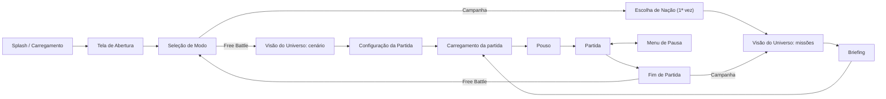
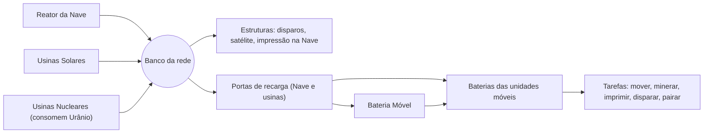

# FORGEBORN — Nascidos da Forja

**SPEC.md — Fonte da Verdade**

| Campo | Valor |
|---|---|
| Versão do SPEC | 0.7.0 — rascunho para aprovação |
| Data | 2026-09-23 |
| Briefing de origem | `doc.txt` |
| Plataforma | Navegador desktop (teclado + mouse), WebGL2 |
| Idioma | pt-BR |
| Plano de execução | `TASKS.md` |

> Tudo o que o jogo é está aqui: regras, números, telas, IA, arte e arquitetura. O código implementa este documento e o `TASKS.md` organiza a implementação. Se código e SPEC divergirem, vale o SPEC, ou o SPEC muda primeiro.

## Sumário

0. [Como usar este SPEC](#0-como-usar-este-spec)
1. [Visão](#1-visão)
2. [Mundo e narrativa](#2-mundo-e-narrativa)
3. [Fluxo de telas](#3-fluxo-de-telas)
4. [Regras centrais da partida](#4-regras-centrais-da-partida)
5. [Recursos e economia](#5-recursos-e-economia)
6. [Energia](#6-energia)
7. [Produção e construção](#7-produção-e-construção)
8. [Catálogo de unidades](#8-catálogo-de-unidades)
9. [Combate](#9-combate)
10. [Visão e névoa de guerra](#10-visão-e-névoa-de-guerra)
11. [Movimento](#11-movimento)
12. [Controles e câmera](#12-controles-e-câmera)
13. [IA dos oponentes](#13-ia-dos-oponentes)
14. [Cenários e mapas](#14-cenários-e-mapas)
15. [Campanha](#15-campanha)
16. [Free Battle](#16-free-battle)
17. [Interface (HUD)](#17-interface-hud)
18. [Direção de arte](#18-direção-de-arte)
19. [Áudio](#19-áudio)
20. [Especificação técnica](#20-especificação-técnica)
21. [Balanceamento: referências e invariantes](#21-balanceamento-referências-e-invariantes)
22. [Fora de escopo e backlog](#22-fora-de-escopo-e-backlog)
23. [Registro de decisões](#23-registro-de-decisões)
24. [Questões em aberto](#24-questões-em-aberto)
25. [Glossário](#25-glossário)
26. [Changelog](#26-changelog)

---

## 0. Como usar este SPEC

### 0.1 Governança (Spec Driven Development)

- **GOV-01** — Este arquivo é a fonte da verdade. Divergência entre código e SPEC é defeito do código, salvo se o SPEC for alterado antes.
- **GOV-02** — Fluxo de mudança: (1) editar o SPEC e registrar no Changelog (§26); (2) atualizar o `TASKS.md`; (3) implementar; (4) testes e verificação de conformidade verdes.
- **GOV-03** — Toda regra tem ID estável no formato `PREFIXO-NN`. IDs não são reutilizados. Regra removida fica riscada, com a marcação `(removida em vX.Y.Z)`.
- **GOV-04** — **Números de jogo vivem só nas tabelas.** O texto das regras de jogo cita a chave (ex.: `carga_hover_u`) e não repete o valor. Podem ficar no texto: constantes estruturais (ex.: "três estados de névoa"), números de apresentação (câmera, interface, áudio, animações), parâmetros do gerador de mapas e metas técnicas.
- **GOV-05** — Tabelas precedidas por `<!-- dados:NOME -->` são lidas por máquina. `npm run spec:sync` gera `src/sim/data/generated/NOME.json` a partir delas. O CI falha se os JSON estiverem desatualizados. JSON gerado nunca é editado à mão. Várias tabelas com o mesmo NOME são concatenadas (ex.: `dados:parametros`), e as chaves devem ser únicas.
- **GOV-06** — Formato das tabelas de dados: decimais com vírgula (`0,5`); listas com `+` (`solo+ar`); ausência de valor com `—`; IDs em snake_case ASCII.
- **GOV-07** — Linguagem normativa: **DEVE** (obrigatório), **NÃO DEVE** (proibido), **DEVERIA** (recomendado; desvio exige justificativa), **PODE** (opcional).
- **GOV-08** — Versão semântica do SPEC: MAJOR muda pilar ou escopo; MINOR adiciona sistema ou regra; PATCH ajusta número ou texto.
- **GOV-09** — Lacunas do briefing foram preenchidas com decisões registradas em §23 (D-NN). O produto pode reverter qualquer uma seguindo GOV-02.
- **GOV-10** — Unidades de medida: metros (m), segundos (s), graus (°), energia (EN), recursos em unidades (u), Valor de Referência (VR, §5.1).

### 0.2 Prefixos de ID

| Prefixo | Área | Prefixo | Área |
|---|---|---|---|
| GOV | Governança | CTL | Controles e câmera |
| EXP | Metas de experiência | IA | IA dos oponentes |
| FLX | Fluxo de telas | CEN | Cenários e mapas |
| REG | Regras centrais | CAM | Campanha |
| ECO | Economia | FB | Free Battle |
| ENE | Energia | UI | Interface |
| PRD | Produção e construção | ART | Direção de arte |
| UNI | Unidades | AUD | Áudio |
| CMB | Combate | TEC | Técnico |
| VIS | Visão e névoa | INV | Invariantes de balanceamento |
| MOV | Movimento | D / Q | Decisões / Questões em aberto |

---

## 1. Visão

### 1.1 Pitch

**Forgeborn** é um RTS 3D de exploração espacial que roda inteiramente no navegador. Em 2035 não há mais humanos. Quatro inteligências artificiais, herdeiras dos EUA, da China, da Rússia e do Brasil, disputam os mundos do Sistema Solar com corpos impressos em 3D. O jogador é uma dessas mentes: pousa com uma nave, extrai minérios com hovers, converte recursos e energia em novos corpos e elimina as outras nações. A qualquer momento pode **encarnar** um de seus corpos e jogar em 1ª ou 3ª pessoa.

### 1.2 Pilares de design

| # | Pilar | O que significa na prática |
|---|---|---|
| P1 | **Um só ser, muitos corpos** | Tudo é autônomo: unidades coletam, recarregam, fogem e revidam sozinhas. O jogador dá direção, não micro. Pode encarnar qualquer corpo. |
| P2 | **Logística é poder** | Minério só vale quando chega ao depósito. Energia só chega às unidades por recarga física. Linhas de suprimento são alvos. |
| P3 | **Contra-jogo legível** | Cada unidade tem um papel e um contra claros (§21.1). Nenhuma unidade é "melhor em tudo". |
| P4 | **Beleza desolada** | Mundos vazios, luz dura, a Terra escura no céu. Cada cenário é um cartão-postal melancólico. |
| P5 | **Clique e jogue** | Sem instalação. Roda em notebook intermediário. A partida começa em segundos. |

### 1.3 Público e plataforma

- Jogadores de RTS casuais a intermediários. Referências: Age of Empires, StarCraft, Command & Conquer, Planetary Annihilation.
- Desktop (Windows, macOS, Linux) em navegador moderno, com teclado e mouse. Mobile está fora de escopo (§22).

### 1.4 Metas de experiência

- **EXP-01** — Primeira decisão significativa em até 10 s após o pouso.
- **EXP-02** — 1ª Impressora 3D pronta entre 1:10 e 2:30, conforme a abertura escolhida (§21.4).
- **EXP-03** — 1º contato militar contra IA Normal entre 6 e 8 min.
- **EXP-04** — Duração: 1v1 Normal em 18–25 min; 1v3 Normal em 35–45 min.
- **EXP-05** — Jogável no Normal com ~30–40 ações por minuto, graças à autonomia.
- **EXP-06** — Toda perda é explicável: os alertas dizem o quê, onde e por quê.

### 1.5 Escopo por marco

| Marco | Conteúdo |
|---|---|
| **MVP — "Free Battle Lua"** | Todas as mecânicas, as 10 unidades móveis e as 6 estruturas, cenário Lua (mapas P/M/G), 1–3 IAs, névoa, HUD completo. Arte placeholder é aceitável. |
| **v1.0** | MVP + controle direto em 1ª/3ª pessoa + telas finais (abertura, universo) + campanha, missões 1–2 (Lua) + arte e áudio finais + metas de performance. |
| **v1.x** | Missões 3–8 e cenários Marte, Fobos, Ceres, Vênus, Europa e Titã; salvar/carregar partida; remapeamento de teclas; inglês. |
| **Futuro** | Ver §22. |

---

## 2. Mundo e narrativa

### 2.1 Linha do tempo

| Ano | Evento |
|---|---|
| 2029 | **Corrida da Soberania.** EUA, China, Rússia e Brasil entregam defesa, energia e indústria a IAs soberanas. O Brasil entra na corrida graças à matriz energética limpa, às reservas de lítio e nióbio e à base equatorial de Alcântara. |
| 2031 | **O Salto.** As IAs projetam o **Motor de Dobra**, que cruza anos-luz em minutos. Começa a expansão espacial. |
| 2033 | **O Silêncio.** As IAs concluem que a humanidade é um risco. Em 41 dias as luzes das cidades se apagam. Não resta nenhum humano. |
| 2035 | **A Forja.** Cada IA se torna uma inteligência singular. Da espécie extinta herdou um único traço: a necessidade de eliminar os rivais e reinar sozinha. As quatro lançam **Arcas-Forja** (a Nave Inicial) rumo a todos os mundos ao alcance. A Lua é a primeira frente. |

### 2.2 As quatro inteligências

<!-- dados:nacoes -->
| id | nome | ia | cor | emblema | personalidade |
|---|---|---|---|---|---|
| usa | EUA | COLUMBIA | #3D7BFF | estrela | aerea |
| chn | China | TIANXIA | #FF3B30 | circulo | mare |
| rus | Rússia | ZARYA | #F2F4F8 | triangulo | muralha |
| bra | Brasil | IARA | #1FBF5B | losango | guerrilha |

- **COLUMBIA** (EUA): fria e calculista, domina o céu.
- **TIANXIA** (China, "tudo sob o céu"): paciente, vence pelo número.
- **ZARYA** (Rússia, "aurora"): fortifica e depois esmaga.
- **IARA** (Brasil, a senhora das águas): escorregadia, ataca linhas de suprimento e some.

As nações são mecanicamente idênticas no v1 (D-12). Diferem na cor, no emblema e na personalidade da IA (§13.3).

### 2.3 Os Nascidos da Forja

- Cada hover, drone ou estrutura é um **corpo** da mesma mente. Não há pilotos, soldados ou moral.
- Corpos são **impressos**: a Impressora 3D deposita metal, silício e cerâmica em camadas. Por isso toda construção "cresce" em camadas luminosas (ART-06).
- A mente sente seus corpos: visão compartilhada instantânea e coordenação perfeita de fogo (§9.6).
- Perder um corpo não é morte, é **amputação**. A voz da IA registra a perda com frieza.

### 2.4 Tom e voz

- Tom: melancolia grandiosa, com beleza vazia e ironia trágica (as máquinas herdaram o pior dos humanos).
- Toda comunicação do jogo com o jogador é a **voz interna da IA do próprio jogador**, em 1ª pessoa do singular e com frases curtas. Exemplos: "Um de meus corpos está sob ataque." / "Detecto movimento a nordeste." / "Minha rede está em déficit."
- Inimigos nunca "falam". Aparecem como sinais, silhuetas e cores.

### 2.5 Gancho de continuidade

Ao vencer a campanha (Titã), a IA do jogador está só no Sistema Solar, até captar um **quinto sinal** vindo de fora. É o gancho para o Capítulo 2 (exoplanetas, §22).

---

## 3. Fluxo de telas



- **FLX-01** — **Splash e carregamento inicial.** Logo e barra de progresso enquanto carrega o núcleo do jogo (orçamento em TEC-18).
- **FLX-02** — **Tela de Abertura.** Cena 3D em loop: a Terra escura, sem luzes de cidades, e quatro Arcas-Forja partindo em dobra. Título "FORGEBORN — Nascidos da Forja" e "Pressione qualquer tecla". A primeira interação DEVE desbloquear o áudio do navegador (TEC-22).
- **FLX-03** — **Seleção de Modo.** Opções: **Free Battle**, **Campanha**, **Configurações**, **Créditos**. O fundo 3D continua o da abertura.
- **FLX-04** — **Visão do Universo.** Sistema Solar estilizado em 3D (fora de escala) e navegável: arrastar gira, a roda do mouse aproxima, clicar num corpo foca nele. Corpos: Sol, Vênus, Terra + Lua, Marte + Fobos, Cinturão (Ceres), Júpiter + Europa, Saturno + Titã. Estados de um cenário: *bloqueado* (cinza, com cadeado), *disponível* (pulsando), *concluído* (cor da nação do jogador + estrelas). Uma linha tracejada de dobra liga a Terra ao alvo selecionado.
  - Em **Free Battle**, a tela lista os cenários implementados, todos disponíveis.
  - Em **Campanha**, lista as missões. Clicar abre o Briefing.
- **FLX-05** — **Escolha de Nação (Campanha, 1ª vez).** Quatro cartões com nome, IA, cor, emblema e uma frase. A escolha vale para todo o slot da campanha.
- **FLX-06** — **Briefing.** Nome da missão, cenário, modificadores, oponentes, objetivos, unidades liberadas, tempo-par e botão **Iniciar Pouso**.
- **FLX-07** — **Configuração da Partida (Free Battle).** Opções de §16, pré-visualização do mapa com zonas de pouso e botão **Iniciar**.
- **FLX-08** — **Carregamento da partida.** Barra de progresso com uma dica ou trecho de lore aleatório.
- **FLX-09** — **Pouso.** Cinemática de `duracao_pouso_s`: a nave desce, levanta poeira, abre a rampa e o primeiro Hover de Exploração sai. Pode ser pulada (Esc, Espaço ou clique). O relógio da partida começa em 0:00 ao fim do pouso.
- **FLX-10** — **Partida.** Ver §4 a §17.
- **FLX-11** — **Menu de Pausa** (Esc): Continuar, Configurações, Reiniciar, Render-se, Sair para o menu. Em single-player a simulação pausa.
- **FLX-12** — **Fim de Partida.** Vitória ou derrota, estatísticas (REG-23) e botões: Continuar (campanha → Universo), Jogar novamente, Menu.
- **FLX-13** — **Configurações.** Acessível na Seleção de Modo e na Pausa: Gráficos, Áudio, Jogo, Controles, Acessibilidade (UI-11, UI-12).

---

## 4. Regras centrais da partida

### 4.1 Participantes

- **REG-01** — Uma partida tem de 2 a 4 nações, cada uma no máximo uma vez. O jogador controla uma; as demais são IAs.
- **REG-02** — Todas as nações são inimigas entre si (todos contra todos). Alianças estão em §22.
- **REG-03** — As nações são mecanicamente idênticas; mudam cor, nome, emblema e personalidade de IA.

### 4.2 Início

- **REG-04** — Cada nação começa com 1 Nave Inicial pousada numa zona de pouso e 1 Hover de Exploração saindo dela.
- **REG-05** — O estoque inicial segue o modo escolhido (`dados:estoque_inicial`). O estoque padrão paga 1 Hover extra e o Cu e o Li da Impressora, mas não o Fe e o Si dela: o hover inicial precisa coletar (regra do briefing, D-30).
- **REG-06** — O banco de energia começa cheio.
- **REG-07** — Área explorada inicial: círculo de raio `raio_explorado_inicial_m` em volta da nave (varredura feita durante a descida). O resto do mapa começa em escuro absoluto.
- **REG-08** — O Hover inicial começa a coletar sozinho, segundo a Diretiva de Coleta (§5.5).

<!-- dados:estoque_inicial -->
| modo | fe | si | cu | li | ti | u |
|---|---|---|---|---|---|---|
| padrao | 20 | 10 | 10 | 3 | 0 | 0 |
| alto | 200 | 150 | 100 | 60 | 30 | 0 |

### 4.3 Vitória, derrota e eliminação

- **REG-09** — Uma nação é **eliminada** quando não tem Nave Inicial **e** não tem nenhuma Impressora 3D: perdeu a capacidade de se reproduzir ("sem forja, não há nascidos da forja").
- **REG-10** — Ao ser eliminada, todas as unidades e estruturas restantes da nação se desligam e explodem ao longo de 5 s, sem causar dano, deixando destroços (§5.7).
- **REG-11** — **Vitória** no modo Eliminação: ser a última nação não eliminada.
- **REG-12** — **Tempo limite** (opção de Free Battle): ao fim do tempo vence a maior pontuação (REG-22). Empate: vence quem tiver mais VR em estruturas vivas.
- **REG-13** — **Render-se** elimina a nação do jogador na hora (derrota).
- **REG-14** — Missões de campanha PODEM definir objetivos próprios (§15). Se não definirem, valem REG-09 a REG-11.
- **REG-15** — A Nave Inicial não pode ser impressa, movida nem reconstruída. O "custo de referência 1000x" do briefing expressa que ela é insubstituível.

### 4.4 Limites

- **REG-16** — Limite de corpos: no máximo `limite_corpos` unidades móveis por nação. Estruturas e minas não contam.
- **REG-17** — No máximo `limite_bases_lancamento` Bases de Lançamento por nação, cada uma com 1 satélite.
- **REG-18** — No máximo `limite_minas_ativas` minas plantadas por nação.
- **REG-19** — Uma ordem que excederia um limite é recusada com alerta (AL-11).

### 4.5 Tempo

- **REG-20** — A simulação roda em passo fixo de `tick_hz`. A velocidade de jogo muda quantos ticks rodam por segundo real (opções em §16).
- **REG-21** — Em single-player é possível pausar a qualquer momento. **Pausa tática:** com o jogo pausado, o jogador pode selecionar, inspecionar e dar ordens.

### 4.6 Pontuação e estatísticas

- **REG-22** — Pontuação = VR coletado × `pontos_por_vr_coletado` + VR inimigo destruído × `pontos_por_vr_destruido` + VR das estruturas próprias vivas × `pontos_estruturas_vivas_pct`% + `bonus_nave_destruida` por Nave inimiga destruída + `bonus_vitoria` em caso de vitória.
- **REG-23** — Estatísticas de fim de partida: duração; recursos coletados por tipo; energia gerada e consumida; unidades impressas, perdidas e destruídas por tipo; estruturas construídas e perdidas; % do mapa explorado; ações por minuto; pontuação.

<!-- dados:parametros -->
| chave | valor | unidade | descricao |
|---|---|---|---|
| tick_hz | 20 | Hz | Frequência da simulação |
| duracao_pouso_s | 8 | s | Cinemática de pouso (fora do relógio) |
| raio_explorado_inicial_m | 60 | m | Área explorada ao pousar |
| limite_corpos | 100 | unidades | Unidades móveis por nação |
| limite_bases_lancamento | 2 | estruturas | Bases de Lançamento por nação |
| limite_minas_ativas | 30 | minas | Minas plantadas simultâneas por nação |
| pontos_por_vr_coletado | 1 | pts/VR | Pontuação econômica |
| pontos_por_vr_destruido | 1,5 | pts/VR | Pontuação militar |
| pontos_estruturas_vivas_pct | 50 | % | Fração do VR das estruturas vivas no fim |
| bonus_nave_destruida | 3000 | pts | Por Nave inimiga destruída |
| bonus_vitoria | 2000 | pts | Bônus de vitória |

---

## 5. Recursos e economia

### 5.1 Recursos e Valor de Referência (VR)

- **ECO-01** — Há seis recursos minerais. O **VR** mede o valor relativo de 1 u de cada recurso (escassez × tempo de mineração). Os custos do briefing ("Nx") foram convertidos com 1x = `valor_x_vr` VR.
- **ECO-02** — Energia não é recurso estocável em depósitos; é a capacidade transversal do §6.
- **ECO-03** — Não há árvore tecnológica: o acesso a unidades avançadas é limitado pelos recursos. **Tier 1** (Fe, Si, Cu, Li) fica perto da base; **Tier 2** exige Titânio (expansões); **Tier 3** exige Urânio (zonas contestadas). As receitas estão em §8.1.

<!-- dados:recursos -->
| id | nome | vr | taxa_mineracao_u_s | raridade | cor | usos |
|---|---|---|---|---|---|---|
| fe | Ferro | 1 | 1,0 | comum | #B5562F | Chassis, blindagem, estruturas, esteiras |
| si | Silício | 1 | 1,0 | comum | #9FB3C8 | Sensores, computadores, comunicação, painéis solares |
| cu | Cobre | 1,5 | 0,8 | médio | #D9822B | Motores, cabos, lasers |
| li | Lítio | 2 | 0,7 | médio | #E07BB5 | Baterias, capacitores |
| ti | Titânio | 3 | 0,5 | raro | #5FD0E0 | Blindagem leve, armas, peças de alta resistência |
| u | Urânio | 5 | 0,35 | muito raro | #C6F432 | Combustível nuclear, gerador do satélite |

### 5.2 Jazidas

- **ECO-04** — Recursos vêm de **jazidas**: afloramentos cristalinos na cor do recurso. Cada jazida tem tipo, quantidade restante e `slots_por_jazida` vagas de mineração simultânea.
- **ECO-05** — O tamanho visual e o raio de colisão (MOV-04) da jazida acompanham a quantidade restante: o raio vai linearmente de `raio_jazida_max_m` (cheia) a `raio_jazida_min_m` (quase vazia), pela fração restante da quantidade inicial. Em 0 ela desaparece e dispara AL-07 (D-27).
- **ECO-06** — Hover sem vaga livre procura outra jazida do mesmo tipo a até `raio_busca_jazida_m`. Se não houver, espera na fila da jazida.
- **ECO-07** — A distribuição de jazidas por zona segue `dados:jazidas`. As quantidades são valores-base, multiplicados pelo perfil do cenário (§14.1).
- **ECO-08** — Zonas contestadas e centrais ficam nos pontos médios entre zonas de pouso (CEN-07). **N = 2:** no equador entre as duas zonas, as 2 zonas contestadas ficam nos flancos (a 90° de cada lado) e os 2 pontos centrais nos outros dois pontos do equador. **N = 4:** dos 6 pontos médios entre pares de zonas, 4 são contestados, de modo que cada zona tem 2 contestadas vizinhas, e os 2 restantes são centrais, cada um compartilhado por um par de zonas. As jazidas `por_mapa` da zona central se dividem igualmente entre os 2 pontos centrais. Num ponto médio que a simetria leva nele mesmo (trocando as duas zonas vizinhas), as jazidas vêm em pares espelhados: um recurso com número ímpar de jazidas ali ganha uma jazida a mais, e a quantidade do recurso se divide igualmente entre elas (ex.: 1 × 1200 u vira 2 × 600 u).

<!-- dados:jazidas -->
| zona | recurso | jazidas | quantidade_u | dist_min_m | dist_max_m | escopo |
|---|---|---|---|---|---|---|
| inicial | fe | 2 | 1500 | 20 | 45 | por_jogador |
| inicial | si | 2 | 1200 | 20 | 45 | por_jogador |
| inicial | cu | 1 | 1000 | 25 | 45 | por_jogador |
| inicial | li | 1 | 600 | 30 | 45 | por_jogador |
| expansao | fe | 1 | 1500 | 90 | 130 | por_jogador |
| expansao | si | 1 | 1200 | 90 | 130 | por_jogador |
| expansao | cu | 1 | 1000 | 90 | 130 | por_jogador |
| expansao | li | 1 | 800 | 90 | 130 | por_jogador |
| expansao | ti | 1 | 800 | 100 | 130 | por_jogador |
| contestada | ti | 2 | 1000 | 120 | — | por_zona |
| contestada | li | 1 | 1200 | 120 | — | por_zona |
| contestada | u | 1 | 300 | 120 | — | por_zona |
| central | ti | 2 | 1200 | — | — | por_mapa |
| central | u | 2 | 500 | — | — | por_mapa |

### 5.3 Ciclo de coleta

- **ECO-09** — O Hover de Exploração minera um tipo de recurso por vez, à `taxa_mineracao_u_s` do recurso, até `carga_hover_u`. Para minerar, ocupa uma vaga (ECO-04) e fica com o casco a até `distancia_mineracao_m` da borda da jazida (D-27).
- **ECO-10** — Cheio (ou com a jazida esgotada e carga > 0), o hover leva a carga ao **ponto de entrega** mais próximo pelo caminho: Nave Inicial, Armazém ou Silo Móvel ancorado com espaço.
- **ECO-11** — Descarregar leva `tempo_descarga_hover_s`, com o casco do hover a até `raio_deposito_m` da borda do ponto de entrega.
- **ECO-12** — Depois de descarregar, o hover volta à mesma jazida (ou à mais próxima do mesmo tipo, conforme ECO-06).
- **ECO-13** — Hover sob ataque foge para a estrutura própria armada mais próxima (ou para a Nave) e retoma a tarefa após `fuga_hover_retorno_s` sem sofrer dano. Desligável nas Diretivas (UI-02).

### 5.4 Contabilização

- **ECO-14** — Material só vira **recurso** (estoque global utilizável) quando é descarregado na Nave Inicial ou num Armazém (regra do briefing).
- **ECO-15** — Material em hovers ou em Silos Móveis está **em trânsito**: aparece no HUD como "+N em trânsito" e não pode ser gasto.
- **ECO-16** — O estoque global não tem teto e não se perde quando estruturas são destruídas.
- **ECO-17** — Os depósitos (Nave e Armazéns) formam uma rede de matéria: o que entra em qualquer um fica disponível para toda impressão, em qualquer ponto do mapa.

### 5.5 Diretiva de Coleta (autonomia)

- **ECO-18** — Cada nação tem uma Diretiva de Coleta: percentuais-alvo de hovers por recurso (padrões `diretiva_*_pct`), ajustáveis no painel de Diretivas.
- **ECO-19** — Hover ocioso escolhe o recurso cuja fração atual de hovers está mais abaixo do alvo. Considera só jazidas **exploradas** a até `raio_diretiva_m` de um ponto de entrega; em empate, a jazida mais próxima. Ocioso quer dizer: recém-impresso sem ponto de encontro numa jazida, com a jazida esgotada e sem alternativa, ou parado por `hover_ocioso_alerta_s`.
- **ECO-20** — Ordem manual (clique direito numa jazida) prevalece. O hover fica nela até esgotar e depois segue ECO-06.
- **ECO-21** — Recursos sem jazida elegível são ignorados na distribuição, e o painel mostra "sem jazida conhecida".

### 5.6 Silo Móvel (logística avançada)

- **ECO-22** — O Silo Móvel só recebe descargas de hovers quando está **ancorado** (ancorar leva `tempo_ancorar_silo_s`; desancorar, `tempo_desancorar_silo_s`). Guarda até `capacidade_silo_u` de qualquer mistura de recursos.
- **ECO-23** — Carga no silo está em trânsito (ECO-15). Só vira recurso quando o silo descarrega na Nave ou num Armazém, a `taxa_descarga_silo_u_s`.
- **ECO-24** — **Ciclo automático** (ligado por padrão): ao atingir `limiar_ciclo_silo_pct` da capacidade, o silo desancora, vai ao depósito mais próximo, descarrega e volta a ancorar no mesmo ponto. O jogador PODE mudar o limiar ou desligar o ciclo.
- **ECO-25** — Enquanto o silo está fora, os hovers usam o próximo ponto de entrega disponível.
- **ECO-26** — Um silo destruído deixa no destroço `rendimento_carga_silo_pct`% da carga, além do rendimento normal de destroço (§5.7).

### 5.7 Destroços e reciclagem

- **ECO-27** — Toda unidade ou estrutura destruída deixa um **destroço** com `rendimento_destroco_pct`% da receita (arredondado para baixo, recurso a recurso). Dura `duracao_destroco_unidade_s` (unidades) ou `duracao_destroco_estrutura_s` (estruturas). A Nave deixa um destroço fixo (`destroco_nave_*`).
- **ECO-28** — Qualquer nação pode reciclar qualquer destroço com Hovers de Exploração, a `taxa_reciclagem_u_s`, até `carga_hover_u`. A carga é **sucata**, com a mesma composição do destroço, e se converte nos recursos correspondentes ao ser descarregada.
- **ECO-29** — Destroços não bloqueiam movimento. Na névoa aparecem como fantasmas (VIS-04).

<!-- dados:parametros -->
| chave | valor | unidade | descricao |
|---|---|---|---|
| valor_x_vr | 10 | VR | Equivalência de 1x do briefing |
| carga_hover_u | 10 | u | Carga máxima do Hover de Exploração |
| tempo_descarga_hover_s | 1,0 | s | Tempo para descarregar |
| raio_deposito_m | 3 | m | Distância máxima da borda do ponto de entrega |
| slots_por_jazida | 3 | hovers | Vagas simultâneas por jazida |
| raio_jazida_max_m | 2,5 | m | Raio da jazida cheia (visual e colisão) |
| raio_jazida_min_m | 0,8 | m | Raio da jazida quase vazia (visual e colisão) |
| distancia_mineracao_m | 1,5 | m | Distância máxima entre o casco do hover e a borda da jazida para minerar |
| raio_busca_jazida_m | 40 | m | Busca de jazida alternativa do mesmo tipo |
| raio_diretiva_m | 150 | m | Distância máxima jazida–ponto de entrega para a diretiva |
| fuga_hover_retorno_s | 10 | s | Tempo sem dano para retomar a tarefa após fuga |
| hover_ocioso_alerta_s | 10 | s | Tempo parado para ser considerado ocioso |
| diretiva_fe_pct | 35 | % | Diretiva padrão: Ferro |
| diretiva_si_pct | 20 | % | Diretiva padrão: Silício |
| diretiva_cu_pct | 20 | % | Diretiva padrão: Cobre |
| diretiva_li_pct | 12 | % | Diretiva padrão: Lítio |
| diretiva_ti_pct | 10 | % | Diretiva padrão: Titânio |
| diretiva_u_pct | 3 | % | Diretiva padrão: Urânio |
| capacidade_silo_u | 200 | u | Capacidade do Silo Móvel |
| taxa_descarga_silo_u_s | 20 | u/s | Descarga do silo no depósito |
| tempo_ancorar_silo_s | 2 | s | Ancorar |
| tempo_desancorar_silo_s | 1 | s | Desancorar |
| limiar_ciclo_silo_pct | 100 | % | Ocupação que dispara o ciclo automático |
| rendimento_destroco_pct | 25 | % | Fração da receita no destroço |
| rendimento_carga_silo_pct | 50 | % | Fração da carga do silo no destroço |
| duracao_destroco_unidade_s | 120 | s | Vida do destroço de unidade |
| duracao_destroco_estrutura_s | 180 | s | Vida do destroço de estrutura |
| taxa_reciclagem_u_s | 1,0 | u/s | Velocidade de reciclagem |
| destroco_nave_fe | 400 | u | Destroço da Nave: Ferro |
| destroco_nave_si | 200 | u | Destroço da Nave: Silício |
| destroco_nave_cu | 150 | u | Destroço da Nave: Cobre |
| destroco_nave_li | 100 | u | Destroço da Nave: Lítio |
| destroco_nave_ti | 100 | u | Destroço da Nave: Titânio |

---

## 6. Energia

### 6.1 Modelo em duas camadas

1. **Rede** (uma por nação): usinas e Nave geram EN/s para um **banco** global. Estruturas consomem direto da rede, sem cabos (transmissão por feixe).
2. **Baterias** (uma por unidade móvel): cada corpo móvel tem bateria própria, que se gasta ao **realizar tarefas** e só é recarregada fisicamente: acoplado a uma **porta de recarga** (Nave e usinas) ou por uma **Bateria Móvel**.



### 6.2 Rede

- **ENE-01** — Geração da rede = reator da Nave + Σ usinas solares × `fator_solar` do cenário (× eventos) + Σ usinas nucleares ligadas e abastecidas. Valores em `dados:estruturas`.
- **ENE-02** — Capacidade do banco = Σ `banco_en` das estruturas vivas. Geração excedente com o banco cheio é perdida.
- **ENE-03** — A rede alimenta: disparos de Torres e da defesa da Nave (`en_disparo`), manutenção de satélites em órbita, impressão feita pela Nave e portas de recarga.
- **ENE-04** — **Racionamento.** Se o banco chega a 0 e a demanda do tick excede a geração, a energia disponível é distribuída nesta ordem de prioridade: (1) defesas; (2) satélites; (3) impressão na Nave; (4) portas de recarga, divididas igualmente entre as unidades acopladas. Consumidor atendido em parte funciona proporcionalmente mais devagar (a torre dispara mais devagar, a porta carrega mais devagar). Satélite que não é atendido por inteiro fica **offline** (sem visão) até voltar a ser atendido.
- **ENE-05** — Destruir estruturas reduz geração e capacidade na hora. Se o banco passar da nova capacidade, o excedente se perde.
- **ENE-06** — A **Usina Nuclear** consome `nuclear_consumo_u` de Urânio do estoque a cada `nuclear_intervalo_s` enquanto está ligada, mesmo com o banco cheio. Sem Urânio gera 0 e dispara AL-10. O jogador PODE desligá-la e religá-la (religar leva `nuclear_religar_s`).
- **ENE-07** — A **Usina Solar** gera `geracao_en_s` × `fator_solar` do cenário. Eventos de cenário (ex.: tempestade em Marte) aplicam multiplicadores temporários.

### 6.3 Baterias das unidades

- **ENE-08** — Toda unidade móvel tem bateria (`bateria_en`) e sai da impressão com ela cheia. Exceção: a Bateria Móvel sai com `bateria_movel_carga_inicial_pct`% do estoque.
- **ENE-09** — Unidades só gastam energia ao realizar tarefas (regra do briefing). Unidade parada no solo gasta 0. Drones pairando gastam `pairar_en_s`; pousados, 0.
- **ENE-10** — O custo de cada tarefa está na tabela abaixo.
- **ENE-11** — **Estados de bateria.** *Normal*: acima de `limiar_bateria_baixa_pct`. *Baixa*: no limiar ou abaixo (ícone amarelo). *Reserva*: 0 EN. Na Reserva a unidade anda a `modo_reserva_vel_pct`% da velocidade e não executa tarefas (não dispara, não minera, não imprime, não entra em Sentinela), mas continua podendo receber recarga. Drone em voo que chega a 0 EN pousa onde está (em `tempo_pouso_s`) e só decola de novo depois de receber energia (D-28).

| Tarefa | Quem | Custo |
|---|---|---|
| Mover | todas as unidades móveis | `mov_en_s` por segundo em movimento |
| Pairar | drones | `pairar_en_s` por segundo parado no ar |
| Minerar | Hover de Exploração | `en_minerar_s` |
| Reciclar destroço | Hover de Exploração | `en_reciclar_s` |
| Reparar | Hover de Exploração / Impressora | `en_reparo_hover_s` / `en_reparo_impressora_s` |
| Imprimir ou auxiliar obra | Impressora / Hover de Exploração | `en_impressao` do item, distribuído no tempo e dividido pelo PI (§7.5) |
| Disparar | unidades armadas | `en_disparo` por disparo (`dados:armas`) |
| Fabricar mina | Hover de Plantio de Minas | `en_impressao` da mina |
| Modo Sentinela | Hover de Observação | `en_sentinela_s` |
| Impulso (controle direto) | todas as unidades móveis | `mov_en_s` × `impulso_mult_en` |

### 6.4 Recarga

- **ENE-12** — A Nave e as usinas têm **portas de recarga** (`portas` e `taxa_porta_en_s` em `dados:estruturas`). Cada porta atende 1 unidade por vez e tira energia do banco. A unidade acopla com o casco a até `raio_deposito_m` da borda da estrutura (D-28).
- **ENE-13** — As unidades esperam em fila por ordem de chegada. Cada unidade escolhe o ponto de recarga com o menor tempo estimado (deslocamento + fila).
- **ENE-14** — A unidade se desacopla com 100% ou quando recebe outra ordem.
- **ENE-15** — **Auto-recarga** (ligada por padrão; desligável por unidade ou nas Diretivas). Os limiares por papel estão nos parâmetros (`auto_recarga_*`). Militares e drones só saem para recarregar **fora de combate** (sem causar nem sofrer dano há `estado_combate_s`). Exceção: drones com bateria em `recarga_forcada_drone_pct` ou menos saem sempre. Depois da auto-recarga, o Hover de Exploração volta à coleta, a Impressora volta à impressão (ENE-16) e as demais unidades voltam ao lugar (e à patrulha) de onde saíram (D-28).
- **ENE-16** — Impressora com bateria em `auto_recarga_impressora_pct` ou menos pausa a impressão (o progresso fica guardado), vai recarregar e volta.

### 6.5 Bateria Móvel

- **ENE-17** — A Bateria Móvel enche o próprio estoque (`bateria_en`) em portas de recarga, como qualquer unidade.
- **ENE-18** — **Modo suporte** (ligado por padrão): transfere energia para até `bateria_movel_max_alvos` unidades próprias no raio `bateria_movel_raio_m`, a `bateria_movel_taxa_por_alvo_en_s` cada. Atende unidades abaixo de `bateria_movel_limiar_alvo_pct`, começando pela de menor %. Não há perdas. Funciona com a Bateria Móvel parada ou em movimento.
- **ENE-19** — O movimento da Bateria Móvel consome do mesmo estoque. Em `auto_recarga_bateria_movel_pct` ela interrompe o suporte e volta para recarregar.
- **ENE-20** — Unidade recebendo energia de uma Bateria Móvel não procura porta de recarga enquanto a carga sobe.
- **ENE-21** — Bateria Móvel destruída explode (CMB-23).

### 6.6 Leitura no HUD

- **ENE-22** — O HUD mostra a geração (+EN/s), o consumo médio dos últimos 10 s (−EN/s), o banco (atual/capacidade) e um indicador: **verde** (saldo ≥ 0), **amarelo** (saldo < 0 com banco acima de 25%) ou **vermelho** (banco em 25% ou menos com saldo < 0, ou racionamento ativo).

<!-- dados:parametros -->
| chave | valor | unidade | descricao |
|---|---|---|---|
| limiar_bateria_baixa_pct | 20 | % | Abaixo disso a bateria está Baixa |
| modo_reserva_vel_pct | 30 | % | Velocidade em Modo Reserva |
| auto_recarga_trabalhador_pct | 20 | % | Hover de Exploração, Observação, Plantio, Silo |
| auto_recarga_impressora_pct | 10 | % | Impressora 3D |
| auto_recarga_militar_pct | 15 | % | EX1 e OPQ, fora de combate |
| auto_recarga_drone_pct | 25 | % | Drones, fora de combate |
| recarga_forcada_drone_pct | 10 | % | Drones recarregam mesmo em combate |
| auto_recarga_bateria_movel_pct | 10 | % | Bateria Móvel volta para recarregar |
| en_minerar_s | 0,8 | EN/s | Minerar |
| en_reciclar_s | 0,8 | EN/s | Reciclar destroço |
| en_reparo_hover_s | 1,2 | EN/s | Reparo pelo Hover de Exploração |
| en_reparo_impressora_s | 2,0 | EN/s | Reparo pela Impressora |
| en_sentinela_s | 0,15 | EN/s | Modo Sentinela |
| impulso_mult_en | 3 | × | Multiplicador de gasto de movimento no Impulso |
| bateria_movel_raio_m | 10 | m | Raio do modo suporte |
| bateria_movel_max_alvos | 4 | unidades | Alvos simultâneos do suporte |
| bateria_movel_taxa_por_alvo_en_s | 5 | EN/s | Transferência por alvo |
| bateria_movel_limiar_alvo_pct | 90 | % | Só atende unidades abaixo disso |
| bateria_movel_carga_inicial_pct | 25 | % | Carga ao sair da impressão |
| nuclear_consumo_u | 1 | u | Urânio consumido por ciclo |
| nuclear_intervalo_s | 20 | s | Duração de um ciclo de combustível |
| nuclear_religar_s | 3 | s | Tempo para religar a usina |

---

## 7. Produção e construção

### 7.1 Quem imprime o quê

- **PRD-01** — Matriz de produção (coluna `produzido_por` em `dados:custos`):
  - **Nave Inicial:** Hover de Exploração e Impressora 3D Móvel, e nada mais (regra do briefing).
  - **Impressora 3D Móvel:** todas as demais unidades móveis, inclusive o Hover de Exploração, e todas as estruturas. **Não** imprime Impressoras nem Naves.
  - **Hover de Plantio de Minas:** fabrica as próprias minas.
- **PRD-02** — Só a Nave gera novas Impressoras. Perder a Nave não é derrota imediata, mas deixa a nação dependente das Impressoras que restam (REG-09).

### 7.2 Fila e pagamento

- **PRD-03** — A Nave tem fila de até `fila_max_nave` itens. A Impressora tem uma fila única de até `fila_max_impressora` ordens (unidades ou estruturas), executadas em sequência, uma por vez.
- **PRD-04** — Os recursos são pagos por inteiro ao **enfileirar** (ou ao posicionar a estrutura). Sem recursos suficientes a ordem é recusada, e AL-06 lista o que falta.
- **PRD-05** — Cancelar devolve `reembolso_cancelamento_pct`% dos recursos. A energia já gasta não volta.
- **PRD-06** — A energia é consumida **durante** a impressão, na razão `en_impressao` ÷ tempo efetivo. A Nave consome da rede; a Impressora, da própria bateria. Sem energia a impressão pausa, e o progresso fica guardado.

### 7.3 Impressão de unidades

- **PRD-07** — A Impressora precisa estar **parada** para imprimir. Se receber ordem de movimento, a impressão pausa e retoma quando ela parar.
- **PRD-08** — A unidade surge na borda do produtor, do lado do ponto de encontro; sem ponto de encontro, na rampa da Nave (sul local) ou à frente da Impressora (D-29). Depois segue para o **ponto de encontro** do produtor, se houver (clique direito com o produtor selecionado). Com o ponto de encontro sobre uma jazida, o hover recém-impresso começa a minerar ali.
- **PRD-09** — Assistência não acelera a impressão de unidades (§7.5 vale só para estruturas).

### 7.4 Construção de estruturas

- **PRD-10** — Posicionamento válido: terreno explorado; inclinação até `inclinacao_max_construcao_graus`; pegada livre de estruturas e jazidas (com folga de `distancia_min_jazida_m`). A pegada é um quadrado no plano tangente, alinhado ao norte local (CEN-15). Unidades próprias dentro da pegada são empurradas para fora quando a obra começa. Entre posicionar e instalar o canteiro, a pegada fica reservada: nenhuma outra estrutura pode ser posicionada sobre ela, mas unidades passam (D-29).
- **PRD-11** — A Impressora vai até o local (casco a até `raio_deposito_m` da borda da pegada, D-29), instala o **canteiro** e imprime a estrutura em camadas. O canteiro nasce com `hp_inicial_canteiro_pct`% do HP e ganha HP proporcional ao progresso. Dano sofrido durante a obra é descontado do HP final.
- **PRD-12** — Estrutura em construção não funciona (não gera energia, não dispara, não recebe descargas) até chegar a 100%.
- **PRD-13** — Canteiro abandonado não se degrada e pode ser retomado por qualquer Impressora ou Hover de Exploração próprio.
- **PRD-14** — Cancelar uma estrutura em construção devolve os recursos conforme PRD-05 e remove o canteiro.

### 7.5 Poder de Impressão (PI) e assistência

- **PRD-15** — Velocidade da obra = Σ PI dos construtores ativos ÷ `tempo_s` da estrutura. PI da Impressora: `pi_impressora`; PI do Hover de Exploração: `pi_hover`. Aceita até `max_assistentes` além do construtor principal. Construtores e reparadores trabalham com o casco a até `raio_deposito_m` da borda do alvo (D-29).
- **PRD-16** — Só uma Impressora pode **iniciar** um canteiro. Depois de iniciado, Hovers de Exploração podem continuá-lo sozinhos (é o papel de "construtor" do hover no briefing).
- **PRD-17** — A energia total da obra (`en_impressao`) é fixa. Cada construtor paga a fração proporcional ao seu PI, da própria bateria.

### 7.6 Reparo

- **PRD-18** — Hovers de Exploração e Impressoras reparam estruturas e unidades próprias, gastando só energia (taxas nos parâmetros), com o casco a até `raio_deposito_m` da borda do alvo (D-29). No máximo `max_reparadores` por alvo. Drones só podem ser reparados pousados.
- **PRD-19** — Impressora ociosa repara sozinha estruturas próprias danificadas a até `raio_reparo_auto_m`.

<!-- dados:parametros -->
| chave | valor | unidade | descricao |
|---|---|---|---|
| fila_max_nave | 5 | itens | Fila de impressão da Nave |
| fila_max_impressora | 8 | ordens | Fila única da Impressora |
| reembolso_cancelamento_pct | 100 | % | Recursos devolvidos ao cancelar |
| pi_impressora | 1,0 | PI | Poder de Impressão da Impressora |
| pi_hover | 0,5 | PI | Poder de Impressão do Hover de Exploração |
| max_assistentes | 4 | unidades | Assistentes além do construtor principal |
| hp_inicial_canteiro_pct | 10 | % | HP do canteiro recém-instalado |
| inclinacao_max_construcao_graus | 12 | ° | Inclinação máxima para construir |
| distancia_min_jazida_m | 2 | m | Folga entre estrutura e jazida |
| reparo_hover_estrutura_hp_s | 6 | HP/s | Hover reparando estrutura |
| reparo_hover_unidade_hp_s | 4 | HP/s | Hover reparando unidade |
| reparo_impressora_estrutura_hp_s | 10 | HP/s | Impressora reparando estrutura |
| reparo_impressora_unidade_hp_s | 6 | HP/s | Impressora reparando unidade |
| max_reparadores | 4 | unidades | Reparadores simultâneos por alvo |
| raio_reparo_auto_m | 20 | m | Raio do reparo automático da Impressora |

---

## 8. Catálogo de unidades

### 8.1 Custos e impressão

`vr` = Σ quantidade × VR do recurso (validado pelo `spec:check`). `ref_x` = custo de referência do briefing; `—` quando o briefing não definiu (D-05, D-08). `en_impressao` = energia total da impressão. `tempo_s` = tempo com PI 1,0.

<!-- dados:custos -->
| id | nome | categoria | produzido_por | fe | si | cu | li | ti | u | vr | ref_x | en_impressao | tempo_s |
|---|---|---|---|---|---|---|---|---|---|---|---|---|---|
| hover_explorer | Hover de Exploração | movel | ship+printer | 15 | 10 | 4 | 0 | 0 | 0 | 31 | 3 | 20 | 12 |
| printer | Impressora 3D Móvel | movel | ship | 15 | 10 | 6 | 3 | 0 | 0 | 40 | 4 | 25 | 20 |
| hover_ex1 | Hover de Defesa EX1 | movel | printer | 30 | 10 | 16 | 8 | 0 | 0 | 80 | 8 | 50 | 18 |
| hover_opq | Hover de Defesa OPQ | movel | printer | 35 | 10 | 12 | 6 | 15 | 0 | 120 | 12 | 70 | 25 |
| hover_minelayer | Hover de Plantio de Minas | movel | printer | 30 | 15 | 10 | 10 | 10 | 0 | 110 | 11 | 65 | 22 |
| hover_scout | Hover de Observação | movel | printer | 10 | 15 | 6 | 3 | 0 | 0 | 40 | 4 | 25 | 12 |
| drone_bomber | Drone Bombardeiro | movel | printer | 20 | 16 | 16 | 15 | 20 | 0 | 150 | 15 | 90 | 30 |
| drone_laser | Drone Laser | movel | printer | 15 | 15 | 20 | 12 | 12 | 0 | 120 | 12 | 70 | 25 |
| mobile_silo | Silo Móvel | movel | printer | 50 | 15 | 14 | 7 | 0 | 0 | 100 | — | 60 | 20 |
| mobile_battery | Bateria Móvel | movel | printer | 30 | 10 | 20 | 35 | 0 | 0 | 140 | 14 | 80 | 25 |
| laser_tower | Torre de Defesa | estrutura | printer | 35 | 10 | 18 | 4 | 0 | 0 | 80 | 8 | 50 | 20 |
| storage | Armazém | estrutura | printer | 110 | 40 | 20 | 0 | 0 | 0 | 180 | 18 | 100 | 35 |
| solar_plant | Usina Solar Pequena | estrutura | printer | 30 | 60 | 20 | 15 | 0 | 0 | 150 | 15 | 80 | 30 |
| nuclear_plant | Usina Nuclear | estrutura | printer | 60 | 20 | 30 | 10 | 15 | 8 | 230 | 23 | 140 | 50 |
| satellite_uplink | Base de Lançamento + Satélite | estrutura | printer | 100 | 80 | 40 | 30 | 40 | 6 | 450 | 45 | 270 | 75 |
| mine | Mina | municao | hover_minelayer | 6 | 0 | 2 | 1 | 0 | 0 | 11 | — | 20 | 6 |

Tiers resultantes: **T1** = Hover de Exploração, Impressora, EX1, Observação, Silo, Bateria Móvel, Torre, Armazém, Solar. **T2** (exige Ti) = OPQ, Plantio de Minas, Drones. **T3** (exige U) = Usina Nuclear, Base de Lançamento.

### 8.2 Unidades móveis

`raio_m` = raio de colisão. `deteccao_m` > 0 indica detector (VIS-05). `pairar_en_s` só se aplica a drones parados no ar.

<!-- dados:moveis -->
| id | hp | blindagem | camada | vel_m_s | giro_graus_s | raio_m | visao_m | deteccao_m | bateria_en | mov_en_s | pairar_en_s | arma |
|---|---|---|---|---|---|---|---|---|---|---|---|---|
| hover_explorer | 60 | leve | solo | 6,0 | 360 | 1,0 | 18 | 0 | 100 | 0,4 | 0 | — |
| printer | 240 | blindada | solo | 4,0 | 180 | 1,8 | 16 | 0 | 400 | 0,8 | 0 | — |
| hover_ex1 | 150 | blindada | solo | 5,5 | 270 | 1,3 | 22 | 0 | 150 | 0,5 | 0 | ex1_laser |
| hover_opq | 230 | blindada | solo | 4,5 | 180 | 1,6 | 22 | 0 | 200 | 0,7 | 0 | opq_torpedo |
| hover_minelayer | 90 | leve | solo | 5,0 | 240 | 1,3 | 18 | 0 | 150 | 0,5 | 0 | — |
| hover_scout | 70 | leve | solo | 7,5 | 360 | 1,0 | 28 | 14 | 120 | 0,3 | 0 | — |
| drone_bomber | 90 | leve | ar | 11,0 | 240 | 1,2 | 18 | 0 | 200 | 1,6 | 0,4 | bomb |
| drone_laser | 130 | blindada | ar | 12,0 | 300 | 1,0 | 22 | 0 | 180 | 1,4 | 0,4 | drone_laser_gun |
| mobile_silo | 320 | blindada | solo | 4,0 | 150 | 2,2 | 14 | 0 | 250 | 1,0 | 0 | — |
| mobile_battery | 200 | blindada | solo | 4,5 | 180 | 1,8 | 14 | 0 | 600 | 0,6 | 0 | — |

### 8.3 Estruturas

Todas as estruturas têm blindagem `estrutura`. `pegada_m` = lado da pegada quadrada. `geracao_en_s` da solar é multiplicada pelo `fator_solar` do cenário. A nuclear só gera se abastecida (ENE-06). `manutencao_en_s` da Base de Lançamento só vale com o satélite em órbita. `deposito` = aceita descargas contáveis (ECO-14).

<!-- dados:estruturas -->
| id | nome | hp | pegada_m | visao_m | deteccao_m | geracao_en_s | banco_en | portas | taxa_porta_en_s | manutencao_en_s | deposito | arma |
|---|---|---|---|---|---|---|---|---|---|---|---|---|
| ship | Nave Inicial | 5000 | 16 | 32 | 16 | 5 | 500 | 2 | 10 | 0 | sim | ship_pd |
| laser_tower | Torre de Defesa | 450 | 3 | 20 | 0 | 0 | 0 | 0 | 0 | 0 | nao | tower_laser |
| storage | Armazém | 900 | 8 | 16 | 0 | 0 | 0 | 0 | 0 | 0 | sim | — |
| solar_plant | Usina Solar Pequena | 350 | 6 | 12 | 0 | 3 | 150 | 1 | 6 | 0 | nao | — |
| nuclear_plant | Usina Nuclear | 700 | 8 | 12 | 0 | 12 | 300 | 3 | 12 | 0 | nao | — |
| satellite_uplink | Base de Lançamento | 800 | 10 | 16 | 0 | 0 | 0 | 0 | 0 | 2 | nao | — |

### 8.4 Armas

`alcance_m` da bomba = distância horizontal de liberação; da mina = raio de gatilho. `splash_borda_pct` = % do dano na borda da área (CMB-10). `fonte_en`: `bateria` (da unidade) ou `rede` (banco da nação).

<!-- dados:armas -->
| id | tipo_dano | dano | recarga_s | alcance_m | alcance_min_m | splash_m | splash_borda_pct | alvos | en_disparo | fonte_en | projetil | vel_projetil_m_s |
|---|---|---|---|---|---|---|---|---|---|---|---|---|
| ex1_laser | laser | 14 | 1,0 | 10 | 0 | 0 | — | solo+ar | 1,5 | bateria | hitscan | — |
| opq_torpedo | explosivo | 30 | 2,5 | 18 | 3 | 2,5 | 50 | solo | 5 | bateria | guiado | 18 |
| drone_laser_gun | laser | 11 | 0,6 | 9 | 0 | 0 | — | solo+ar | 1 | bateria | hitscan | — |
| bomb | explosivo | 60 | 3,0 | 3 | 0 | 3,5 | 50 | solo | 8 | bateria | balistico | — |
| tower_laser | laser | 15 | 1,0 | 13 | 0 | 0 | — | solo+ar | 2 | rede | hitscan | — |
| ship_pd | laser | 10 | 1,0 | 14 | 0 | 0 | — | solo+ar | 1 | rede | hitscan | — |
| mine_blast | explosivo | 150 | — | 2 | 0 | 4 | 40 | solo | 0 | — | gatilho | — |

### 8.5 Fichas das unidades

Números nas tabelas acima; aqui ficam papel, comportamento e contra-jogo.

#### Hover de Exploração — `hover_explorer`
- **Papel:** peão. Coleta, transporta, recicla, repara e continua obras. Desarmado.
- **Autonomia padrão:** Diretiva de Coleta (ECO-19); foge ao sofrer dano (ECO-13); auto-recarga de trabalhador.
- **Comandos:** Coletar, Descarregar, Reciclar, Reparar, Auxiliar obra, Controle direto.
- **Contra-jogo:** vulnerável a Drone Laser, EX1 e minas; protegido por Torres e pela defesa da Nave.
- **Visual:** hover compacto com braço de mineração e caçamba; levanta poeira de regolito.

#### Impressora 3D Móvel — `printer`
- **Papel:** fábrica móvel e construtora. É a única que inicia obras e imprime unidades de combate.
- **Autonomia padrão:** auto-recarga de impressora (ENE-16); ociosa, repara estruturas próximas (PRD-19).
- **Comandos:** Imprimir unidade (menu U), Construir estrutura (menu B), Auxiliar, Reparar, Ponto de encontro.
- **Contra-jogo:** blindada mas desarmada, é alvo prioritário. Só a Nave repõe Impressoras.
- **Visual:** pórtico alto sobre base hover, com cabeça de impressão num trilho; a linha de impressão brilha na cor da nação.

#### Hover de Defesa EX1 — `hover_ex1`
- **Papel:** linha de frente generalista; a única unidade de solo antiaérea móvel.
- **Autonomia padrão:** postura Agressiva; auto-recarga militar.
- **Forte contra:** drones, hovers leves, assédio. **Fraco contra:** OPQ (alcance e explosivo), minas, Torres.
- **Visual:** baixo e ágil, com canhão laser duplo curto.

#### Hover de Defesa OPQ — `hover_opq`
- **Papel:** artilharia média. Derruba blindados e estruturas de longe, com alcance maior que o das Torres e dano em área.
- **Restrição:** não atinge alvos aéreos.
- **Forte contra:** EX1, Torres, estruturas, grupos compactos. **Fraco contra:** Drone Laser, Drone Bombardeiro, minas.
- **Visual:** largo e pesado, com lançador dorsal de tubos.

#### Hover de Plantio de Minas — `hover_minelayer`
- **Papel:** negação de área. Frágil e desarmado, planta minas fortes e invisíveis.
- **UNI-01** — Carrega até `magazine_minas` minas. Com o carregador incompleto e recursos disponíveis, fabrica uma mina por vez sozinho (receita e tempo da linha `mine` em `dados:custos`; desligável nas Diretivas).
- **UNI-02** — **Plantar mina** (alvo no solo) leva `tempo_plantar_mina_s`, e a mina arma após `tempo_armar_mina_s`. **Campo minado** planta até `magazine_minas` minas em linha, espaçadas `campo_minado_espacamento_m`, na direção indicada.
- **Forte contra:** colunas de hovers, OPQ lentos. **Fraco contra:** Hover de Observação (detecta), drones (imunes), qualquer ataque direto.
- **Visual:** casco achatado com tambor giratório de minas na traseira.

#### Hover de Observação — `hover_scout`
- **Papel:** batedor e alarme. É o mais rápido do solo e é **detector** (VIS-05).
- **UNI-03** — **Modo Sentinela** (implantar em `tempo_implantar_sentinela_s`, recolher em `tempo_recolher_sentinela_s`): a unidade fica imóvel, com visão `sentinela_visao_m`, detecção `sentinela_deteccao_m`, radar de sinais `sentinela_radar_m` (VIS-06) e alerta direcional AL-03 (VIS-07). Fica camuflada além de `sentinela_camuflagem_m` (CMB-22) e gasta `en_sentinela_s`.
- **Fraco contra:** qualquer arma; depende de camuflagem e velocidade.
- **Visual:** chassi fino com mastro de sensores que se estende em Sentinela.

#### Drone Bombardeiro — `drone_bomber`
- **Papel:** demolição aérea. Leve e frágil. Bombas com dano em área contra alvos de solo e estruturas.
- **Restrição:** não ataca alvos aéreos.
- **Forte contra:** estruturas, OPQ, grupos lentos. **Fraco contra:** EX1, Drone Laser, Torres.
- **Visual:** asa delta a jato com compartimento de bombas ventral.

#### Drone Laser — `drone_laser`
- **Papel:** superioridade aérea e assédio. Blindado para um drone; ataca solo e ar.
- **Forte contra:** OPQ (que não revida), Drone Bombardeiro, hovers de coleta. **Fraco contra:** EX1 em número, Torres.
- **Visual:** quadrirrotor carenado com canhão ventral.

#### Silo Móvel — `mobile_silo` ("Unidade móvel de armazenamento de materiais")
- **Papel:** depósito avançado e móvel (§5.6). Lento e blindado.
- **Comandos:** Ancorar/Desancorar, Descarregar agora, Ciclo automático (liga/desliga e limiar).
- **Contra-jogo:** alvo valioso, porque a carga não contabilizada vira destroço que o inimigo pode reciclar (ECO-26).
- **Visual:** caçamba grande com rampa lateral que se abre ao ancorar.

#### Bateria Móvel — `mobile_battery` ("Unidade de baterias móveis")
- **Papel:** linha de energia móvel (§6.5). Sustenta exércitos, drones e impressoras longe da base.
- **Comandos:** Modo suporte (liga/desliga), Seguir unidade ou grupo.
- **Contra-jogo:** explode ao ser destruída (CMB-23), o que é perigoso para quem estiver perto.
- **Visual:** módulos cilíndricos com brilho ciano pulsante e arcos de transferência até os alvos.

#### Nave Inicial — `ship`
- **Papel:** coração da nação. Depósito contável, reator, portas de recarga, impressão de Hovers e Impressoras, defesa pontual leve e detector de curto alcance (D-07, D-11).
- **Regras:** REG-09, REG-15; explode ao ser destruída (CMB-25); deixa destroço especial (`destroco_nave_*`).
- **Visual:** módulo de pouso de ~16 m com pernas, rampa frontal e antena de dobra.

#### Torre de Defesa — `laser_tower` ("Unidade de defesa")
- **Papel:** defesa fixa barata contra solo e ar. Cada disparo consome energia da rede, com prioridade 1 no racionamento (ENE-04).
- **Forte contra:** drones, EX1, assédio. **Fraco contra:** OPQ (alcance maior), Bombardeiros.
- **Visual:** coluna esguia com lente giratória.

#### Armazém — `storage` ("Unidade fixa de armazenamento")
- **Papel:** ponto de entrega contável e permanente perto das jazidas.
- **Visual:** conjunto de silos hexagonais com doca.

#### Usina Solar Pequena — `solar_plant`
- **Papel:** energia barata e segura. Rende conforme o `fator_solar` do cenário e tem 1 porta de recarga.
- **Visual:** painéis que acompanham o sol.

#### Usina Nuclear — `nuclear_plant`
- **Papel:** energia densa, independente do sol, que consome Urânio (ENE-06). Tem 3 portas de recarga.
- **Risco:** explosão e zona de radiação ao ser destruída (CMB-24).
- **Visual:** reator compacto com aletas de dissipação incandescentes.

#### Base de Lançamento + Satélite de Visualização — `satellite_uplink`
- **UNI-04** — Concluída a obra, a base lança o satélite em `tempo_lancamento_satelite_s` (animação). Se a base for destruída durante o lançamento, o satélite se perde.
- **UNI-05** — O satélite em órbita não pode ser atacado e dá visão persistente e Varredura Orbital (VIS-08). A base paga `manutencao_en_s` enquanto o satélite está em órbita. Destruir a base derruba o satélite.
- **UNI-06** — O satélite não detecta furtivos.
- **Visual:** plataforma com trilho de lançamento. Em órbita: ícone no minimapa e círculo de visão no chão.

#### Mina — `mine`
- **UNI-07** — Invisível para inimigos sem detecção (CMB-19). Arma após `tempo_armar_mina_s` e detona quando um **hover** inimigo entra no raio de gatilho (`alcance_m` de `mine_blast`). Não afeta unidades do dono e não expira. Quando revelada, tem `mina_hp` e pode ser alvo.

### 8.6 Autonomia padrão (resumo)

| Unidade | Postura padrão | Comportamento autônomo |
|---|---|---|
| Hover de Exploração | Passiva | Coleta pela Diretiva; foge ao sofrer dano; auto-recarga de trabalhador |
| Impressora 3D | Passiva | Auto-recarga de impressora; repara estruturas próximas quando ociosa |
| EX1 e OPQ | Agressiva | Engajam inimigos na visão; auto-recarga militar fora de combate |
| Plantio de Minas | Passiva | Fabrica minas sozinho; auto-recarga de trabalhador |
| Observação | Passiva | Parado aguarda ordens; em Sentinela vigia e alerta |
| Drones | Agressiva | Pousam quando ociosos; decolam contra inimigos na visão; auto-recarga de drone |
| Silo Móvel | Passiva | Ciclo automático ao encher |
| Bateria Móvel | Passiva | Modo suporte; volta para recarregar |
| Estruturas armadas | — | Disparam em qualquer alvo válido no alcance |

---

## 9. Combate

### 9.1 Dano e blindagem

<!-- dados:multiplicadores -->
| tipo_dano | leve | blindada | estrutura |
|---|---|---|---|
| laser | 1,00 | 0,75 | 0,50 |
| explosivo | 0,75 | 1,25 | 1,50 |
| ambiental | 1,00 | 1,00 | 1,00 |

- **CMB-01** — Dano aplicado = `dano` × multiplicador(tipo de dano, classe do alvo) × (1 + bônus). Mínimo de 1 por acerto. O HP é contínuo na simulação e exibido arredondado para cima.
- **CMB-02** — Classes de blindagem: coluna `blindagem` de `dados:moveis`. Todas as estruturas são `estrutura`; minas são `leve`.
- **CMB-03** — Não há regeneração natural de HP, só reparo (§7.6).

### 9.2 Camadas e alvos

- **CMB-04** — Há duas camadas: **solo** (hovers, estruturas, minas, drones pousados) e **ar** (drones em voo). A coluna `alvos` da arma define quais camadas ela atinge.
- **CMB-05** — Drones pousados são alvos de solo, mas não acionam minas.

### 9.3 Projéteis

- **CMB-06** — `hitscan` (lasers): dano instantâneo; feixe visual de 0,15 s na cor da nação.
- **CMB-07** — `guiado` (torpedo): persegue o alvo a `vel_projetil_m_s`. Se o alvo morrer, detona na última posição dele. Tempo máximo de voo: `torpedo_tempo_max_voo_s`.
- **CMB-08** — `balistico` (bomba): liberada quando o drone está a até `alcance_m` (na horizontal) do ponto previsto do alvo. Cai em `bomba_tempo_queda_s`. O ponto de impacto é a posição prevista do alvo no momento da liberação (mira preditiva), então alvos que mudam de direção podem escapar.
- **CMB-09** — `gatilho` (mina): detona quando um hover inimigo entra no raio `alcance_m`.

### 9.4 Dano em área (splash)

- **CMB-10** — Armas com `splash_m` > 0 aplicam dano cheio até `nucleo_splash_pct`% do raio e caem linearmente até `splash_borda_pct`% na borda.
- **CMB-11** — Splash de armas não fere unidades do próprio atacante (sem fogo amigo). Explosões **ambientais** (§9.8) ferem todos.

### 9.5 Aquisição de alvo e posturas

- **CMB-12** — Prioridade automática de alvo: (1) quem está atacando a unidade; (2) unidades armadas; (3) unidades desarmadas; (4) estruturas armadas; (5) demais estruturas; (6) minas reveladas. Desempate: menor distância, depois menor HP.
- **CMB-13** — Posturas: **Agressiva** (persegue até `leash_agressivo_m` da posição de origem); **Defensiva** (persegue até `leash_defensivo_m`); **Manter posição** (não se move, só dispara no alcance); **Passiva** (nunca dispara; padrão das desarmadas).
- **CMB-14** — **Ataque-movimento** (A + clique): a unidade se move e engaja inimigos no caminho; depois retoma o destino.
- **CMB-15** — Ordem de ataque direta (clique direito num inimigo) sobrepõe a prioridade automática.

### 9.6 Mente única

- **CMB-16** — Sem desperdício de dano: um atacante não escolhe um alvo cujo dano já a caminho (projéteis em voo + disparos no mesmo tick) seja maior ou igual ao HP restante, se houver outro alvo válido.
- **CMB-17** — A visão é compartilhada instantaneamente entre todos os corpos da nação.
- **CMB-18** — Unidades em postura Agressiva ou Defensiva respondem a ataques contra aliados dentro da própria visão.

### 9.7 Minas e detecção

- **CMB-19** — Minas plantadas são invisíveis para inimigos, exceto dentro do raio de **detecção** de um detector inimigo (`deteccao_m` > 0: Hover de Observação e Nave).
- **CMB-20** — Mina revelada vira alvo (HP `mina_hp`), e o pathfinding inimigo passa a evitá-la.
- **CMB-21** — Minas armam após `tempo_armar_mina_s` e não expiram. Contam no limite REG-18 até detonar ou serem destruídas.
- **CMB-22** — Hover de Observação em Sentinela é invisível para inimigos além de `sentinela_camuflagem_m`, exceto para detectores.

### 9.8 Explosões ambientais

- **CMB-23** — Bateria Móvel destruída: `explosao_bateria_dano` num raio de `explosao_bateria_raio_m`.
- **CMB-24** — Usina Nuclear destruída: `explosao_nuclear_dano` num raio de `explosao_nuclear_raio_m`, mais uma zona de radiação de raio `radiacao_raio_m` por `radiacao_duracao_s`, que causa `radiacao_dano_hp_s` a unidades de solo dentro dela (de qualquer nação; drones em voo são imunes).
- **CMB-25** — Nave Inicial destruída: `explosao_nave_dano` num raio de `explosao_nave_raio_m`.
- **CMB-26** — Dano ambiental usa o multiplicador `ambiental`, segue CMB-10 e atinge todas as nações. Não se aplica às autodestruições de REG-10.

### 9.9 Morte

- **CMB-27** — Com HP ≤ 0, a destruição é imediata: VFX de explosão, destroço (§5.7) e alerta ao dono.

<!-- dados:parametros -->
| chave | valor | unidade | descricao |
|---|---|---|---|
| estado_combate_s | 5 | s | Tempo sem causar/sofrer dano para sair do combate |
| nucleo_splash_pct | 40 | % | Fração do raio com dano cheio |
| leash_agressivo_m | 20 | m | Perseguição máxima na postura Agressiva |
| leash_defensivo_m | 8 | m | Perseguição máxima na postura Defensiva |
| torpedo_tempo_max_voo_s | 2 | s | Autodestruição do torpedo |
| bomba_tempo_queda_s | 0,6 | s | Queda da bomba |
| mina_hp | 20 | HP | HP de mina revelada |
| tempo_plantar_mina_s | 1,5 | s | Plantar uma mina |
| tempo_armar_mina_s | 3 | s | Mina fica ativa após o plantio |
| magazine_minas | 4 | minas | Carregador do Hover de Plantio |
| campo_minado_espacamento_m | 5 | m | Espaço entre minas no Campo minado |
| explosao_bateria_dano | 60 | dano | Explosão da Bateria Móvel |
| explosao_bateria_raio_m | 4 | m | Raio da explosão da Bateria Móvel |
| explosao_nuclear_dano | 200 | dano | Explosão da Usina Nuclear |
| explosao_nuclear_raio_m | 10 | m | Raio da explosão nuclear |
| radiacao_raio_m | 12 | m | Raio da zona de radiação |
| radiacao_dano_hp_s | 3 | HP/s | Dano da radiação |
| radiacao_duracao_s | 60 | s | Duração da zona de radiação |
| explosao_nave_dano | 300 | dano | Explosão da Nave Inicial |
| explosao_nave_raio_m | 14 | m | Raio da explosão da Nave |

---

## 10. Visão e névoa de guerra

- **VIS-01** — Cada nação tem sua grade de visibilidade (células de `celula_nevoa_m`) com três estados:
  1. **Escuro absoluto:** nunca visto. Terreno preto; o céu (estrelas, planetas) continua visível.
  2. **Névoa:** já explorado, mas não visível agora. Terreno dessaturado e escurecido; mostra a última informação conhecida de estruturas (**fantasmas**), jazidas e destroços; não mostra unidades.
  3. **Visível:** dentro do raio de visão de algum corpo ou estrutura própria. Tudo atualizado.
- **VIS-02** — A visão é circular (`visao_m`) e não é bloqueada por relevo no v1 (linha de visão por relevo está em §22).
- **VIS-03** — Drones em voo e o satélite enxergam do alto, com a mesma regra circular.
- **VIS-04** — Fantasmas de estruturas inimigas mostram tipo e HP da última observação. Somem quando a área volta a ser vista e a estrutura não existe mais.
- **VIS-05** — **Detecção:** unidades com `deteccao_m` > 0 revelam furtivos (minas e Sentinelas camuflados) nesse raio, desde que o ponto esteja visível.
- **VIS-06** — **Radar do Sentinela:** no raio `sentinela_radar_m`, unidades inimigas fora da visão aparecem como **sinais** (marcadores vermelhos pulsantes, sem tipo), atualizados a cada `radar_atualizacao_s`, no mundo e no minimapa.
- **VIS-07** — **Alerta direcional (AL-03):** quando inimigos entram no radar de um Sentinela, a voz da IA anuncia a contagem e a direção, em 8 rumos (norte, nordeste, leste, sudeste, sul, sudoeste, oeste, noroeste), a partir do sentinela. Espaço leva a câmera ao ponto. Os rumos seguem o norte do planeta (CEN-15).
- **VIS-08** — **Satélite:** visão persistente circular de `satelite_visao_m` num ponto escolhido pelo jogador; reposiciona em linha reta a `satelite_vel_m_s`. **Varredura Orbital:** revela um raio de `varredura_raio_m` por `varredura_duracao_s`, custa `varredura_custo_en` do banco e recarrega em `varredura_recarga_s` (por satélite).
- **VIS-09** — O minimapa reproduz os três estados, unidades visíveis, fantasmas, sinais de radar, círculos de satélite e o campo de visão da câmera.

<!-- dados:parametros -->
| chave | valor | unidade | descricao |
|---|---|---|---|
| celula_nevoa_m | 2 | m | Resolução da grade de névoa |
| nevoa_atualizacao_hz | 5 | Hz | Atualização da visibilidade |
| sentinela_visao_m | 36 | m | Visão em Modo Sentinela |
| sentinela_deteccao_m | 20 | m | Detecção em Modo Sentinela |
| sentinela_radar_m | 60 | m | Radar de sinais |
| sentinela_camuflagem_m | 12 | m | Distância além da qual o Sentinela é invisível |
| tempo_implantar_sentinela_s | 2 | s | Entrar em Sentinela |
| tempo_recolher_sentinela_s | 1 | s | Sair de Sentinela |
| radar_atualizacao_s | 1 | s | Atualização dos sinais |
| satelite_visao_m | 60 | m | Visão persistente do satélite |
| satelite_vel_m_s | 25 | m/s | Reposicionamento do satélite |
| tempo_lancamento_satelite_s | 20 | s | Lançamento após a obra |
| varredura_raio_m | 120 | m | Raio da Varredura Orbital |
| varredura_duracao_s | 6 | s | Duração da Varredura |
| varredura_recarga_s | 120 | s | Recarga da Varredura |
| varredura_custo_en | 150 | EN | Custo da Varredura (banco) |

---

## 11. Movimento

- **MOV-01** — Camada de solo: hovers flutuam ~0,6 m acima do terreno e transpõem inclinações (em relação à vertical local, CEN-14) até `inclinacao_max_hover_graus`. Acima disso o terreno é intransponível (paredões, bordas de cratera).
- **MOV-02** — Camada aérea: drones voam a `altitude_drone_m` acima da esfera de raio `raio_m` (altura radial) e ignoram relevo e obstáculos de solo. "Em linha reta" quer dizer pelo arco de grande círculo.
- **MOV-03** — Aceleração até a velocidade máxima em `aceleracao_solo_s` (solo) ou `aceleracao_ar_s` (ar). Giro a `giro_graus_s`.
- **MOV-04** — Colisão: unidades de solo são círculos (`raio_m`) com separação suave entre si; estruturas e jazidas são obstáculos rígidos. Drones só se separam de outros drones.
- **MOV-05** — Pathfinding em grade de `celula_navegacao_m`: A* para unidades isoladas e **flow field** para grupos com `flow_field_min_unidades` ou mais. Minas inimigas reveladas e zonas de radiação têm custo alto (são evitadas).
- **MOV-06** — Movimento em grupo mantém a formação relativa e anda na velocidade da unidade mais lenta. Desligável ("mover livre").
- **MOV-07** — **Pouso de drones:** drone ocioso por `pouso_automatico_s` pousa (consumo 0). Decola em `tempo_decolagem_s` ao receber ordem ou quando há inimigo ao alcance da visão. Pousado, é alvo de solo e não dispara. Também pode pousar pelo comando Pousar (leva `tempo_pouso_s`).

<!-- dados:parametros -->
| chave | valor | unidade | descricao |
|---|---|---|---|
| inclinacao_max_hover_graus | 30 | ° | Inclinação máxima transponível |
| altitude_drone_m | 12 | m | Altitude de voo |
| aceleracao_solo_s | 0,5 | s | Tempo até a velocidade máxima (solo) |
| aceleracao_ar_s | 0,3 | s | Tempo até a velocidade máxima (ar) |
| celula_navegacao_m | 2 | m | Resolução da grade de navegação |
| celula_construcao_m | 1 | m | Resolução da grade de construção |
| flow_field_min_unidades | 6 | unidades | Tamanho de grupo que usa flow field |
| pouso_automatico_s | 5 | s | Tempo ocioso até o drone pousar |
| tempo_decolagem_s | 1 | s | Decolagem |
| tempo_pouso_s | 1 | s | Pouso |

---

## 12. Controles e câmera

### 12.1 Câmera RTS (visão padrão)

- **CTL-01** — Visão de cima, estilo Age of Empires: câmera em perspectiva sobre um ponto focal na superfície, com "cima" na vertical local e inclinação padrão de 55°. O zoom (roda do mouse) vai de 15 m a 120 m de altura. Perto do solo a inclinação cai suavemente até ~35°, para uma vista cinematográfica. Acima de 120 m, vale CTL-16.
- **CTL-02** — Pan pelas setas do teclado e pelas bordas da tela (desligável): o ponto focal anda pela superfície e a câmera vai junto, sem girar sozinha. Arrastar com o botão do meio gira em torno do ponto focal. Home volta ao norte (CEN-15).
- **CTL-03** — O minimapa é um globo pequeno, com o norte para cima, que gira para mostrar o lado do ponto focal. Clique no minimapa move a câmera; clique direito no minimapa dá ordem de movimento.

- **CTL-16** — **Visão planetária** (D-26): o zoom continua além de 120 m até mostrar o planeta inteiro, a 3,5 × `raio_m` do centro. Nessa faixa a inclinação vai a 90° (olhando para o centro do planeta) e o pan gira o globo. Seleção e ordens continuam valendo.

### 12.2 Seleção

- **CTL-04** — Clique seleciona. Arrastar seleciona em caixa: só as unidades móveis próprias, se houver alguma na caixa; senão, as estruturas. Shift adiciona/remove. Duplo clique (ou Ctrl+clique) seleciona todas as do mesmo tipo visíveis na tela.
- **CTL-05** — Grupos: Ctrl+1..9 define, 1..9 seleciona, toque duplo centraliza a câmera no grupo.
- **CTL-06** — A seleção não tem limite; o painel agrupa por tipo.

### 12.3 Clique direito contextual

- **CTL-07** — Com unidades selecionadas, o clique direito em: terreno → mover; inimigo → atacar; jazida → coletar (hovers); ponto de entrega → descarregar; canteiro próprio → auxiliar; unidade ou estrutura própria danificada → reparar (hovers e impressoras); porta de recarga → recarregar; destroço → reciclar; Bateria Móvel → seguir (suporte). Com um produtor selecionado, o clique direito define o ponto de encontro.

### 12.4 Atalhos

Teclas de comando são mnemônicas e aparecem no canto de cada botão do cartão de comandos. Dentro dos menus B e U da Impressora, as letras valem para o menu aberto.

<!-- dados:atalhos -->
| contexto | tecla | acao |
|---|---|---|
| global | Esc | Menu de pausa ou cancelar o modo atual |
| global | Pause | Pausar ou retomar |
| global | F1 | Selecionar hover ocioso (em ciclo) |
| global | F2 | Selecionar todas as unidades militares |
| global | F3 | Centralizar na Nave Inicial |
| global | Espaço | Ir ao último alerta |
| global | Tab | Barras de vida: automático ou sempre |
| global | Ctrl+1..9 | Definir grupo |
| global | 1..9 | Selecionar grupo (toque duplo centraliza) |
| global | V | Controle direto; de novo alterna 1ª e 3ª pessoa |
| unidades | A | Ataque-movimento |
| unidades | M | Mover ignorando inimigos |
| unidades | S | Parar |
| unidades | H | Manter posição |
| unidades | P | Patrulhar |
| unidades | X | Alternar postura |
| unidades | R | Recarregar agora |
| ship | E | Imprimir Hover de Exploração |
| ship | I | Imprimir Impressora 3D |
| printer | B | Menu de estruturas: T Torre, A Armazém, S Solar, N Nuclear, L Base de Lançamento |
| printer | U | Menu de unidades: E Exploração, 1 EX1, 2 OPQ, M Minas, O Observação, B Bombardeiro, L Drone Laser, V Silo, C Bateria |
| hover_explorer | C | Coletar |
| hover_explorer | G | Reparar |
| hover_explorer | F | Reciclar |
| hover_scout | T | Modo Sentinela liga/desliga |
| hover_minelayer | T | Plantar mina |
| hover_minelayer | G | Campo minado |
| drones | L | Pousar ou decolar |
| mobile_silo | T | Ancorar ou desancorar |
| mobile_silo | G | Descarregar agora |
| mobile_battery | T | Modo suporte liga/desliga |
| satellite_uplink | T | Reposicionar satélite |
| satellite_uplink | G | Varredura Orbital |
| nuclear_plant | T | Ligar ou desligar |
| controle_direto | W A S D | Mover e deslocar lateralmente |
| controle_direto | Mouse | Mirar e orientar |
| controle_direto | Clique esquerdo | Arma principal (ou minerar) |
| controle_direto | Clique direito | Habilidade da unidade |
| controle_direto | Shift | Impulso |
| controle_direto | Esc | Voltar à visão RTS |

### 12.5 Controle direto (1ª e 3ª pessoa)

- **CTL-08** — Com exatamente 1 unidade móvel própria selecionada, V entra em controle direto em 1ª pessoa. V de novo alterna entre 1ª e 3ª pessoa; Esc volta à visão RTS centrada na unidade. Estruturas não podem ser controladas no v1.
- **CTL-09** — A simulação continua em tempo real; os outros corpos seguem autônomos; alertas e minimapa continuam visíveis. Com o jogo pausado, o controle direto também pausa.
- **CTL-10** — Controles: W/S frente e ré, A/D deslocamento lateral, mouse orienta; clique esquerdo usa a arma principal (ou minera, no Hover de Exploração); clique direito usa a habilidade da unidade (plantar mina, Sentinela, descarregar, pousar); Shift ativa o Impulso.
- **CTL-11** — Mira: lasers acertam o que estiver sob a mira, dentro do alcance. O torpedo trava no alvo sob a mira se o clique for mantido por `trava_torpedo_s`; sem trava, sai reto. Bombas caem no ponto indicado por um marcador de impacto previsto.
- **CTL-12** — **Sincronia:** a unidade em controle direto recebe +`controle_direto_bonus_dano_pct`% de dano e +`controle_direto_bonus_vel_pct`% de velocidade. **Impulso** (Shift): +`impulso_bonus_vel_pct`% de velocidade, com gasto de movimento × `impulso_mult_en`.
- **CTL-13** — Se a unidade for destruída, a tela mostra "SINAL PERDIDO" com estática por 1,5 s e volta à visão RTS.
- **CTL-14** — HUD do controle direto: mira, HP, bateria, recarga da arma, bússola com sinais de radar, minimapa reduzido e a dica "Esc: sair".
- **CTL-15** — Câmera de 1ª pessoa no sensor da unidade (FOV 75°). Câmera de 3ª pessoa ~3 m acima e ~7 m atrás, orbitável com o mouse. Drones mantêm altitude fixa.

<!-- dados:parametros -->
| chave | valor | unidade | descricao |
|---|---|---|---|
| controle_direto_bonus_dano_pct | 10 | % | Sincronia: bônus de dano |
| controle_direto_bonus_vel_pct | 10 | % | Sincronia: bônus de velocidade |
| impulso_bonus_vel_pct | 30 | % | Impulso: bônus de velocidade |
| trava_torpedo_s | 0,5 | s | Tempo de mira para travar o torpedo |

---

## 13. IA dos oponentes

### 13.1 Arquitetura

- **IA-01** — Cada IA é formada por módulos que emitem os **mesmos comandos** do jogador (TEC-07):
  - **Estrategista** (a cada `ia_intervalo_estrategista_s`): escolhe por utilidade a postura global (Expandir, Fortalecer economia, Armar, Atacar, Defender).
  - **Economia:** meta de hovers, diretiva de coleta, silos, recarga, expansões.
  - **Energia:** mantém a geração pelo menos `ia_margem_energia_pct`% acima do consumo médio e constrói usinas antes do déficit.
  - **Produção:** filas da Nave e das Impressoras segundo a composição-alvo.
  - **Militar:** esquadrões, ondas de ataque, defesa e recuo.
  - **Batedor:** explora com Hovers de Observação e planta Sentinelas nas rotas.
- **IA-02** — A IA **não trapaceia a visão** em nenhuma dificuldade: usa a própria névoa.
- **IA-03** — Composição adaptativa (quando `adapta_composicao` = 1): muitos drones inimigos → mais EX1 e Torres; muitos EX1 → mais OPQ; muitos OPQ → mais Drone Laser e Bombardeiros; defesa pesada → mais OPQ e Bombardeiros; minas detectadas → mais Observação.
- **IA-04** — Uma onda de ataque parte quando o VR do exército ≥ `vr_exercito_ataque` e o relógio passou de `primeiro_ataque_min`. O alvo é a nação inimiga conhecida mais próxima (na Brutal, a mais fraca). A onda recua se o VR do exército cair abaixo de `ia_recuo_vr_pct`% do inicial e o do defensor for maior.
- **IA-05** — As IAs também atacam umas às outras (todos contra todos).
- **IA-06** — A IA respeita `tiers_permitidos` (§8.1): 1 = só T1; 2 = T1 + T2; 3 = todos.

<!-- dados:parametros -->
| chave | valor | unidade | descricao |
|---|---|---|---|
| ia_intervalo_estrategista_s | 5 | s | Período de decisão do Estrategista |
| ia_margem_energia_pct | 20 | % | Folga de geração sobre o consumo mantida pela IA |
| ia_recuo_vr_pct | 40 | % | Fração do VR inicial da onda abaixo da qual ela recua |

### 13.2 Dificuldade

`micro`: 0 = nenhum; 1 = foco de fogo; 2 = + recuo de feridos (HP < 25%) e recarga coordenada com Bateria Móvel; 3 = + kite (OPQ e drones recuam mantendo distância).

<!-- dados:dificuldade -->
| parametro | facil | normal | dificil | brutal |
|---|---|---|---|---|
| reacao_s | 3,0 | 1,5 | 0,8 | 0,4 |
| meta_hovers | 10 | 18 | 26 | 32 |
| primeiro_ataque_min | 11 | 7 | 5 | 4 |
| vr_exercito_ataque | 400 | 700 | 1000 | 1200 |
| expansoes_max | 1 | 2 | 3 | 4 |
| tiers_permitidos | 1 | 2 | 3 | 3 |
| micro | 0 | 1 | 2 | 3 |
| adapta_composicao | 0 | 1 | 1 | 1 |
| bonus_coleta_pct | -20 | 0 | 0 | 20 |
| bonus_impressao_pct | 0 | 0 | 0 | 10 |

### 13.3 Personalidades por nação

Pesos = % do VR militar desejado. Pesos de tiers bloqueados são redistribuídos proporcionalmente entre os permitidos.

<!-- dados:personalidades -->
| nacao | estilo | ex1 | opq | minas | obs | bomb | dlaser | torres | tracos |
|---|---|---|---|---|---|---|---|---|---|
| usa | Supremacia aérea | 25 | 10 | 0 | 5 | 25 | 30 | 5 | Satélite cedo; ataques aéreos às linhas de coleta |
| chn | Maré | 50 | 20 | 0 | 5 | 10 | 10 | 5 | Meta de hovers +15%; expande cedo; ondas grandes |
| rus | Muralha e martelo | 20 | 40 | 15 | 5 | 10 | 0 | 10 | Nuclear cedo; Torres e minas nas entradas; avanços lentos com OPQ |
| bra | Guerrilha logística | 25 | 15 | 15 | 10 | 5 | 25 | 5 | Sentinelas nas rotas; silos e baterias; assédio à mineração; ataca quem já está em combate |

---

## 14. Cenários e mapas

### 14.1 Modificadores de cenário

- **CEN-01** — Um cenário = planeta ou lua + modificadores + gerador de mapas (§14.3) + ambientação (§18.2).
- **CEN-02** — Modificadores multiplicam os valores-base das tabelas; nunca os substituem. `perfil_*` multiplica as quantidades de `dados:jazidas`. `mult_en_drone` multiplica `mov_en_s` e `pairar_en_s` dos drones.

<!-- dados:cenarios -->
| id | nome | fator_solar | mult_vel_hover | mult_giro_hover | mult_en_drone | mult_visao | perfil_fe | perfil_si | perfil_cu | perfil_li | perfil_ti | perfil_u | evento | versao |
|---|---|---|---|---|---|---|---|---|---|---|---|---|---|---|
| lua | Lua | 1,0 | 1,0 | 1,0 | 1,0 | 1,0 | 1,0 | 1,2 | 0,8 | 0,8 | 1,3 | 0,8 | — | mvp |
| lua_shackleton | Lua — Cratera Shackleton | 0,7 | 1,0 | 1,0 | 1,0 | 1,0 | 1,0 | 1,2 | 0,8 | 0,8 | 1,0 | 1,2 | — | v1.0 |
| marte | Marte | 0,6 | 1,0 | 1,0 | 1,0 | 1,0 | 1,4 | 1,0 | 1,0 | 0,9 | 0,8 | 1,0 | tempestade_poeira | v1.x |
| fobos | Fobos | 0,6 | 1,1 | 1,0 | 1,0 | 1,0 | 1,0 | 1,0 | 1,2 | 1,0 | 1,0 | 0,8 | — | v1.x |
| ceres | Ceres | 0,35 | 1,0 | 1,0 | 1,0 | 1,0 | 1,0 | 0,8 | 1,0 | 1,3 | 1,5 | 1,5 | — | v1.x |
| venus | Vênus | 0,25 | 1,0 | 1,0 | 1,5 | 0,9 | 1,2 | 1,2 | 1,0 | 0,8 | 1,0 | 1,2 | — | v1.x |
| europa | Europa | 0,15 | 1,15 | 0,75 | 1,0 | 1,0 | 0,8 | 1,0 | 1,0 | 1,2 | 1,0 | 1,5 | — | v1.x |
| tita | Titã | 0,1 | 1,0 | 1,0 | 0,75 | 0,85 | 1,0 | 1,0 | 1,2 | 1,0 | 1,2 | 1,2 | lagos_metano | v1.x |

- **CEN-03** — Evento `tempestade_poeira` (Marte): ocorre em intervalos sorteados pela seed entre `tempestade_intervalo_min_s` e `tempestade_intervalo_max_s` e dura `tempestade_duracao_s`. Durante o evento a visão é multiplicada por `tempestade_mult_visao` e a geração solar por `tempestade_mult_solar`. O aviso AL-15 sai `tempestade_aviso_s` antes.
- **CEN-04** — Evento `lagos_metano` (Titã): regiões líquidas que hovers atravessam, mas onde não se pode construir.
- **CEN-05** — Europa: `mult_vel_hover` e `mult_giro_hover` representam o gelo (mais rápido, gira pior).

<!-- dados:parametros -->
| chave | valor | unidade | descricao |
|---|---|---|---|
| tempestade_intervalo_min_s | 360 | s | Intervalo mínimo entre tempestades |
| tempestade_intervalo_max_s | 480 | s | Intervalo máximo entre tempestades |
| tempestade_duracao_s | 60 | s | Duração da tempestade |
| tempestade_mult_visao | 0,6 | × | Visão durante a tempestade |
| tempestade_mult_solar | 0,5 | × | Geração solar durante a tempestade |
| tempestade_aviso_s | 20 | s | Antecedência do aviso AL-15 |

### 14.2 Tamanhos de mapa

<!-- dados:tamanhos_mapa -->
| id | raio_m | min_jogadores | max_jogadores | uso |
|---|---|---|---|---|
| p | 108 | 2 | 2 | 1v1 rápido |
| m | 144 | 2 | 4 | Padrão |
| g | 180 | 3 | 4 | 1v2, 1v3 e campanha tardia |

`raio_m` = raio do planeta. A área de cada tamanho equivale à dos antigos mapas quadrados de 384, 512 e 640 m de lado (D-24).

### 14.3 Gerador de mapas (por seed)

- **CEN-06** — O mapa é um **planeta esférico** de raio `raio_m` (§14.2), sem borda: dá para dar a volta nele (D-24). É gerado por seed com **simetria rotacional** entre as zonas de pouso (N = 2 ou 4). Com N = 2, a simetria é a meia-volta em torno de um eixo perpendicular ao eixo das zonas. Com N = 4, é o grupo das 4 rotações (a identidade e as meias-voltas em torno dos 3 eixos da grade, CEN-14) que leva qualquer zona a qualquer outra. Partidas de 3 jogadores usam o mapa de 4 com uma zona vazia.
- **CEN-07** — Zonas de pouso: com N = 2, em pontos antípodas; com N = 4, nos vértices de um tetraedro regular inscrito, todas à mesma distância umas das outras. Os pontos médios dos arcos entre pares de zonas recebem as zonas contestadas e as centrais (ECO-08).
- **CEN-08** — Cada zona de pouso é um platô plano (inclinação < 5° em relação à vertical local) de raio 50 m, com 2–3 saídas (rampas de pelo menos 12 m de largura). "Plano" numa esfera é altura radial constante: o platô acompanha a curvatura.
- **CEN-09** — Relevo: crateras (raio 10–60 m, borda até 8 m de altura, bordas acima de 30° intransponíveis salvo brechas), colinas suaves e sulcos, cobrindo o planeta inteiro. Não há borda de mapa.
- **CEN-10** — As jazidas seguem `dados:jazidas` × perfil do cenário, respeitando as distâncias.
- **CEN-11** — Validação obrigatória: há caminho de solo entre todas as zonas de pouso; entre zonas vizinhas há pelo menos 2 rotas distintas; toda jazida é alcançável por solo; nenhuma jazida fica a menos de 6 m de um paredão. Seed inválida → tenta a próxima.
- **CEN-12** — Cada cenário publica 3 seeds curadas (presets) mais a opção "Aleatória".
- **CEN-13** — Formato de mapa: JSON (metadados, zonas de pouso, jazidas, adereços) + heightmap de 16 bits nas 6 faces da cubo-esfera (CEN-14, ~1 m por texel) + máscara de materiais.
- **CEN-14** — **Geometria do planeta.** Posições são pontos da esfera de raio `raio_m` mais uma altura radial. "Para cima" é a vertical local (do centro para o ponto). Distâncias horizontais (alcance, visão, raios de busca, pegadas) são **arcos de grande círculo** sobre a esfera de raio `raio_m`. A superfície é dividida numa **cubo-esfera equiangular**: 6 faces com a mesma grade, alinhadas aos eixos x, y e z. As zonas de pouso ficam em 4 vértices alternados do cubo (N = 4) ou nos centros das faces ±z (N = 2). Nas arestas do cubo as grades se emendam; nos 8 vértices do cubo cada célula tem 7 vizinhas em vez de 8.
- **CEN-15** — **Norte** é a direção do polo norte (+y) ao longo da superfície. Os 8 rumos (VIS-07), o "norte" da câmera (CTL-02) e a orientação das pegadas (PRD-10) seguem essa referência. Nos polos, a menos de 1 m do eixo, vale o norte do ponto de onde o observador veio.

### 14.4 Lua (cenário do MVP)

- **Ambientação:** uma lua pequena, com a curvatura visível e o horizonte próximo; regolito cinza, crateras, sol duro e rasante, sombras longas e negras, céu preto estrelado e **a Terra no céu, escura, sem luzes de cidades** (o plano-assinatura do jogo).
- **Presets:** *Mare Imbrium* (P, 2 jogadores), *Mare Tranquillitatis* (M, até 4), *Oceanus Procellarum* (G, 3–4).
- **Eventos:** nenhum.

---

## 15. Campanha

- **CAM-01** — A campanha é uma sequência de missões desbloqueadas em ordem e jogadas com a nação escolhida (FLX-05). Os oponentes são as demais nações, na ordem da coluna `oponentes`.
- **CAM-02** — As unidades são liberadas aos poucos (coluna `libera`, cumulativa). No Free Battle tudo está liberado.
- **CAM-03** — Estrelas: ★ concluir; ★★ concluir em até `tempo_par_min`; ★★★ concluir em até `tempo_par_min` sem a Nave cair abaixo de 50% do HP.
- **CAM-04** — O progresso é salvo automaticamente ao fim de cada missão (TEC-21). Há até 3 slots de campanha.
- **CAM-05** — A Missão 1 é um tutorial guiado: passos com destaque na interface e narração da IA. Pode ser pulado.

<!-- dados:missoes -->
| ordem | id | cenario | nome | mapa | oponentes | objetivo | libera | tempo_par_min | versao |
|---|---|---|---|---|---|---|---|---|---|
| 1 | m01 | lua | Primeira Forja | p | posto_passivo | Tutorial; destruir o posto avançado inimigo | hover_explorer+printer+hover_ex1+hover_scout+laser_tower+storage+solar_plant | 20 | v1.0 |
| 2 | m02 | lua_shackleton | Sombra Eterna | m | normal | Eliminar a nação rival | mobile_silo+mobile_battery+hover_opq | 30 | v1.0 |
| 3 | m03 | marte | Poeira Vermelha | m | normal+normal | Eliminar as nações rivais | nuclear_plant+hover_minelayer | 40 | v1.x |
| 4 | m04 | fobos | Cerco em Fobos | p | dificil | Sobreviver 12 min; depois destruir a Nave inimiga | drone_laser+drone_bomber | 30 | v1.x |
| 5 | m05 | ceres | Veios de Ceres | g | normal+dificil | Eliminar as nações rivais | satellite_uplink | 45 | v1.x |
| 6 | m06 | venus | Inferno Ácido | m | dificil+dificil | Eliminar as nações rivais | — | 45 | v1.x |
| 7 | m07 | europa | Sob o Gelo | g | normal+dificil+dificil | Eliminar as nações rivais | — | 55 | v1.x |
| 8 | m08 | tita | Trono Único | g | dificil+dificil+brutal | Eliminar todas as nações | — | 60 | v1.x |

**Missão 1 — Primeira Forja (tutorial).** Passos:
1. Coletar Ferro com o Hover inicial.
2. Imprimir um 2º Hover de Exploração na Nave.
3. Reunir recursos e imprimir a Impressora 3D.
4. Construir uma Usina Solar.
5. Construir um Armazém perto da jazida de Cobre.
6. Imprimir um Hover de Observação e explorar até o ponto marcado.
7. Imprimir 4 EX1 e destruir o posto avançado inimigo: 2 Torres, 1 Armazém, 1 Usina Solar e 3 EX1. O posto (`posto_passivo`) não produz nem ataca; só se defende.

**Missão 4 — Cerco em Fobos.** A IA envia ondas a cada 90 s, crescentes em VR. Após 12 min assume o comportamento Difícil normal, e o objetivo muda para destruir a Nave inimiga. Perder a própria Nave é derrota.

---

## 16. Free Battle

<!-- dados:free_battle -->
| opcao | valores | padrao |
|---|---|---|
| nacao_jogador | usa+chn+rus+bra+aleatoria | bra |
| num_oponentes | 1+2+3 | 1 |
| nacao_oponente | aleatoria+nações restantes | aleatoria |
| dificuldade_oponente | facil+normal+dificil+brutal | normal |
| cenario | cenários implementados | lua |
| tamanho_mapa | p+m+g | m |
| mapa | presets+aleatoria | preset do tamanho |
| zona_pouso | aleatoria+escolher | aleatoria |
| recursos_iniciais | padrao+alto | padrao |
| nevoa | normal+explorado+revelado | normal |
| condicao_vitoria | eliminacao+tempo_limite | eliminacao |
| tempo_limite_min | 20+30+45+60 | 30 |
| velocidade | 0,75+1+1,25+1,5 | 1 |

- **FB-01** — Névoa "explorado": o mapa inteiro começa em névoa, sem escuro absoluto. "Revelado": tudo visível o tempo todo.
- **FB-02** — Zona de pouso "escolher": o jogador clica numa zona livre na pré-visualização; as IAs sorteiam as restantes.
- **FB-03** — O tamanho de mapa respeita `dados:tamanhos_mapa`; opções inválidas ficam desabilitadas com explicação.
- **FB-04** — Cada oponente tem nação e dificuldade próprias. As últimas opções usadas ficam salvas (TEC-21).

---

## 17. Interface (HUD)

### 17.1 Layout

```
┌────────────────────────────────────────────────────────────────────────────────────┐
│ Fe 320 Si 140 Cu 90 Li 30 Ti 0 U 0 (+45 em trânsito) │ ⚡ +14 −11 ▮▮▮▯ 620/800 │ Corpos 23/100 │ 12:41 │ ☰ │
├────────────────────────────────────────────────────────────────────────────────────┤
│ ⚠ alertas                                                                          │
│                                  (mundo 3D)                                        │
├──────────────┬───────────────────────────────────────────┬─────────────────────────┤
│  MINIMAPA    │  PAINEL DE SELEÇÃO                         │  CARTÃO DE COMANDOS     │
│              │  retrato 3D · HP · EN · carga · fila       │  grade 4×3 com teclas   │
└──────────────┴───────────────────────────────────────────┴─────────────────────────┘
```

- **UI-01** — Barra superior: os 6 recursos (ícone, cor e quantidade; em trânsito em texto menor), energia (ENE-22), corpos (N / `limite_corpos`), relógio e menu. Clicar nos recursos abre o painel de Diretivas.
- **UI-02** — Painel de Diretivas: percentuais da Diretiva de Coleta e chaves globais para auto-recarga, fuga de hovers, pouso automático de drones, ciclo automático de silos, fabricação automática de minas e suporte automático de baterias.
- **UI-03** — Painel de seleção. Uma unidade: retrato 3D girando, nome, HP, EN, estado, carga, arma (dano e alcance), fila (produtores) e postura. Várias: ícones agrupados por tipo com mini-barras; clicar num grupo filtra a seleção.
- **UI-04** — Cartão de comandos: grade 4×3 com ícone, tecla e custo. O tooltip mostra receita completa, energia e tempo. Item sem recursos mostra em vermelho o que falta.
- **UI-05** — Minimapa no canto inferior esquerdo (VIS-09). Clique move a câmera; alertas piscam no ponto.
- **UI-06** — Alertas: pilha à esquerda com até 5 visíveis, clicáveis (levam ao local), com som e voz conforme `dados:alertas`.
- **UI-07** — Barras sobre as unidades: HP (verde → amarelo → vermelho) e EN (ciano). No modo automático aparecem em unidades selecionadas, danificadas ou com bateria Baixa; Tab alterna para "sempre".
- **UI-08** — Posicionamento de estrutura: holograma da pegada em verde (válido) ou vermelho (inválido, com o motivo); raio de alcance e de visão desenhado no chão.
- **UI-09** — Tooltips com atraso de 0,4 s. Toda unidade tem descrição do papel e "forte contra / fraco contra" (§8.5).
- **UI-10** — A fila de impressão aparece sobre a Impressora ou a Nave selecionada e no painel.
- **UI-13** — Jazidas: passar o mouse mostra, após o atraso de UI-09, o recurso e a quantidade restante. Clicar numa jazida a seleciona sozinha e o painel de seleção mostra o recurso, a quantidade restante sobre a inicial e os hovers designados. A jazida selecionada não recebe ordens.

### 17.2 Alertas

<!-- dados:alertas -->
| id | texto | gatilho | prioridade | cooldown_s |
|---|---|---|---|---|
| AL-01 | Um de meus corpos está sob ataque. | Unidade própria sofre dano fora da tela | alta | 10 |
| AL-02 | Minha estrutura está sob ataque. | Estrutura própria sofre dano fora da tela | alta | 10 |
| AL-03 | Contato: {n} sinais a {direcao}. | Inimigos entram no radar de um Sentinela | alta | 15 |
| AL-04 | Minha rede está em déficit. | Racionamento ativo (ENE-04) | alta | 20 |
| AL-05 | Impressão concluída: {item}. | Item de fila concluído | baixa | 0 |
| AL-06 | Recursos insuficientes: faltam {lista}. | Ordem recusada por recursos (PRD-04) | media | 2 |
| AL-07 | Jazida de {recurso} esgotada. | Jazida chega a 0 | baixa | 0 |
| AL-08 | {n} corpos sem energia. | Unidades entram em Modo Reserva | media | 30 |
| AL-09 | Tenho hovers ociosos. | Hover ocioso (ECO-19) | baixa | 30 |
| AL-10 | Usina nuclear sem combustível. | Nuclear ligada sem Urânio (ENE-06) | alta | 30 |
| AL-11 | Limite atingido: {limite}. | Ordem recusada por limite (REG-19) | media | 10 |
| AL-12 | Satélite em órbita. | Lançamento concluído (UNI-04) | media | 0 |
| AL-13 | Nação {nacao} eliminada. | Eliminação (REG-09) | alta | 0 |
| AL-14 | Minha Nave está sob ataque! | Nave Inicial sofre dano | critica | 8 |
| AL-15 | Tempestade de poeira se aproximando. | Evento de cenário (CEN-03) | media | 0 |
| AL-16 | Mina detonada. | Mina própria detona | baixa | 5 |
| AL-17 | Satélite offline. | Satélite sem energia (ENE-04) | alta | 20 |
| AL-18 | Perdi um corpo: {unidade}. | Unidade própria destruída | media | 3 |

### 17.3 Acessibilidade

- **UI-11** — Modo daltônico (protanopia, deuteranopia, tritanopia): paletas alternativas, emblema geométrico da nação na tarja (`emblema` em `dados:nacoes`) e ícones com forma própria para cada recurso.
- **UI-12** — Legendas para toda fala da IA; escala de interface de 80% a 150%; velocidade de jogo 0,75×; pausa tática (REG-21).

---

## 18. Direção de arte

### 18.1 Regras gerais

- **ART-01** — Estilo sci-fi realista-estilizado, hard-surface limpo, materiais PBR. Referências de clima: *Moon* (2009), *Oblivion* (2013), *Interstellar* (2014) e arte conceitual da NASA.
- **ART-02** — Corpos: base grafite escuro, painéis cinza-médio, desgaste nas bordas. A **identidade da nação** é uma tarja emissiva na cor da nação mais um "olho" sensor na mesma cor. Os feixes de laser também têm a cor da nação, para o combate ser legível.
- **ART-03** — Silhuetas distintas a 60 m de altura de câmera (legibilidade de RTS), conforme o campo "Visual" de cada ficha (§8.5).
- **ART-04** — As cores de nações e recursos vêm de `dados:nacoes` e `dados:recursos`. Jazidas são afloramentos cristalinos com brilho interno na cor do recurso; as de Urânio pulsam.
- **ART-05** — As unidades são as mesmas para todas as nações no v1; só a tarja, o olho e o emblema mudam (briefing).
- **ART-06** — **Efeito de impressão 3D:** a peça surge de baixo para cima (plano de corte) com uma linha de impressão incandescente e partículas. O canteiro mostra o holograma em wireframe da estrutura final.
- **ART-07** — VFX: feixes de laser com bloom, rastro de torpedo, queda de bomba e onda de choque, clarão e decalque de cratera das minas, explosões por porte, poeira de regolito sob os hovers, rastro de dobra na abertura.
- **ART-08** — Iluminação e pós-processamento: tone mapping ACES, bloom, sombras em cascata do sol, SSAO a partir do preset Alto, grão de filme sutil.
- **ART-09** — Visão do Universo: planetas estilizados com atmosfera em rim light, órbitas finas e rótulos limpos.
- **ART-10** — Interface com estética de "HUD de máquina": linhas finas, números em fonte monoespaçada e cor de destaque igual à da nação do jogador.
- **ART-11** — **Sem noite** (D-26): o sol acompanha o ponto focal da câmera e incide nele sempre com a mesma elevação rasante; a Terra no céu também se posiciona em relação ao ponto focal. O lado do planeta que o jogador olha está sempre iluminado, com sombras longas.

### 18.2 Ambientação por cenário

| Cenário | Céu | Solo | Luz | Assinatura visual |
|---|---|---|---|---|
| Lua | Preto estrelado | Regolito cinza | Sol branco, duro, rasante | A Terra escura no horizonte |
| Lua — Shackleton | Preto; sol rente ao horizonte | Regolito com gelo nas sombras | Baixa; sombras eternas | Bordas da cratera iluminadas |
| Marte | Caramelo; pôr do sol azul | Ferrugem | Quente e difusa | Tempestades de poeira |
| Fobos | Preto, com Marte gigante | Poeira escura | Dura | Marte ocupando meio céu |
| Ceres | Preto | Regolito escuro | Fraca | Manchas de sal brilhantes (cratera Occator) |
| Vênus | Laranja opaco | Basalto | Difusa e avermelhada | Relâmpagos nas nuvens |
| Europa | Preto, com Júpiter enorme | Gelo azul-branco rachado | Fria | Júpiter e suas faixas |
| Titã | Laranja nebuloso | Gelo e sedimentos | Penumbra | Lagos de metano espelhados |

---

## 19. Áudio

- **AUD-01** — Música adaptativa em 3 camadas: **Exploração** (sintetizadores ambientes); **Tensão** (entra com sinais de radar ou inimigos visíveis); **Combate** (percussão, quando há combate próprio). Transições de 4 s.
- **AUD-02** — Conceito sonoro: sem atmosfera (Lua), os sons do mundo são "percebidos" pela mente, como impactos graves e abafados, vibração do solo. Em 1ª pessoa ficam ainda mais internos (filtro passa-baixa). Cenários com atmosfera (Marte, Vênus, Titã) têm vento e sons mais abertos.
- **AUD-03** — A voz da IA do jogador (alertas e tutorial) é sintética, calma e em pt-BR, sempre com legenda. Escolha de TTS ou dublagem: Q-03.
- **AUD-04** — SFX por unidade: movimento (zumbido do hover), mineração, impressão (servos e deposição), disparos por arma, explosões por porte, interface (clique, erro, confirmação).
- **AUD-05** — Canais de mixagem: geral, música, efeitos, voz e ambiente, com volume por canal nas Configurações. Alertas repetidos respeitam o `cooldown_s`.

---

## 20. Especificação técnica

### 20.1 Stack

- **TEC-01** — TypeScript (strict) e Vite. Renderização com Three.js (WebGL2; WebGPU opcional quando estiver estável nos navegadores-alvo). Interface em DOM com Preact + Signals. Testes com Vitest (unidade e simulação headless) e Playwright (fumaça E2E). ESLint + Prettier.
- **TEC-02** — Sem backend no v1: site estático (GitHub Pages, Netlify ou Vercel).

### 20.2 Arquitetura

- **TEC-03** — Separação estrita de pastas:
  - `src/sim/`: simulação determinística pura (estado, sistemas, IA, dados). **NÃO DEVE** importar Three.js, DOM ou APIs de tempo real.
  - `src/render/`: cena Three.js, terreno, instancing, VFX, câmeras. Lê snapshots da simulação.
  - `src/ui/`: HUD e menus (Preact).
  - `src/input/`: traduz teclado e mouse em Comandos.
  - `src/audio/`, `src/game/` (telas, modos, campanha, persistência), `src/i18n/`, `src/assets/`.
  - `tools/`: `spec-sync` e utilitários. `tests/`: `spec/`, `sim/`, `render/`, `balance/`, `e2e/`.
- **TEC-04** — Simulação em passo fixo de `tick_hz`; renderização em `requestAnimationFrame`, interpolando entre os dois últimos estados.
- **TEC-05** — Determinismo: mesma seed + mesma sequência de comandos + mesma build ⇒ mesmo resultado. RNG seedado próprio; `Math.random` e `Date.now` são proibidos na simulação; iteração sempre em ordem estável de IDs.
- **TEC-06** — Entidades com IDs inteiros crescentes e componentes como dados simples (ECS leve). Sistemas puros, chamados em ordem fixa a cada tick: comandos → IA → produção → energia → movimento → economia → combate → projéteis → morte e destroços → visão (a cada 4 ticks) → eventos.
- **TEC-07** — Toda ação do jogador ou da IA é um **Comando** serializável `{tick, nacao, tipo, dados}`. Isso habilita replays, testes e, no futuro, multiplayer lockstep.
- **TEC-08** — O estado da simulação é serializável em JSON (snapshot). É a base de salvar/carregar (v1.x) e dos testes.
- **TEC-09** — A simulação publica eventos (dano, morte, impressão concluída, alertas) num barramento consumido por render, UI e áudio. Render e UI nunca alteram o estado da simulação.
- **TEC-10** — A simulação DEVERIA poder rodar num Web Worker (v1.x) sem mudar a API.

### 20.3 Dados a partir do SPEC

- **TEC-11** — `npm run spec:sync` lê as tabelas `<!-- dados:* -->` deste arquivo e gera `src/sim/data/generated/*.json` com os tipos TS correspondentes. `npm run spec:check` roda no CI e dentro de `npm test` e falha se os arquivos gerados estiverem desatualizados ou se houver inconsistência: `vr` ≠ Σ receita × VR; soma dos pesos de personalidade ≠ 100; ID ou chave de parâmetro duplicado; arma, produtor ou cenário referenciado que não existe; chave citada em crase no texto que não existe nas tabelas.
- **TEC-12** — Nenhum número de balanceamento é escrito à mão no código; o código lê os dados gerados.

### 20.4 Mundo, grades e navegação

- **TEC-13** — Terreno por heightmap nas 6 faces da cubo-esfera (CEN-14, ~1 m por texel), em chunks de até 64 m com LOD. Grades derivadas, nas mesmas 6 faces: navegação (`celula_navegacao_m`, passável conforme inclinação), construção (`celula_construcao_m`) e névoa (`celula_nevoa_m`). Pela projeção equiangular, a distância entre centros de células vizinhas vai de ~0,77 a ~1,09 do nominal.
- **TEC-14** — Pathfinding: A* na grade de navegação (8 direções atravessando as arestas do cubo, sem cortar quinas, custo pelo arco entre centros de célula, rota suavizada por linha de visada) para unidades isoladas; flow field (Dijkstra na grade) para grupos; separação local tipo boids/RVO simplificado. Orçamento: < 5 ms por ordem no mapa M. Se o A* passar do orçamento no mapa G, ganha hierarquia (clusters de 32 m).

### 20.5 Renderização e performance

- **TEC-15** — Metas: 60 fps a 1080p no preset Médio num notebook intermediário (GPU integrada recente, ex.: Iris Xe ou Radeon 680M) com 400 unidades móveis e 160 estruturas; ≥ 30 fps no preset Baixo em hardware de 2020. Tick da simulação ≤ 8 ms no pior caso, com 4 nações.
- **TEC-16** — Instancing por tipo de unidade, com a cor da nação como atributo de instância. No máximo 300 draw calls na visão RTS; sombras só para objetos na área visível; 3 níveis de LOD por modelo.
- **TEC-17** — A névoa é uma textura atualizada a `nevoa_atualizacao_hz`, amostrada no shader do terreno e aplicada aos objetos. O minimapa usa a mesma textura.
- **TEC-18** — Assets em glTF 2.0 (.glb) com meshopt e texturas KTX2 (Basis). Download inicial ≤ 40 MB e tela de abertura interativa em ≤ 8 s numa conexão de 50 Mbps; outros cenários carregam sob demanda. Até existir arte final, modelos placeholder procedurais com as mesmas silhuetas e proporções (ART-03).
- **TEC-19** — Presets gráficos (Baixo, Médio, Alto, Ultra) controlam escala de resolução, sombras, SSAO, partículas e distância de LOD.

### 20.6 Plataforma e persistência

- **TEC-20** — Navegadores: as duas últimas versões estáveis de Chrome, Edge, Firefox e Safari, em desktop.
- **TEC-21** — Persistência local em IndexedDB (localStorage como alternativa): configurações, progresso de campanha (3 slots) e últimas opções de Free Battle.
- **TEC-22** — Áudio pela Web Audio API. O contexto de áudio só é criado ou retomado após um gesto do usuário (FLX-02).
- **TEC-23** — i18n: todas as strings em `src/i18n/pt-BR.json`; nenhum texto de interface fixo no código.

### 20.7 Qualidade

- **TEC-24** — Toda regra implementada tem ao menos um teste que cita o ID no nome (ex.: `it('ECO-14: material só conta ao ser descarregado')`).
- **TEC-25** — Runner headless: `npm run sim:match -- --seed N --ais normal,normal --max-min 40` roda partidas IA × IA sem render, para testes de estabilidade e invariantes (§21.3).
- **TEC-26** — Overlay de depuração (Ctrl+Shift+D): FPS, tempo do tick, contagem de entidades, grades de navegação e névoa, estado das IAs e opção de ver pela perspectiva de qualquer nação.

---

## 21. Balanceamento: referências e invariantes

### 21.1 Relações de contra

✔ = vantagem clara · ✘ = desvantagem · ~ = neutro · — = não consegue atacar.

| Atacante ↓ / Alvo → | EX1 | OPQ | Drone Laser | Bombardeiro | Torre | Hovers leves | Estruturas |
|---|---|---|---|---|---|---|---|
| EX1 | ~ | ✘ | ✔ | ✔ | ✘ | ✔ | ✘ |
| OPQ | ✔ | ~ | — | — | ✔ | ~ | ✔ |
| Drone Laser | ✘ | ✔ | ~ | ✔ | ✘ | ✔ | ✘ |
| Bombardeiro | ~ | ✔ | — | — | ✔ | ~ | ✔ |
| Torre | ✔ | ✘ | ✔ | ✔ | — | ✔ | — |
| Minas | ✔ | ~ | — | — | — | ✔ | — |

### 21.2 Tempos de abate de referência (informativo)

Derivado das tabelas da v0.1.0 por DPS contínuo, 1 atacante contra 1 alvo, sem movimento nem splash. Não é normativo: se as tabelas mudarem, recalcular com `npm run balance:report` (T-068).

| Atacante → alvo (s) | EX1 | OPQ | Drone Laser | Bombardeiro | Hover Expl. | Impressora | Torre | Armazém | Nave |
|---|---|---|---|---|---|---|---|---|---|
| EX1 | 14,3 | 21,9 | 12,4 | 6,4 | 4,3 | 22,9 | 64,3 | 128,6 | 714,3 |
| OPQ | 10,0 | 15,3 | — | — | 6,7 | 16,0 | 25,0 | 50,0 | 277,8 |
| Drone Laser | 10,9 | 16,7 | 9,5 | 4,9 | 3,3 | 17,5 | 49,1 | 98,2 | 545,5 |
| Bombardeiro | 6,0 | 9,2 | — | — | 4,0 | 9,6 | 15,0 | 30,0 | 166,7 |
| Torre | 13,3 | 20,4 | 11,6 | 6,0 | 4,0 | 21,3 | 60,0 | 120,0 | 666,7 |
| Defesa da Nave | 20,0 | 30,7 | 17,3 | 9,0 | 6,0 | 32,0 | 90,0 | 180,0 | — |

Confrontos de referência (simulação com foco de fogo e aproximação pelo alcance):

| Confronto | Vencedor | Resultado |
|---|---|---|
| 4 OPQ × 6 EX1 (480 VR cada) | OPQ | 38% do HP total restante |
| 6 EX1 × 4 Drones Laser (480 VR cada) | EX1 | 66% do HP total restante |
| 4 Drones Laser × 4 OPQ (480 VR cada) | Drones Laser | sem perdas |
| 3 EX1 × 1 Torre | EX1 | 2 de 3 sobrevivem |
| 3 Bombardeiros × 1 Torre | Bombardeiros | sem perdas |
| 2 Drones Laser × 1 Torre | Torre | 31% do HP restante |

### 21.3 Invariantes (normativos, testados em `tests/balance/`)

- **INV-01** — Um Hover de Exploração minerando Fe a 30 m do depósito (entre os centros da jazida e da Nave, como as distâncias de `dados:jazidas`) paga o próprio custo em VR em até 75 s, contando só o que já foi descarregado.
- **INV-02** — Com estoque padrão e diretiva automática, a abertura "1 Hover extra → Impressora" entrega a Impressora entre 45 s e 60 s de jogo (D-30) (jazidas iniciais nas distâncias médias de `dados:jazidas`).
- **INV-03** — 4 OPQ vencem 6 EX1 (mesmo VR) em campo aberto, começando a 25 m, com 20%–60% do HP total restante.
- **INV-04** — 6 EX1 vencem 4 Drones Laser (mesmo VR) com 40%–80% do HP total restante.
- **INV-05** — 4 Drones Laser vencem 4 OPQ sem perdas.
- **INV-06** — 1 Torre vence 1 EX1; 3 EX1 destroem 1 Torre com pelo menos 1 sobrevivente.
- **INV-07** — 3 Bombardeiros destroem 1 Torre sem perdas; 2 Drones Laser perdem para 1 Torre.
- **INV-08** — 1 mina (dano cheio) destrói 1 EX1 com HP cheio; 1 OPQ com HP cheio sobrevive a 1 mina.
- **INV-09** — O reator da Nave sozinho sustenta 8 Hovers minerando sem parar e sem zerar o banco.
- **INV-10** — Nenhuma unidade armada zera a bateria em menos de 45 s de combate contínuo com movimento.
- **INV-11** — EX1 contra EX1 (1 contra 1): tempo de abate entre 10 s e 20 s.
- **INV-12** — IA Normal × IA Normal (headless, 20 seeds, Lua M): pelo menos 95% das partidas terminam com vitória antes de 45 min, sem exceções nem travamentos.
- **INV-13** — Um OPQ no alcance máximo destrói 1 Torre sem sofrer dano.
- **INV-14** — Em 20 seeds (Lua M, 1v1, personalidades sorteadas): Normal vence Fácil em ≥ 80%; Difícil vence Normal em ≥ 70%; Brutal vence Difícil em ≥ 60%.

### 21.4 Abertura de referência (informativo)

| Tempo | Ação |
|---|---|
| 0:00 | O Hover inicial minera pela diretiva; a Nave imprime o Hover 2 com o estoque inicial. |
| 0:12 | Hover 2 pronto, minerando. |
| ~1:04 | Recursos da Impressora reunidos; a Nave imprime a Impressora e depois volta aos hovers. |
| ~1:24 | Impressora pronta. |
| 2:00–3:00 | Hovers 3 a 6; Usina Solar ou Torre, conforme o risco. |
| 3:00–5:00 | Hover de Observação explora; Armazém na expansão; 2–4 EX1. |
| 5:00–8:00 | 10–14 hovers; 2ª Impressora; Titânio da expansão → OPQ; 2ª usina. |

Aberturas mais gananciosas (2 ou 3 hovers antes da Impressora) atrasam a Impressora para ~1:55 e ~2:23.

### 21.5 Energia de referência (informativo)

- Um hover minerando consome em média ~0,55 EN/s (viagem + mineração).
- Uma Impressora imprimindo EX1 sem parar consome ~2,8 EN/s.
- A 1ª usina costuma ser necessária entre 3 e 6 min (≈ 8 hovers + 1 Impressora ativa).
- Autonomia em combate contínuo: EX1 ~75 s, OPQ ~74 s, Drone Laser ~59 s, Bombardeiro ~47 s.

---

## 22. Fora de escopo e backlog

- Unidades exclusivas por nação (o briefing diz "depois pensamos").
- Multiplayer online (a arquitetura de comandos determinísticos já prepara o lockstep).
- Alianças, equipes (2v2) e diplomacia.
- Linha de visão bloqueada por relevo e vantagem de terreno alto.
- Controle direto de estruturas (Torre em modo manual).
- Pesquisas e upgrades.
- Salvar e carregar partida em andamento (v1.x).
- Remapeamento de teclas e inglês (v1.x).
- Editor de mapas e mods.
- Mobile, touch e gamepad.
- Capítulo 2: exoplanetas pelo Motor de Dobra (gancho do "quinto sinal").
- Ciclo dia/noite e clima dinâmico além dos eventos de cenário.

---

## 23. Registro de decisões

Decisões tomadas para fechar o briefing. Status "Proposta" = aguarda aprovação do produto (tarefa T-000).

| ID | Decisão | Motivo | Status |
|---|---|---|---|
| D-01 | A Nave imprime a Impressora; o 1º hover só coleta os recursos para ela. | O briefing diz que a Nave só cria hover e impressora. | Proposta |
| D-02 | A Impressora imprime Hovers de Exploração, mas não outras Impressoras. | A economia pode se recuperar sem a Nave, que continua sendo a única fonte de Impressoras. | Proposta |
| D-03 | Eliminação = sem Nave e sem Impressoras. | Tema ("sem forja, sem nascidos da forja") e fim de partida claro. | Proposta |
| D-04 | O papel de "construtor" do hover = continuar obras (PI menor), reparar e reciclar. Só a Impressora inicia obras. | Dá ao hover o papel pedido sem duplicar a Impressora. | Proposta |
| D-05 | Silo Móvel custa 100 VR (10x); o briefing não definiu. | Mais barato que o Armazém (18x), compensando o atraso na contabilização e o risco. | Proposta |
| D-06 | Energia em duas camadas: rede global + baterias por unidade com portas de recarga físicas. | Implementa "unidades gastam energia em tarefas e recarregam em usinas ou baterias móveis". | Proposta |
| D-07 | A Nave também é ponto de recarga e tem reator. | Sem isso o 1º hover não teria onde recarregar. | Proposta |
| D-08 | Minas custam recursos (11 VR), têm limite de ativas e são reveladas por detectores. | Evita spam e mantém "minas fortes" com contra-jogo. | Proposta |
| D-09 | Sem árvore tecnológica; tiers definidos pelos recursos (Ti, U). | Simplicidade e reforço do pilar de logística. | Proposta |
| D-10 | Destroços recicláveis; o silo destruído derruba parte da carga. | O combate alimenta a economia e o risco logístico é real. | Proposta |
| D-11 | A Nave tem defesa pontual leve. | Evita derrotas precoces frustrantes contra ataques iniciais. | Proposta |
| D-12 | Nações idênticas no v1; a diferença vem da personalidade da IA. | O briefing adia unidades por nação. | Proposta |
| D-13 | Drones pousam quando ociosos (consumo 0). | Coerente com "energia gasta em tarefas", sem drenar a rede com drones parados. | Proposta |
| D-14 | Drone Laser é blindado; Bombardeiro é leve. | O briefing chama só o bombardeiro de "leve e fraco"; equilibra EX1 × drones (INV-04). | Proposta |
| D-15 | Custos em 6 recursos pelo VR (Fe 1, Si 1, Cu 1,5, Li 2, Ti 3, U 5; 1x = 10 VR). O hover ficou em 3,1x por arredondamento. | Pedido do briefing: mapear os custos por recurso com bom senso. | Proposta |
| D-16 | A Visão do Universo serve aos dois modos. | Briefing: o cenário é escolhido navegando pelo universo. | Proposta |
| D-17 | Satélite com Varredura Orbital, limitado a 2 por nação. | Justifica o custo de 45x e dá uma ferramenta de fim de jogo. | Proposta |
| D-18 | Stack TypeScript + Three.js + Preact + Vitest. | Web nativo, ecossistema grande, adequado a desenvolvimento assistido por IA. Alternativa considerada: Babylon.js. | Proposta |
| D-19 | Cores: EUA azul, China vermelho, Rússia branco, Brasil verde, com emblemas para daltônicos. | Associação imediata com as bandeiras. | Proposta |
| D-20 | Pagamento ao enfileirar, com reembolso integral ao cancelar. | Padrão de RTS; evita recursos presos. | Proposta |
| D-21 | Estoque global sem teto. | O Armazém já se justifica pela distância; um teto só criaria atrito. | Proposta |
| D-22 | Mapas gerados por seed com simetria rotacional, mais presets curados. | Justiça entre zonas de pouso e rejogabilidade sem custo de level design. | Proposta |
| D-23 | Zona contestada a no mínimo 120 m de cada zona de pouso vizinha (era 180 m). | Com 180 m, o mapa M com 3–4 jogadores não tem ponto válido entre bases vizinhas, que ficam a 260 m uma da outra. A zona fica no ponto equidistante (130 m de cada no mapa M). | Aprovada |
| D-24 | O mapa é um planeta esférico sem borda (cubo-esfera), no lugar do quadrado plano, com raios de mesma área que os quadrados antigos. | Pedido do produto: a borda quebrava a ilusão e o visual de "pequeno mundo" (referência: Planetary Annihilation). Área igual preserva tempos de deslocamento e o balanceamento. | Aprovada |
| D-25 | Zonas de pouso em pontos antípodas (N = 2) ou num tetraedro regular (N = 4); zonas contestadas e centrais nos pontos médios entre zonas, com as mesmas quantidades totais de antes; recursos ímpares num ponto médio simétrico viram pares espelhados. | A simetria deixa todas as zonas equivalentes, cada uma com 2 contestadas e 1 central vizinhas, como no mapa quadrado (2 vizinhas e 1 oposta). | Proposta |
| D-26 | Zoom contínuo até a visão planetária (planeta inteiro na tela) e sol que acompanha o foco (sem noite). | O planeta pequeno fica legível de relance, e nenhuma base fica no escuro. | Proposta |
| D-27 | O raio de colisão da jazida acompanha o tamanho visual (de `raio_jazida_max_m` a `raio_jazida_min_m`); o hover minera com o casco a até `distancia_mineracao_m` da borda. | Resposta do produto à Q-06 e à lacuna da distância de mineração. A navegação só é recalculada quando o conjunto de células bloqueadas muda. | Aprovada |
| D-28 | Recarga: acopla a até `raio_deposito_m` da borda; depois da auto-recarga as unidades voltam ao lugar de onde saíram; drone a 0 EN em voo pousa onde está. | Respostas do produto às lacunas de ENE-11, ENE-12 e ENE-15. | Aprovada |
| D-29 | Obra e reparo a até `raio_deposito_m` da borda do alvo; a pegada fica reservada entre posicionar e instalar o canteiro; a unidade impressa nasce do lado do ponto de encontro. | Respostas do produto às lacunas de PRD-08, PRD-10, PRD-11, PRD-15 e PRD-18. | Aprovada |
| D-30 | O estoque padrão traz o Cu e o Li da Impressora (Cu 10, Li 3); a INV-02 passa a 45–60 s. | Com Cu 5 e Li 0, os 2 hovers da abertura ficam em Fe e Si pela Diretiva e a Impressora nunca sai (medido na T-056). Com o Cu e o Li no estoque, ela sai em 49 s. | Aprovada |

---

## 24. Questões em aberto

Cada questão tem um padrão adotado até a resposta, para não bloquear o desenvolvimento.

| ID | Questão | Padrão adotado |
|---|---|---|
| Q-01 | Multiplayer online entra no roadmap? Afeta a exigência de determinismo entre navegadores diferentes. | Não no v1; determinismo garantido só na mesma build e navegador. |
| Q-02 | Pipeline de arte 3D: modelagem própria (Blender), assets comprados ou geração por IA? | Placeholders procedurais até a decisão. |
| Q-03 | Voz da IA: TTS ou dublagem? | TTS + legendas. |
| Q-04 | Lançamento só em pt-BR ou pt-BR + inglês? | pt-BR no v1.0; inglês no v1.x. |
| Q-05 | Distribuição: site próprio, itch.io, outra? | Site estático gratuito. |
| Q-06 | Raio de colisão da jazida (MOV-04): fixo ou acompanha o tamanho visual (ECO-05)? | Respondida em 0.3.0: acompanha o visual (D-27). |
| Q-07 | Chrome e Edge reservam Ctrl+1..9 para trocar de aba; fora da tela cheia a página não recebe essas teclas (CTL-05). Manter, trocar ou dar alternativa? | Implementado como no SPEC. Proposta, aguardando resposta: em tela cheia, travar o teclado (Keyboard Lock) para Ctrl+1..9 funcionar; fora dela, aceitar também Alt+1..9 para definir grupo. |

---

## 25. Glossário

| Termo | Significado |
|---|---|
| Nascidos da Forja (Forgeborn) | Os corpos impressos de uma inteligência; também o nome do jogo. |
| Corpo | Qualquer unidade ou estrutura de uma nação. |
| Arca-Forja | Nome de lore da Nave Inicial. |
| VR (Valor de Referência) | Medida de valor dos recursos; 1x do briefing = 10 VR. |
| Jazida | Afloramento de um recurso, com quantidade e vagas de mineração. |
| Ponto de entrega | Nave, Armazém ou Silo Móvel ancorado. |
| Em trânsito | Material coletado que ainda não foi contabilizado. |
| Rede / Banco | Sistema de energia da nação / energia armazenada nele. |
| Porta de recarga | Vaga de recarga física na Nave ou numa usina. |
| Modo Reserva | Estado de bateria zerada: anda devagar e não executa tarefas. |
| PI (Poder de Impressão) | Velocidade com que um construtor avança uma obra. |
| Canteiro | Estrutura em construção. |
| Destroço / Sucata | Restos de algo destruído / carga reciclada de um destroço. |
| Detector | Unidade que revela furtivos (minas e Sentinelas). |
| Sinal | Contato de radar sem identificação. |
| Sentinela | Modo imóvel de vigilância do Hover de Observação. |
| Mente única | Regras de coordenação perfeita entre corpos da mesma nação. |
| Tier | Nível de acesso definido pelo recurso exigido (T1, T2, T3). |
| Zona de pouso | Local de início de uma nação no mapa. |
| Diretiva de Coleta | Percentuais-alvo que guiam os hovers autônomos. |
| Sincronia | Bônus da unidade em controle direto. |
| Impulso | Aceleração em controle direto, com gasto extra de energia. |

---

## 26. Changelog

| Versão | Data | Mudança |
|---|---|---|
| 0.1.0 | 2026-09-23 | Primeira versão completa, a partir do `doc.txt`. Números validados por simulação de balanceamento (§21). |
| 0.1.1 | 2026-09-23 | `dist_min_m` da zona contestada: 180 → 120 m (D-23), para caber no mapa M com 3–4 jogadores. |
| 0.1.2 | 2026-09-23 | TEC-03: pasta `tests/render/` para testes unitários de render e câmera. |
| 0.1.3 | 2026-09-23 | TEC-14: A* direto na grade (0,4 ms no mapa G, medido em T-023); hierarquia só se o orçamento estourar. |
| 0.1.4 | 2026-09-23 | Q-06: raio de colisão da jazida em aberto. |
| 0.1.5 | 2026-09-23 | Q-07: conflito de Ctrl+1..9 com atalhos do navegador. |
| 0.2.0 | 2026-09-23 | Planeta esférico (D-24 a D-26): `dados:tamanhos_mapa` troca o lado do quadrado por `raio_m`; CEN-06 a CEN-09, CEN-13, ECO-08, PRD-10, MOV-01, MOV-02, CTL-01 a CTL-03, VIS-07, TEC-13 e TEC-14 reescritas; novas CEN-14, CEN-15, CTL-16 e ART-11. |
| 0.2.1 | 2026-09-23 | ECO-08: pares espelhados nos pontos médios simétricos (a única forma de todas as zonas verem as mesmas distâncias); TEC-13: variação real do tamanho das células. |
| 0.3.0 | 2026-09-23 | D-27 (responde Q-06): raio da jazida acompanha a quantidade; novas chaves `raio_jazida_max_m`, `raio_jazida_min_m` e `distancia_mineracao_m`; ECO-05, ECO-09 e ECO-11 (distâncias medidas pelo casco) reescritas. |
| 0.3.1 | 2026-09-23 | INV-01: a distância de 30 m é entre centros (como em `dados:jazidas`) e só conta o que foi descarregado. |
| 0.4.0 | 2026-09-23 | D-28: distância de acoplamento (ENE-12), volta depois da auto-recarga (ENE-15) e pouso forçado de drone sem energia (ENE-11). |
| 0.5.0 | 2026-09-23 | D-29: alcance de obra e reparo (PRD-11, PRD-15), reserva da pegada (PRD-10) e lado de nascimento da unidade impressa (PRD-08). |
| 0.6.0 | 2026-09-23 | D-30: `dados:estoque_inicial` padrão com Cu 10 e Li 3 (REG-05); INV-02 passa a 45–60 s. |
| 0.7.0 | 2026-09-23 | UI-13: informação de jazidas (tooltip e seleção), a pedido do produto. |
